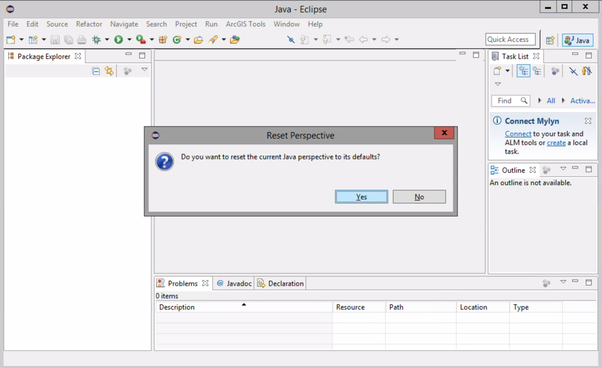

# Eclipse 

##### 1. Launch Eclips luna Windows Screen

##### 2. Set default workspace

##### 3. Program will be restart

##### 4. Reset Perspective

##### 5. Snippets

We will nead Snippets for future works.

##### 6. Save Perspective

##### 7. Create our first project

##### 8. Expand the project folder

##### 9. Create a class

change the package name to gis7010, and type Main for class name.

active the check box of "public static void main"

##### 10. click on Finish

##### 11. To appear a meaasage on screen type this command in the body of the main method:

###### System.out.println("Welcome to GIST 7010");

##### 12. To run the code, right-click on the Main.java class on the folder tree > Run As > Java Application.

You can see the results on the bottom:

