# Creating a web map

##### 1. In a web browser, go to: http://www.arcgis.com. 

In the upper-right corner, click Sign In.

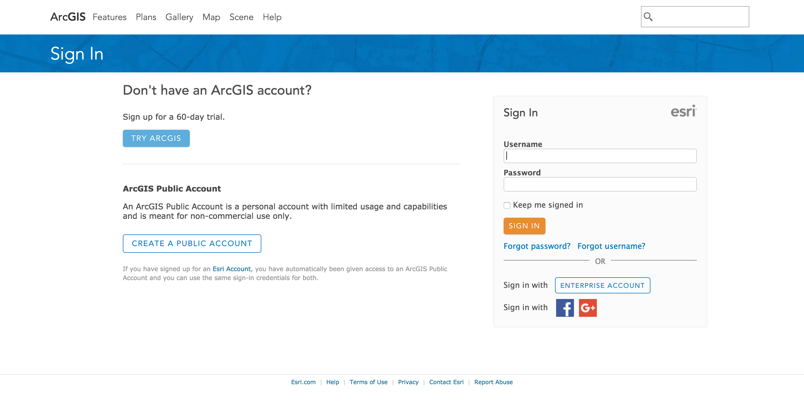

If you already have an Esri account, sign in and skip to step 3.

##### 2. If you don't have an Esri account, create one.

##### 3. On the main navigation bar at the top, click My Content.

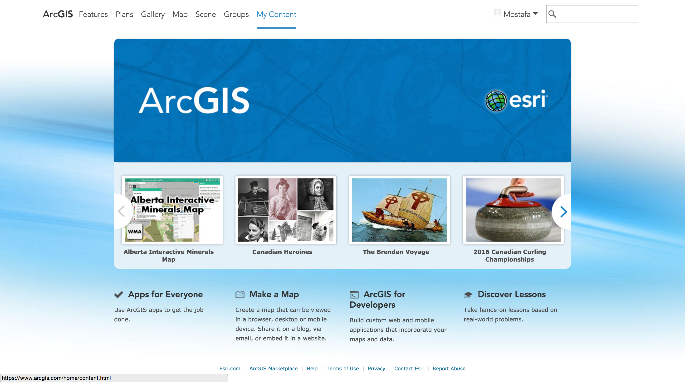

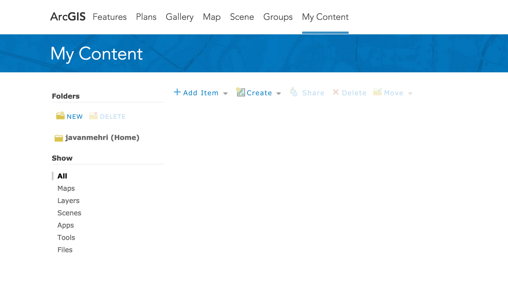

##### 4. On the main navigator bar, click Map. 

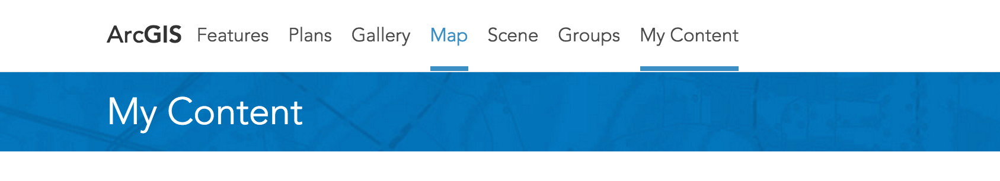

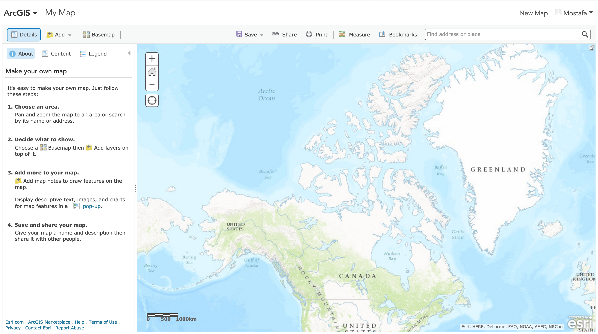

##### 5. Drag the pointer to pan around the map.

##### 6. Double-click a location on the map to center and zoom.

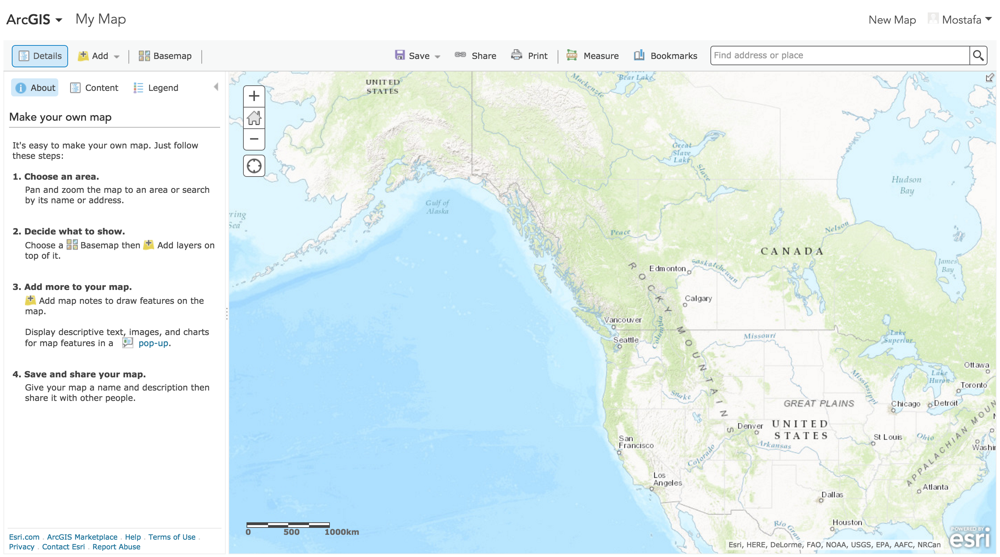

##### 7. Rotate the scroll wheel of the mouse up and down to zoom in and out, respectively.

##### 8. Pan and zoom to the Himalayas.

##### 9. On the map viewer toolbar, click the Basemap button. Click Imagery with Labels.

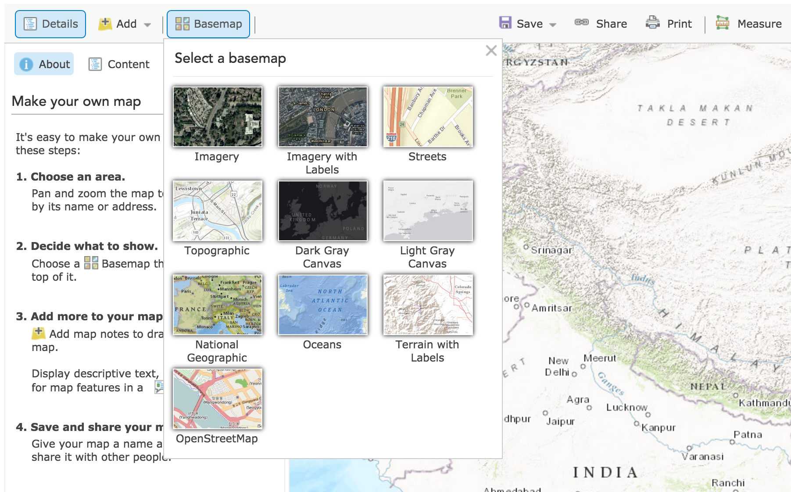

##### 10. On the Details panel, click the Contents button. 

##### 11. Hover the mouse pointer over the Imagery with Labels text. 

##### 12. Click the arrow, and then click the World Boundaries and places. On the menu click Description.

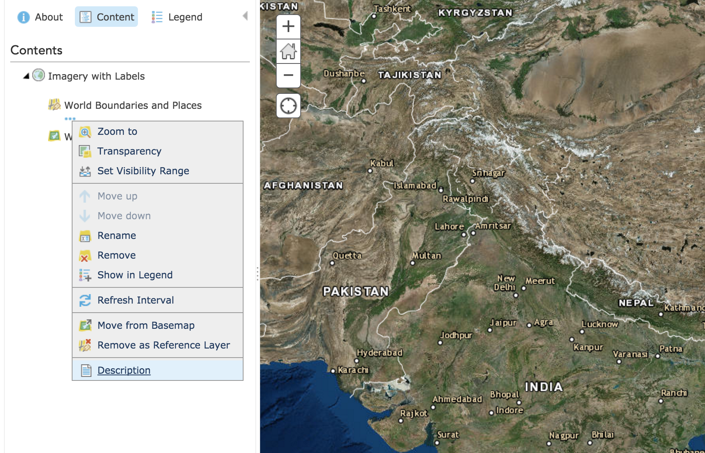

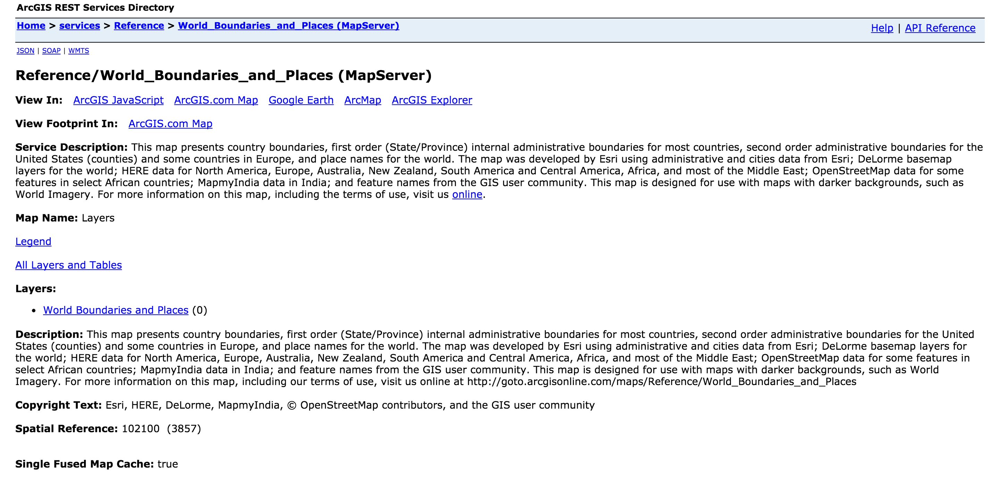

##### 13. Scroll down the page to view more metadata. Stop and review the Tile Info section.

##### 14. Back to the map. On the menu navigation bar, click Save button, and then click Save.

##### 15. On the Save Map dialog box, enter the title: Himalayas. Enter the tags: himalayas, mountain range, mount everest. Enter the summary: A basemap of the Himalayan range, and click the Save Map button.

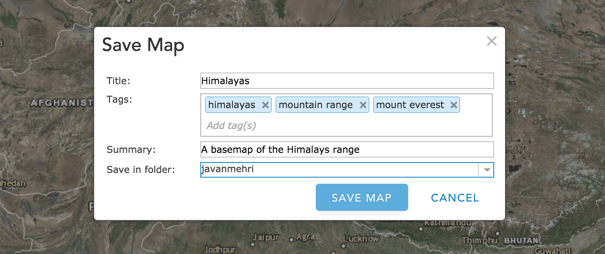

##### 16. To the left of the title Himalayas, click the arrow, and in the list click Home. Click My Content.

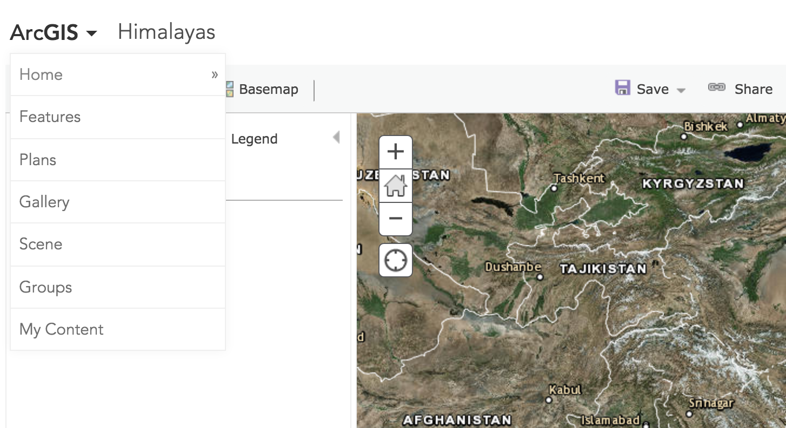

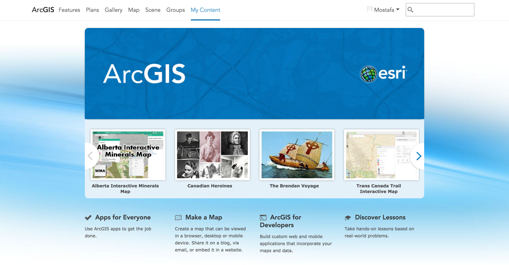

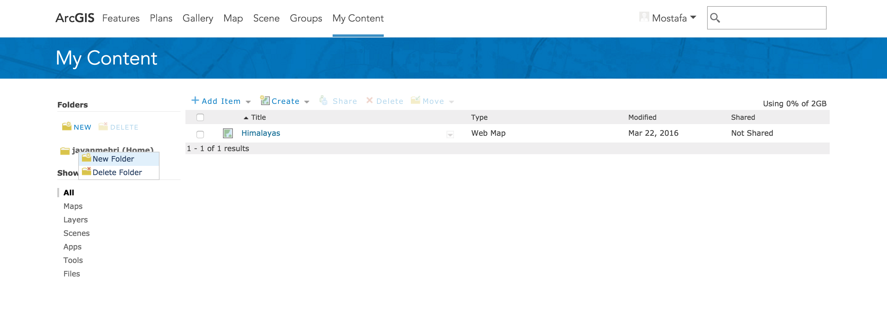

##### 17. Click the Himalayas map title.

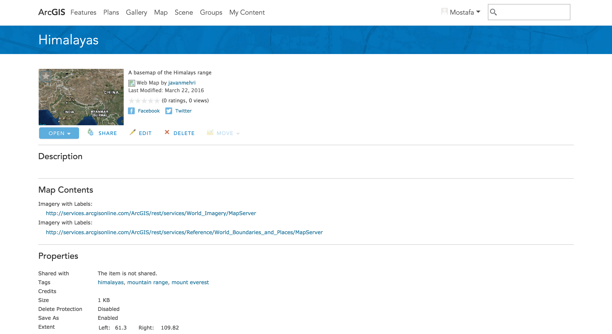

##### 18. Above Description, click the Edit button.

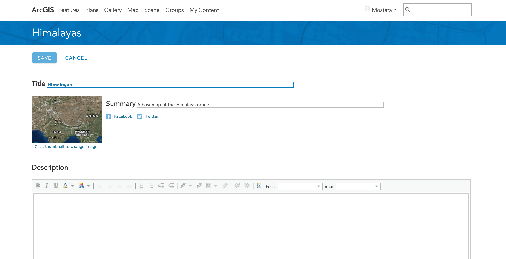

##### 19. In the Description box, type "This map shows satellite imagery and labels of the Himalayas mountain range.".

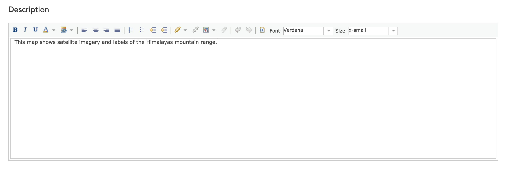

##### 20. At the top of the page, click the Save button. On the main navigation bar, click My Content to return to the content list. 

