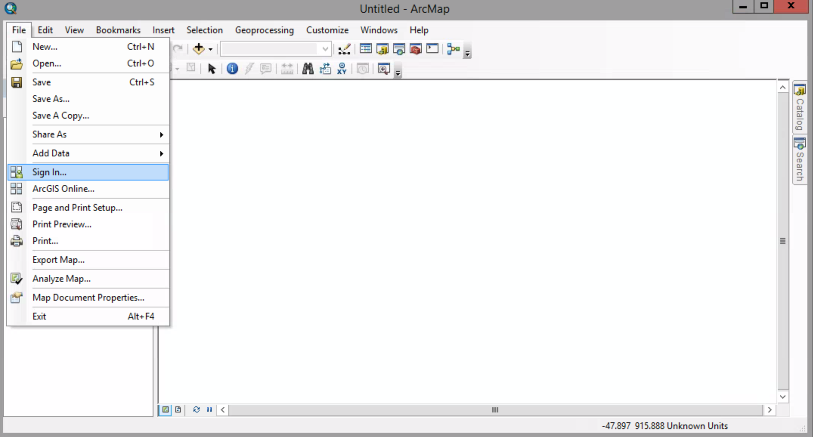
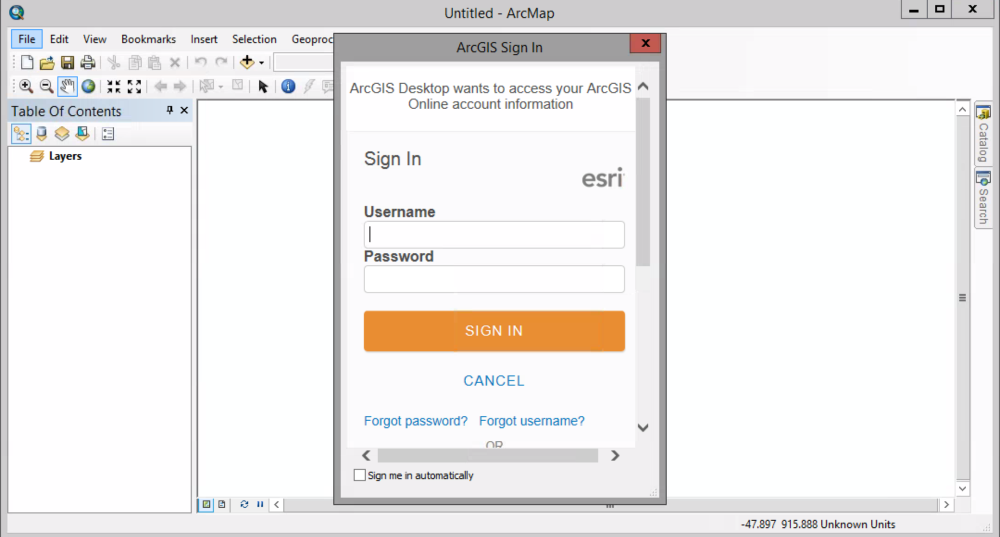
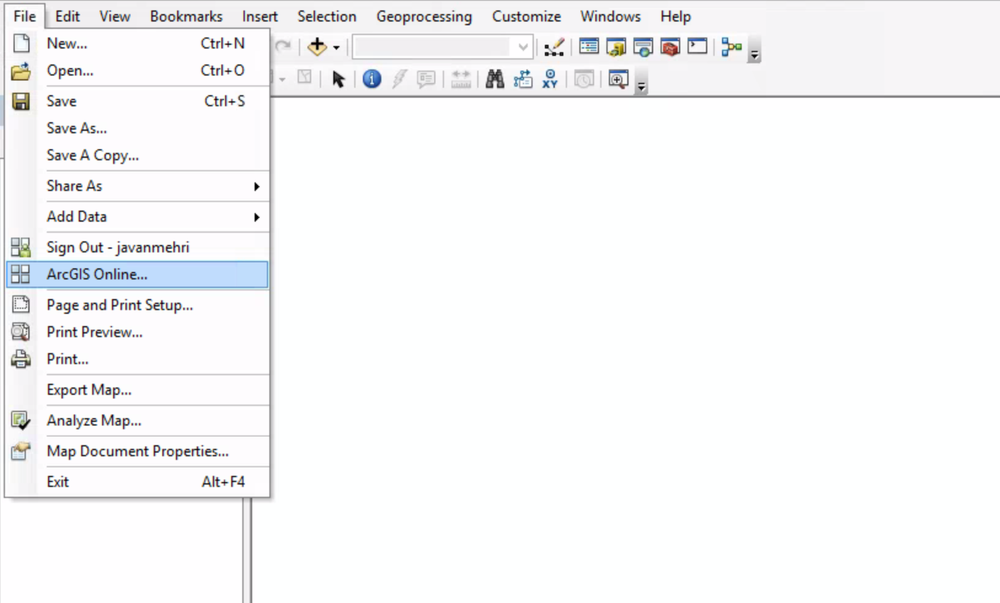
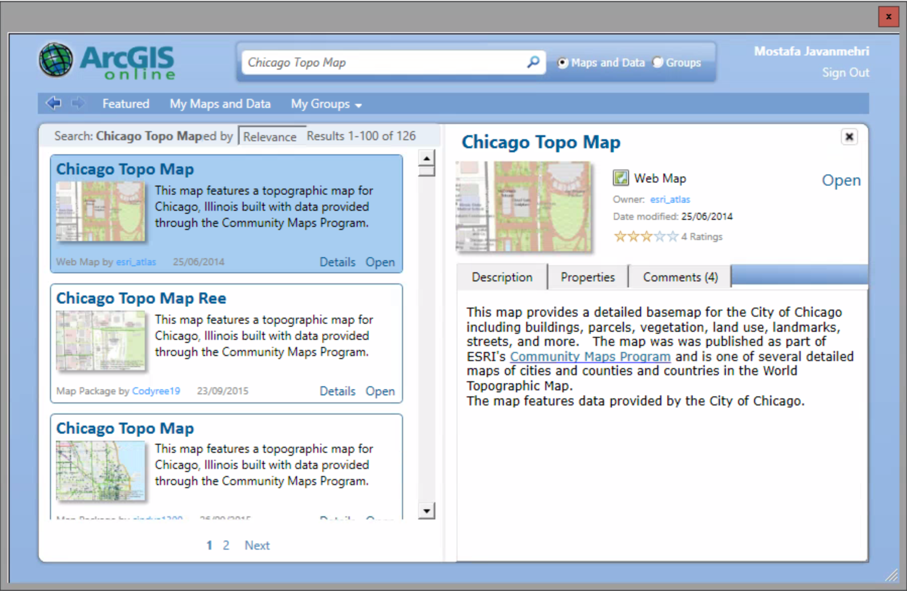
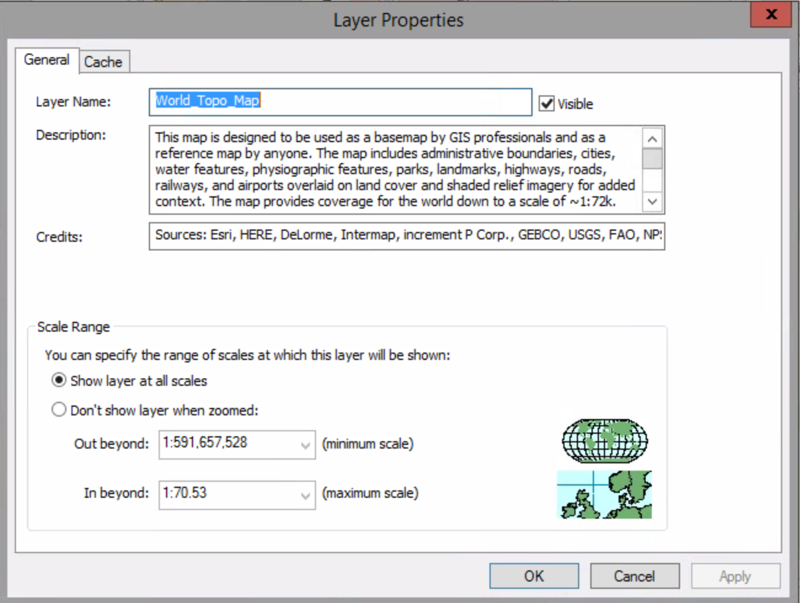
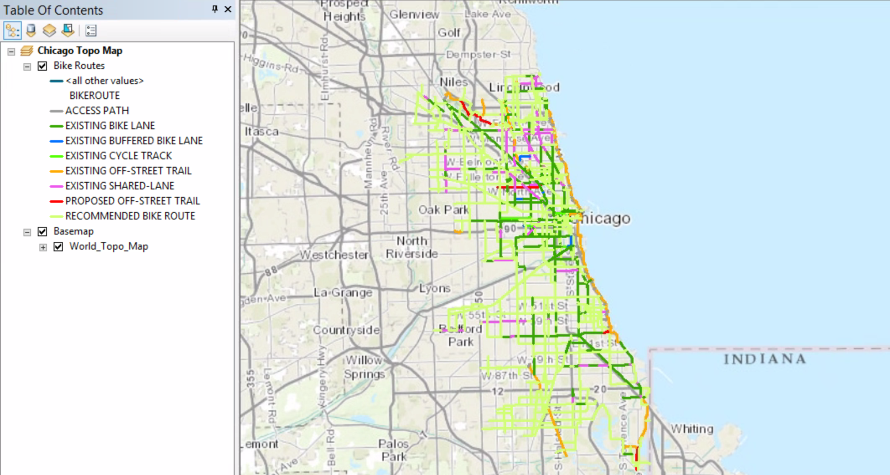
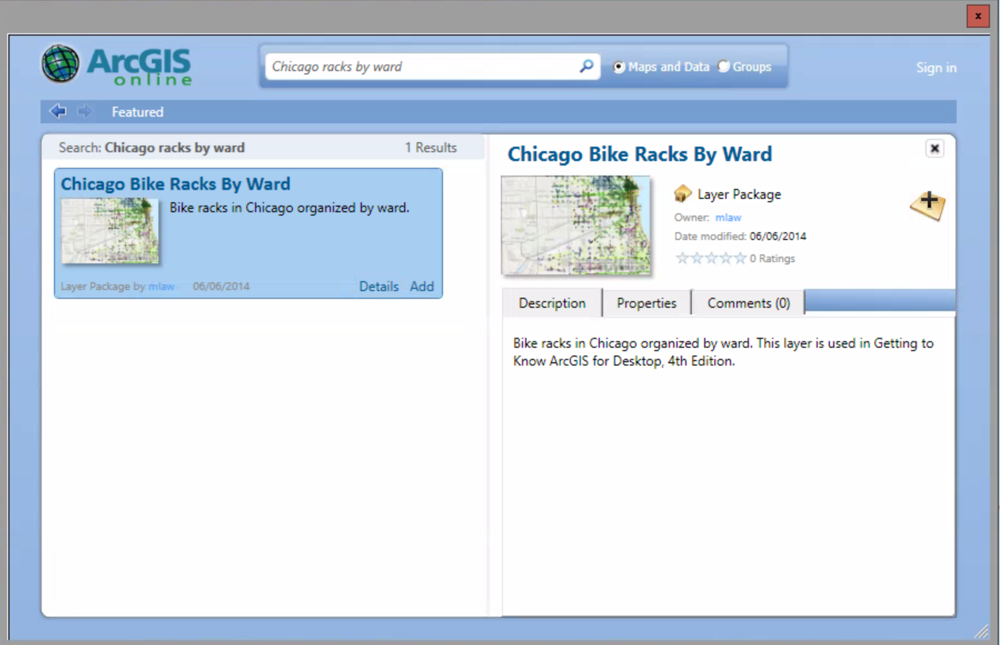
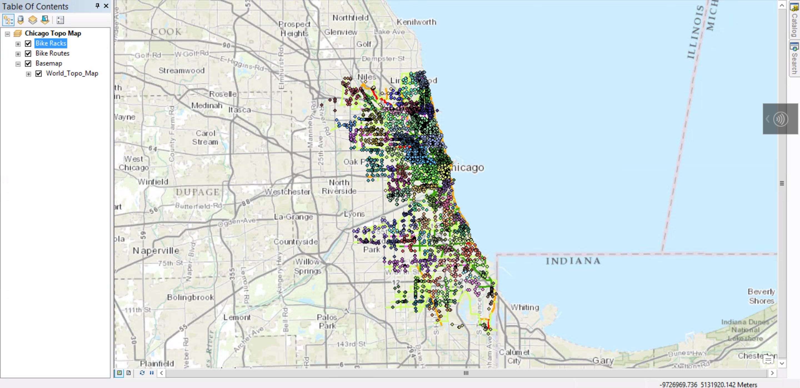
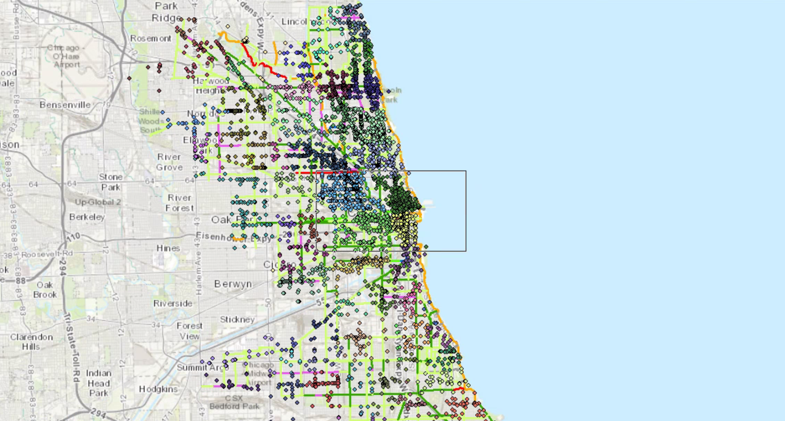
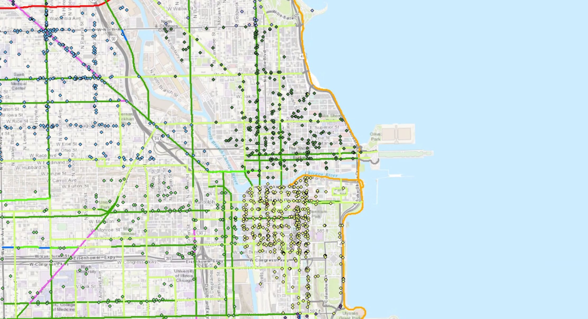

# Merging online and local layers

##### 1. Start ArcMap. Click the New button to open a blank map.

##### 2. On the menu bar, click File > Sign In.

##### 3. Enter your public account user name and password, and click Sign In.

##### 4. Click File > ArcGIS Online.

##### 5. In the Search box, type Chicago Topo Map, and press Enter.

##### 6. In the returned maps, locate the one titled Chicago Topo Map, and click the Details link.

##### 7. In the Description panel, click Open. If ArcMap asks you to save your untitled map, click No.

##### 8. Access the World_Topo_Map layer properties.

Notice the layer description and source redits.

##### 9. Close the dialog box. Click the Add Data button. Browse to Chapter05\Data, and add Bike Routes.lyr.

##### 10. Zoome out until the map scale is 1:450,000.

##### 11. Click ArcGIS Online again. In the search box, type Chicago bike racks by ward, and press Enter. In the search results, click the Details link to see a short description of it.

##### 12. Click Add button.

##### 13. Click the Zoom in tool and draw a rectangle around the downtown portion of chicago.

