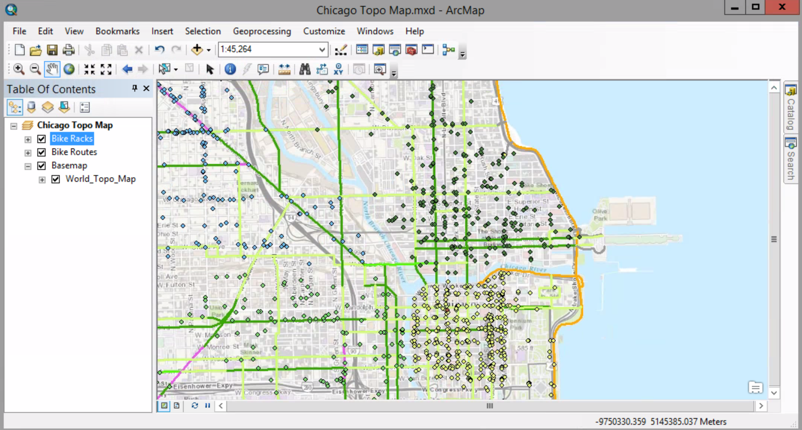
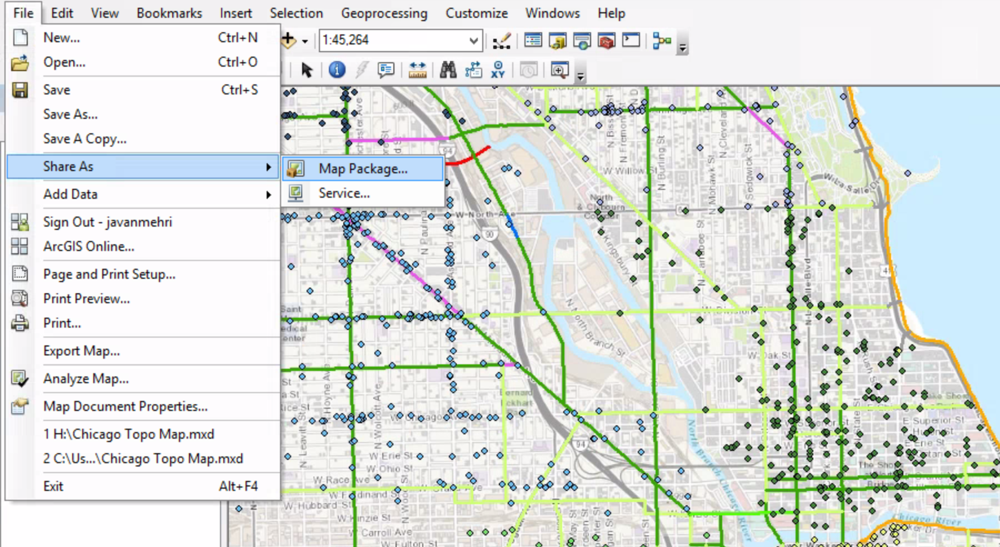
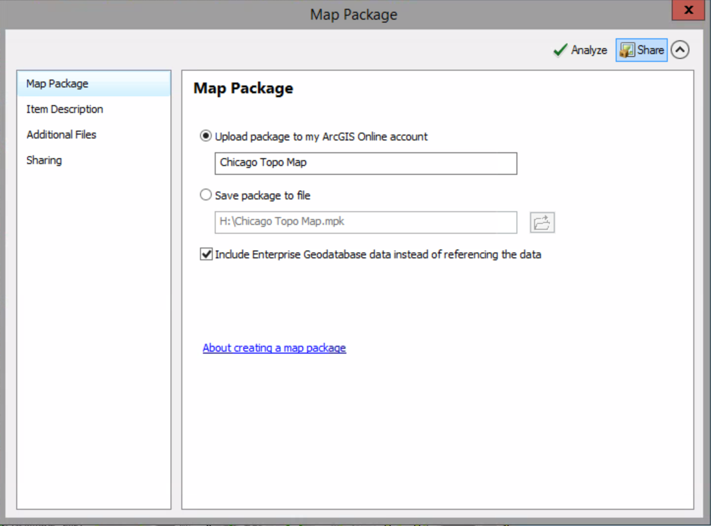
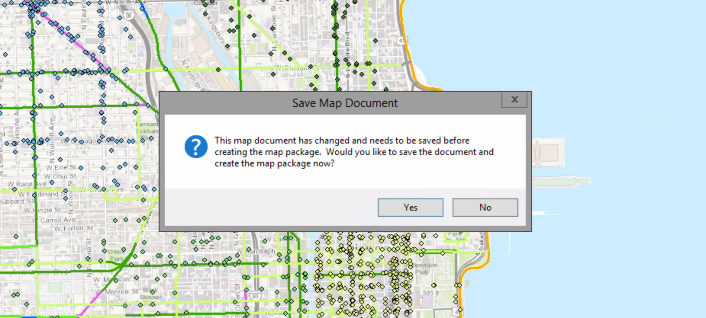
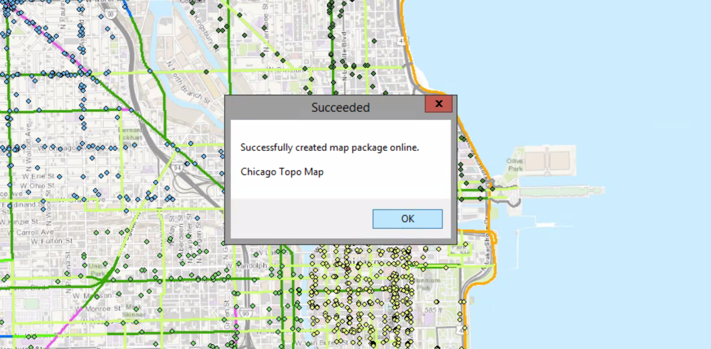
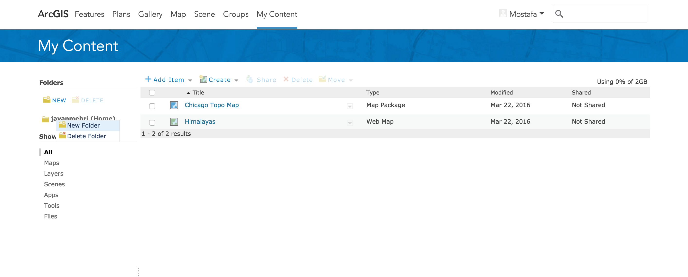

# Sharing a map package

##### 1. Open the map you created in the previous exercise.

##### 2. Sign in to your public ArcGIS Online account (File > Sign In).

##### 3. From the File menu, click Share As > Map Package.

A map package contains the map document and the data referenced by the layers it contains in a portable file.

##### 4. Click the Analyze button.

##### 5. Click the "Upload package to my ArcGIS Online account" option. Click the Share button. Click Yes when you are prompted to save the map document.

##### 6. When you see a message telling you the map has been successfully created online, click OK.

##### 7. In your browser, go to www.arcgis.com and log in. Go to My Content to see the map.

