# Using dynamic labels

##### 1. Open the ex9a map document

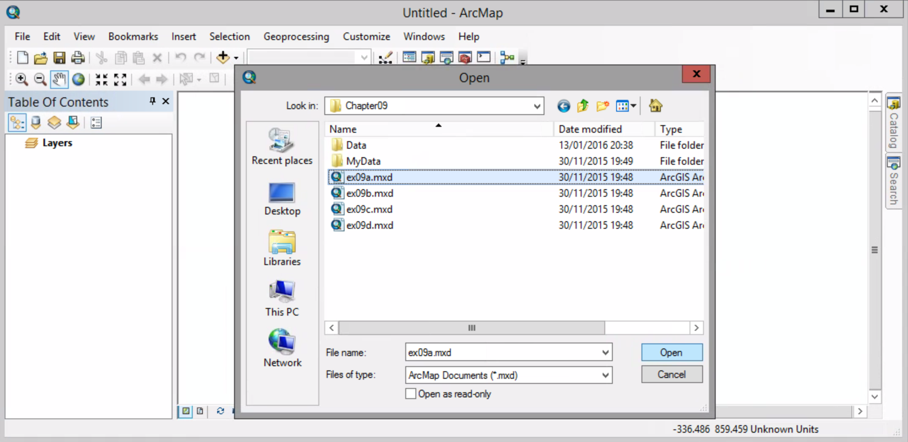

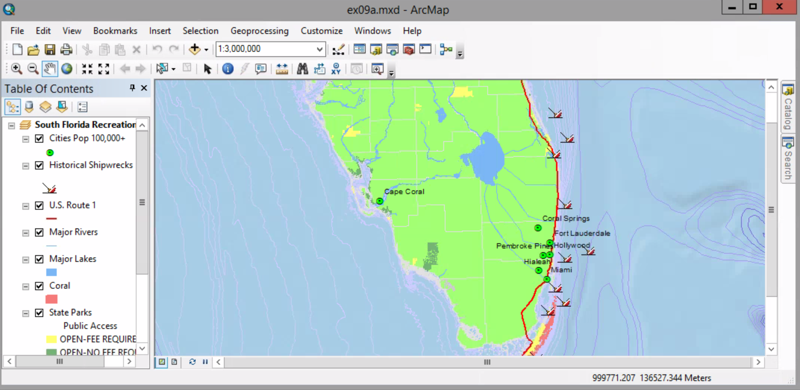

##### 2. Right-click the Southeast layer, and click Label Features.

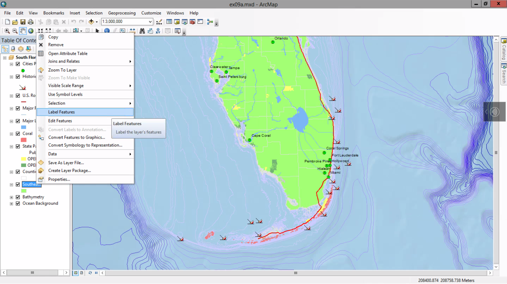

Beacause this map shows only one state, you see only one label, for Florida, in the center.

##### 3. Open the properties for the the Southeast layer, and click the Labels.tab.

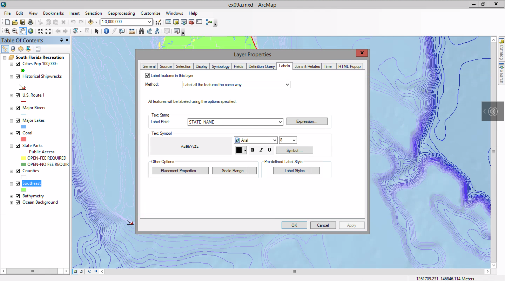

##### 4. Change the colour to click Gray 20%.

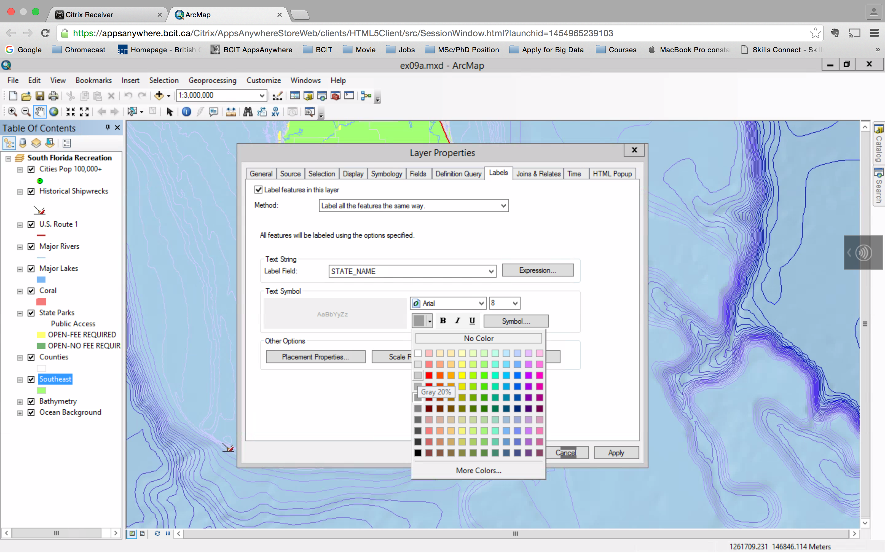

##### 5. In the Text Symbol frame, in the size list, replace 8 with 14.

##### 6. Click the Symbol button. Click Edit Symbol.

##### 7. Click the Formatted Text tab. Change Character With to 130. Under Text Case, click All Caps.

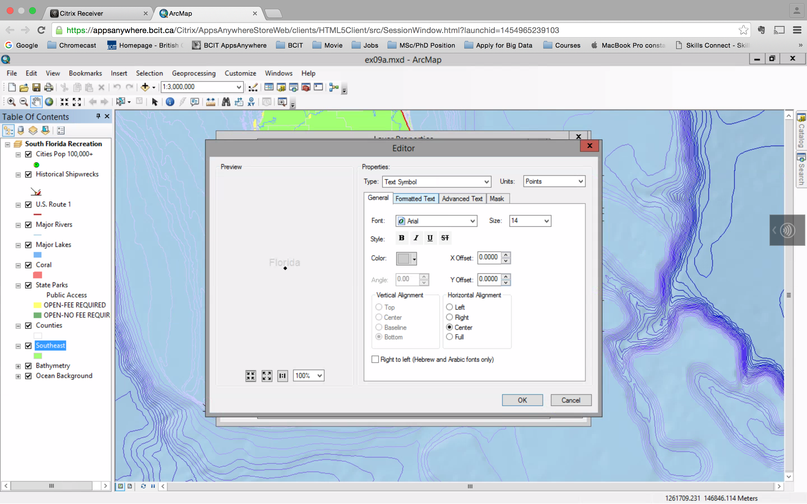

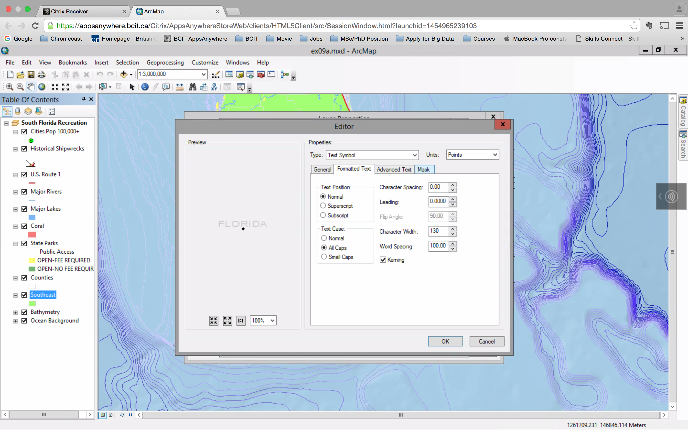

##### 8. Click the Mask tab. Under style, click Halo. Change the size to 1.

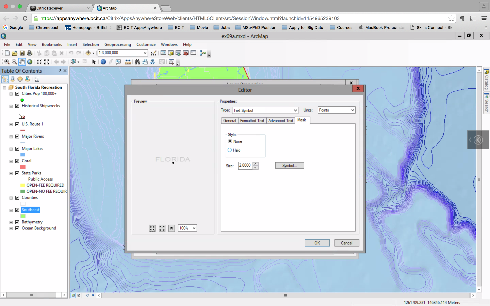

the Halo ensures the text isn't lost on the map.

##### 9. Click Ok in all windows to apply the changes. 

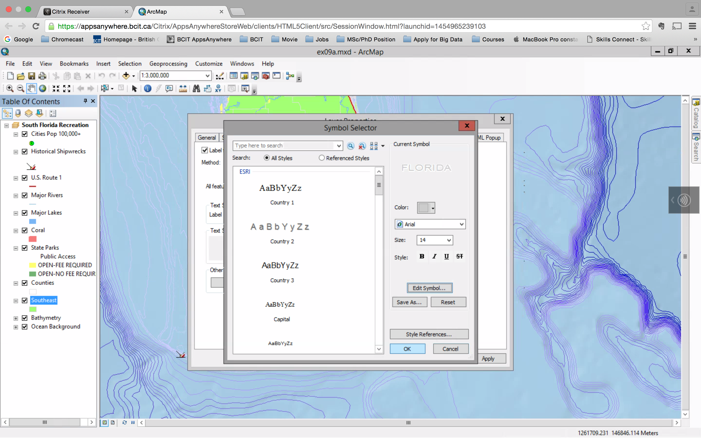

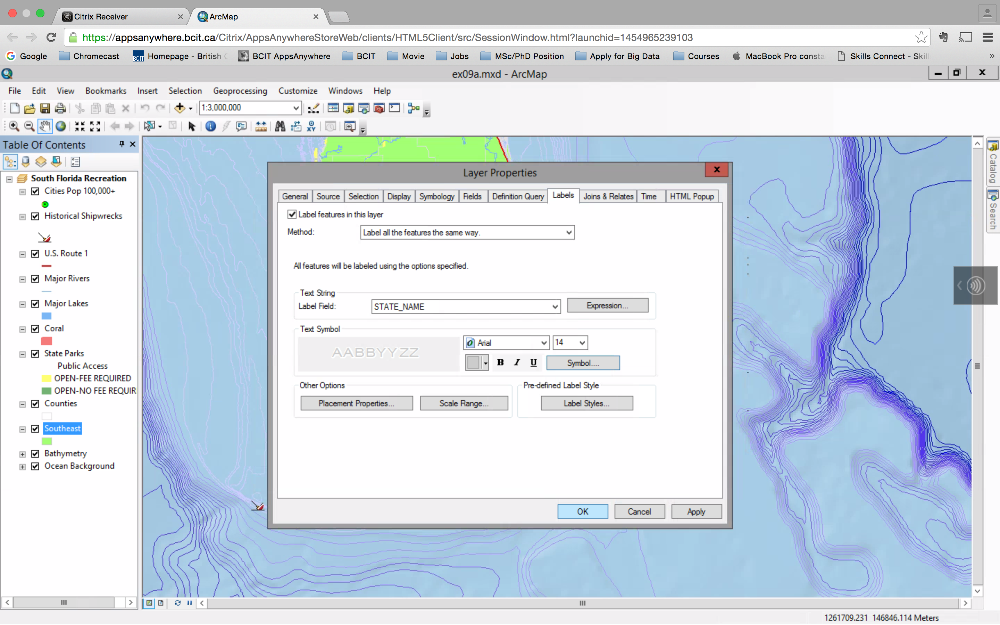

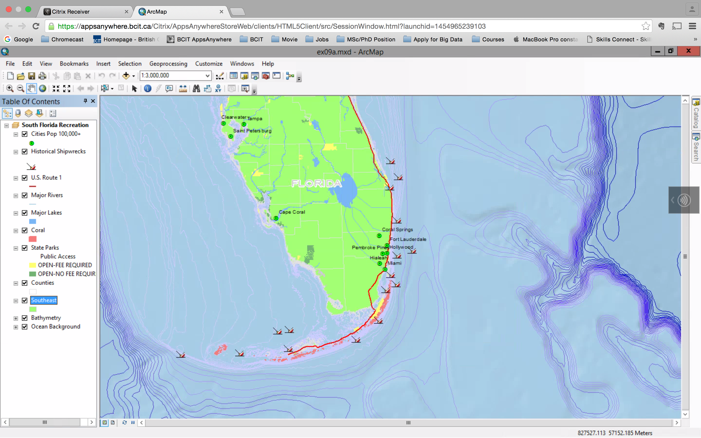

##### 10. Major Lakes layer > properties > Labels tab

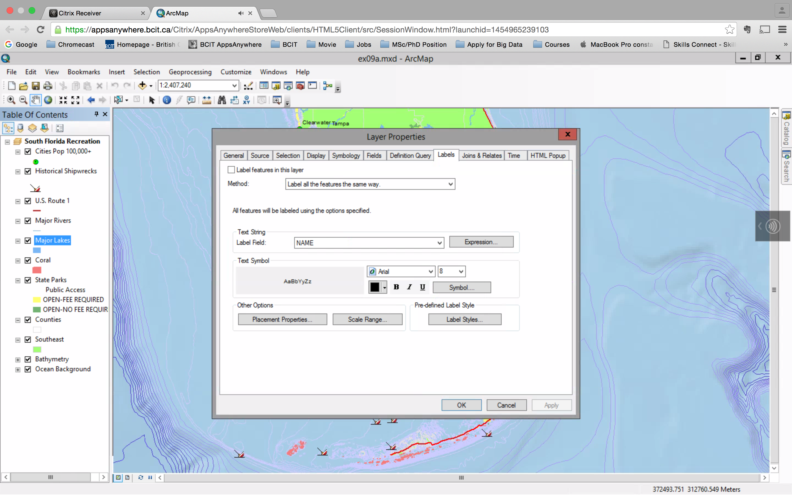

#####  Select the "Lebel features in this layer" check box. Click the Symbol buttom to open the Symbol Selector.

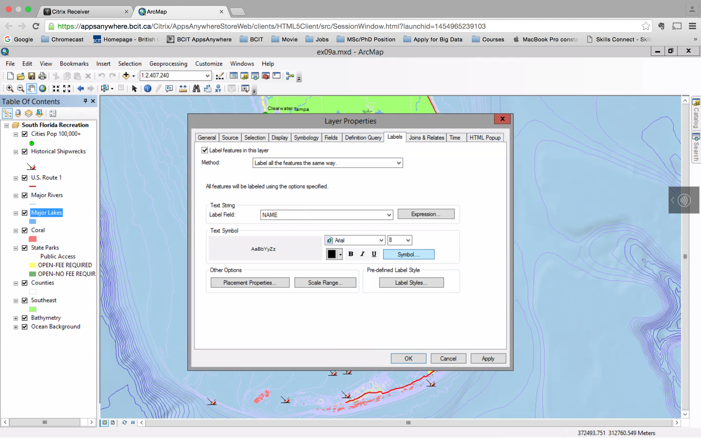

##### 11. Click the label style River, and then click OK.

##### 12. Ok

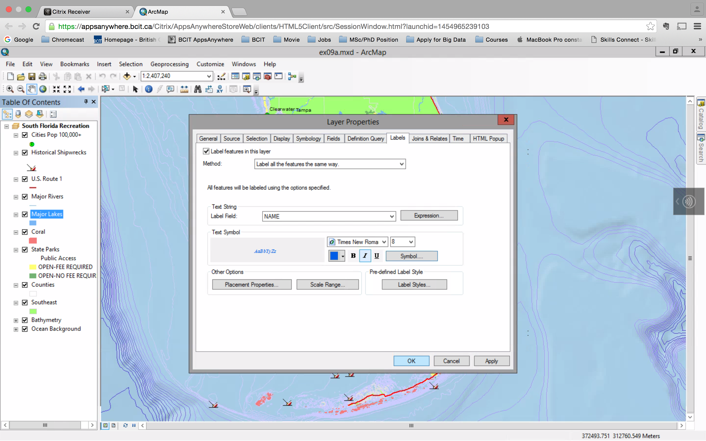

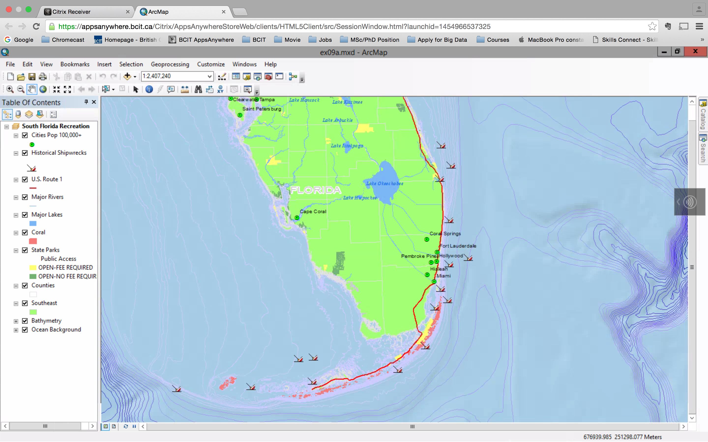

