# Creating graphic labels

##### 1. Open the ex09c map document

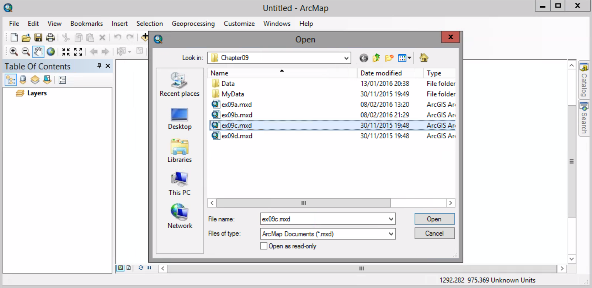

##### 2. Customize > Toolbars > Draw

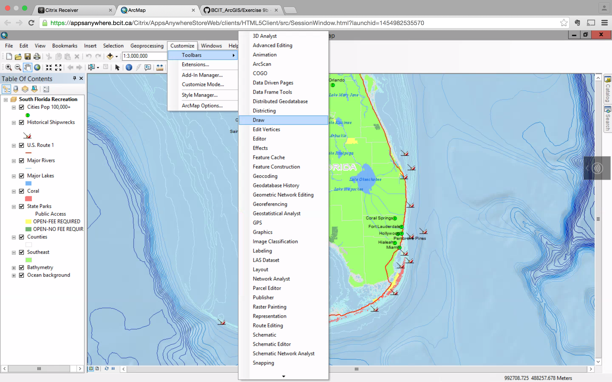

##### 3. On the Draw toolbar, click Text tool. Move the mouse pointer over the map. Click in the Gulf of Mexico to add a text box.

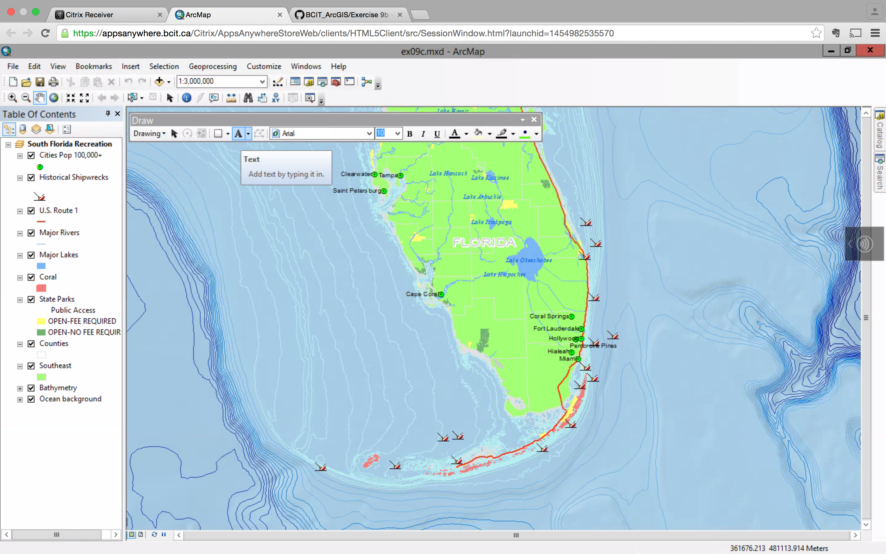

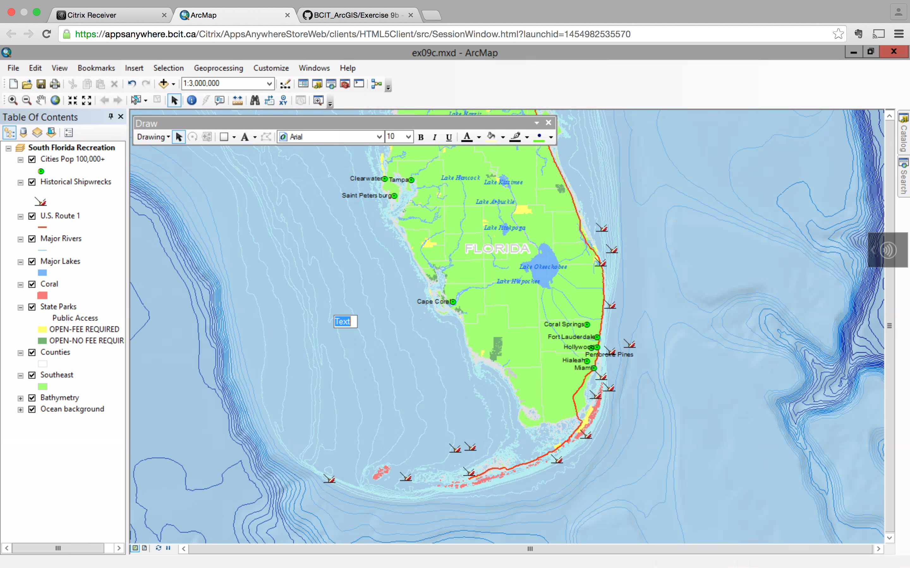

##### 4. In the text box, type Gulf of Mexico, and press Enter.

##### 5. Right-click the label > properties > Change Symbol

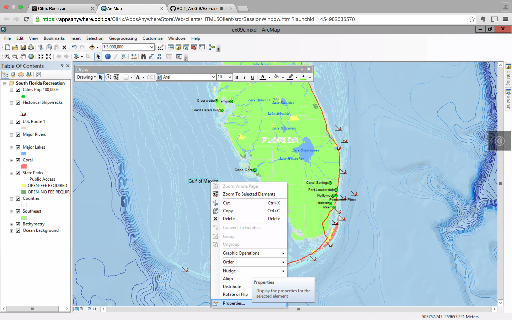

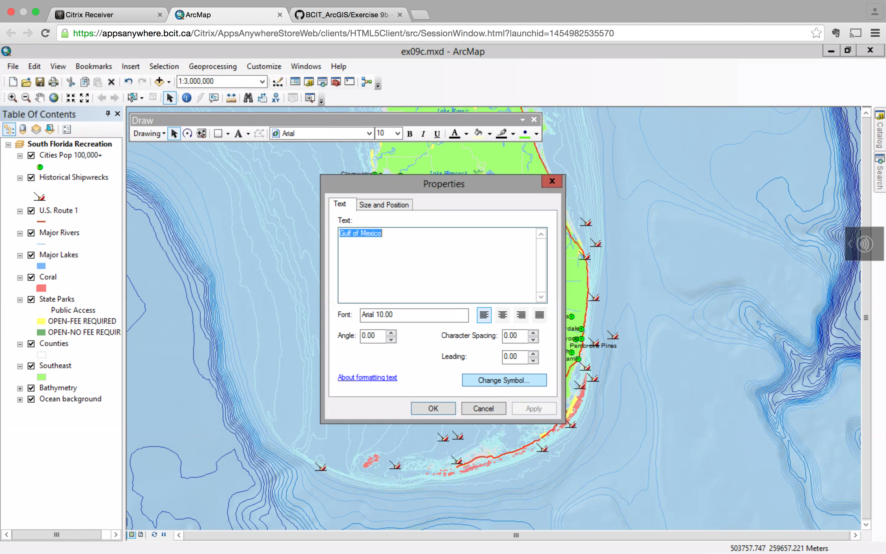

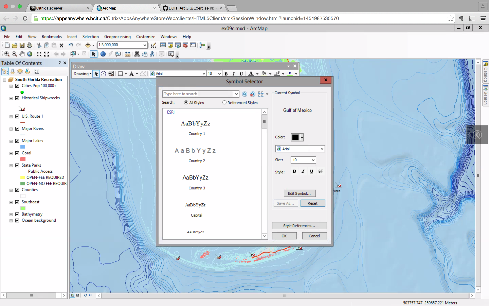

##### 6. In the symbol selector, click on "Ocean", and select a font.

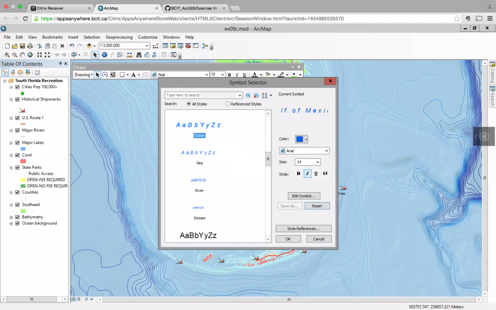

##### 7. Click Ok. Click OK again.

##### 8. Drag the text so that it approximately matches the graphic.

You can do the same process for Atlantic Ocean.

##### 9. On the Draw toobox, click the down arrow next to the Text tool. Click the label too.

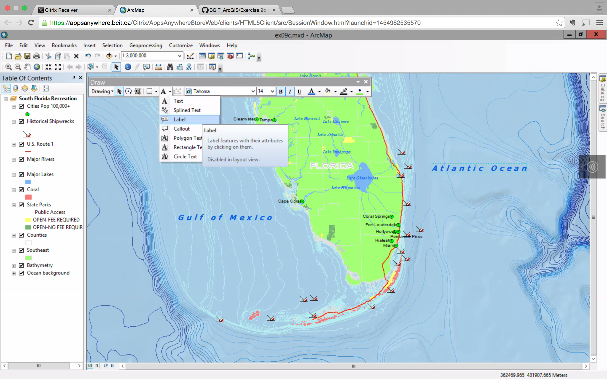

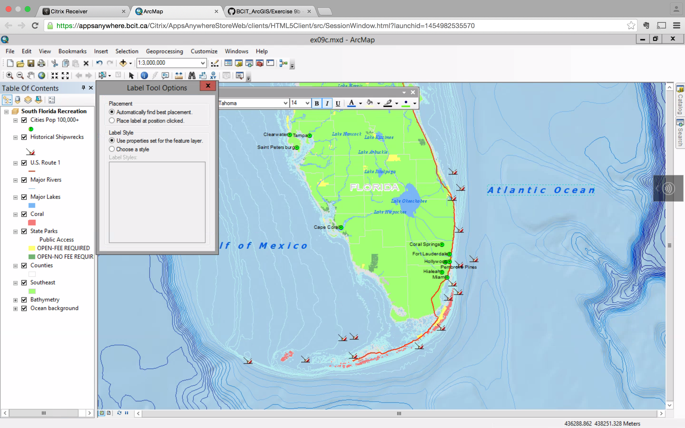

##### 10. On the dialog box, click the "Place label at position clicked" and "Choose a style" options. In the style library, click the first symbol, U.S. Route.

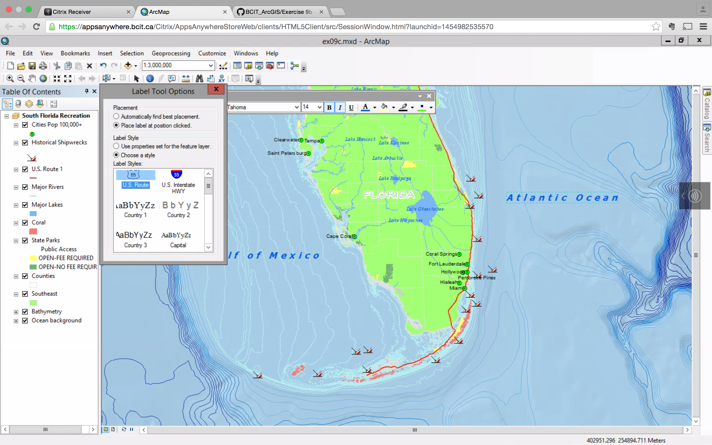

##### 11. Move your mouse pointer over the U.S. Route 1 line feature. When you see the MapTip US1, click to place the label.

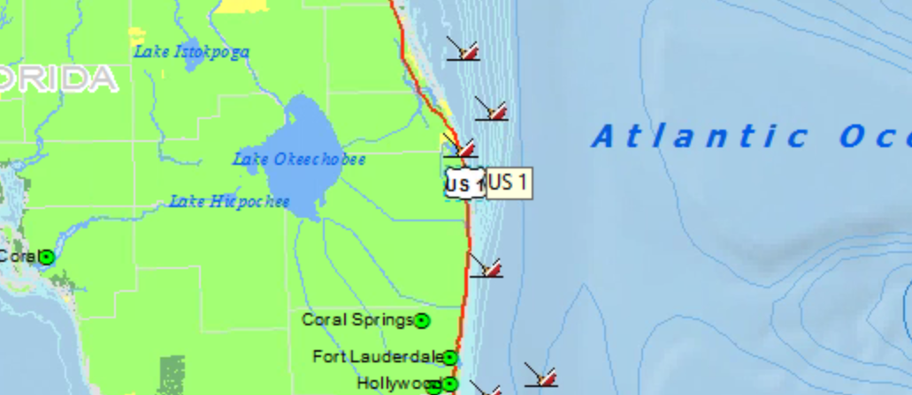

##### 12. Rigth-click the label > properties > Change Symbol: Change the size to 6

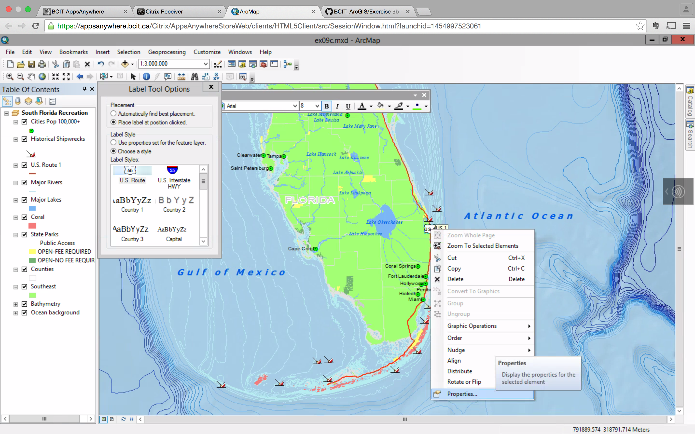

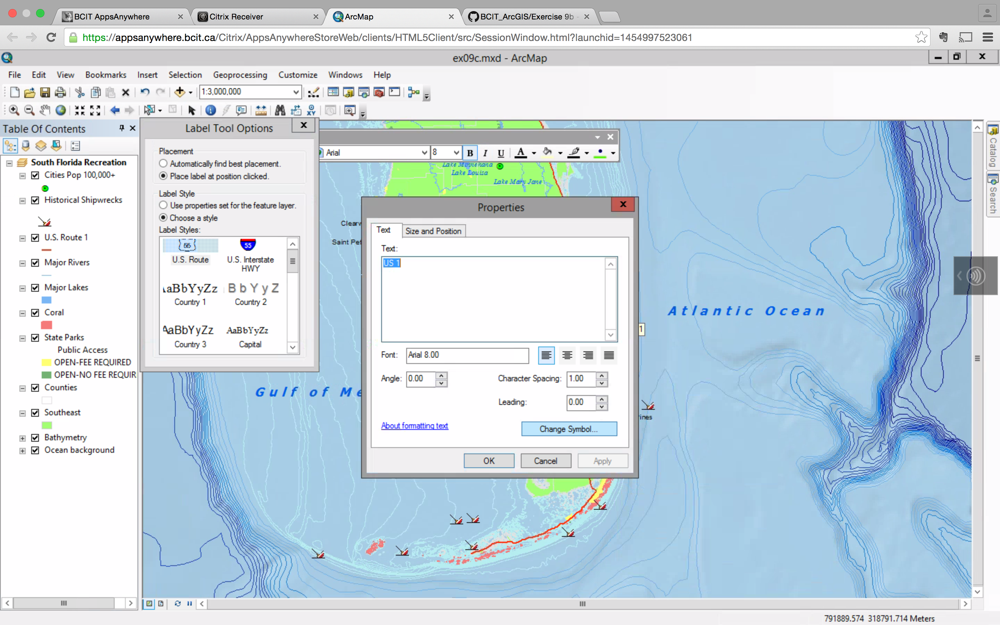

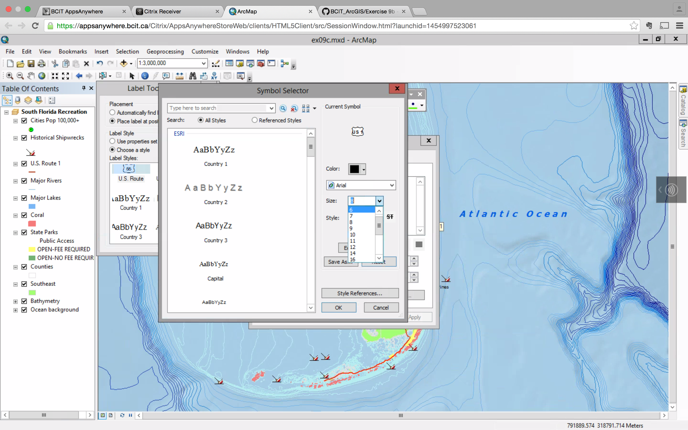

##### 13. Close any open dialog box, click Select Elements tool, and click anywhere on the map to clear the selection.

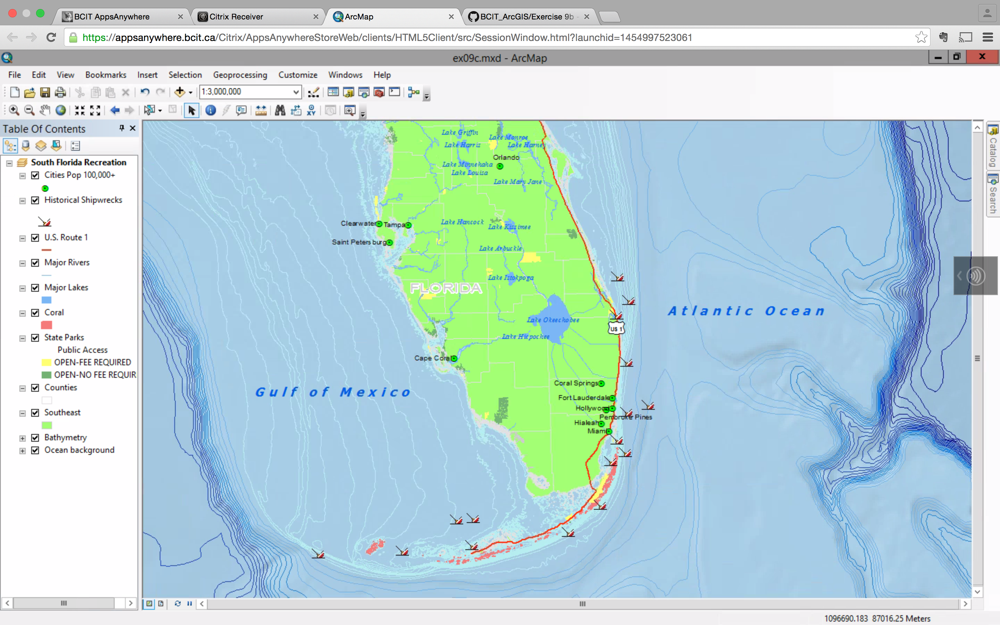

