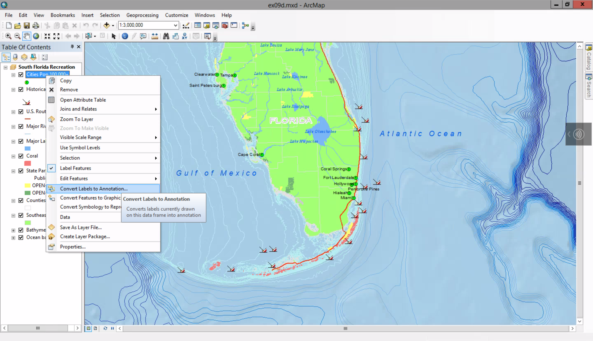
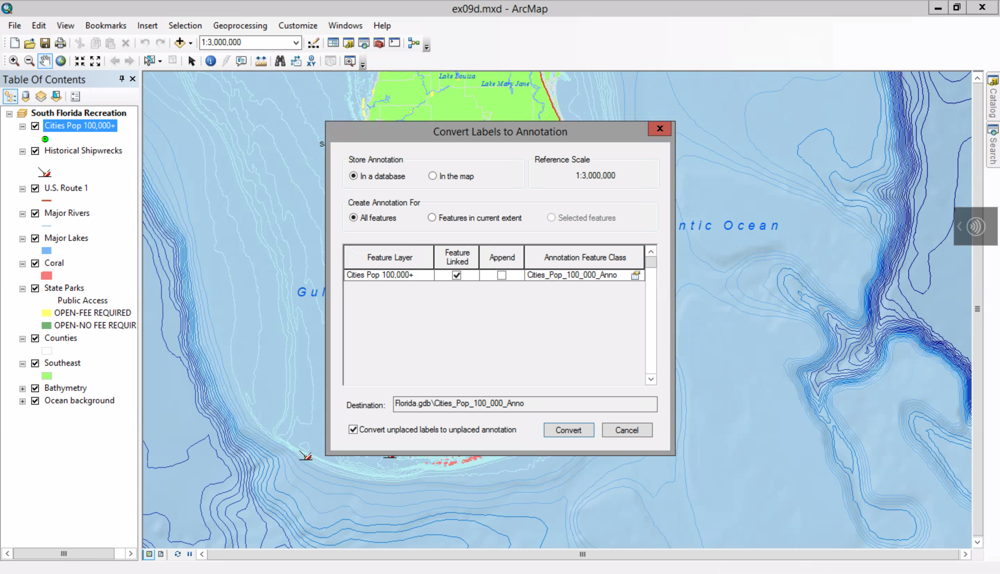
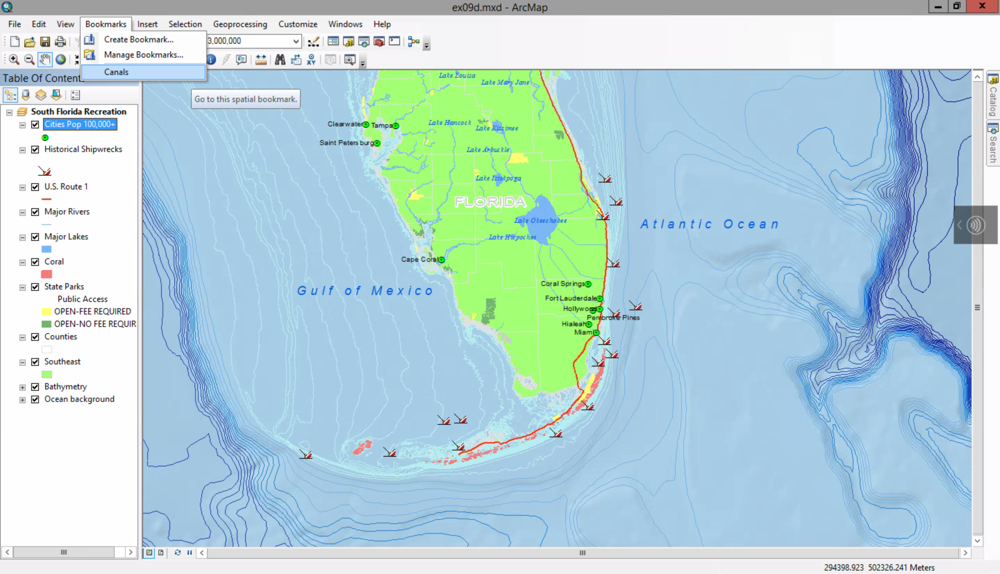
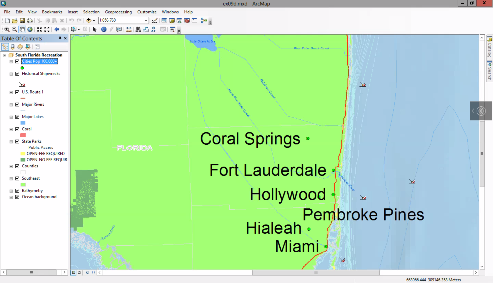
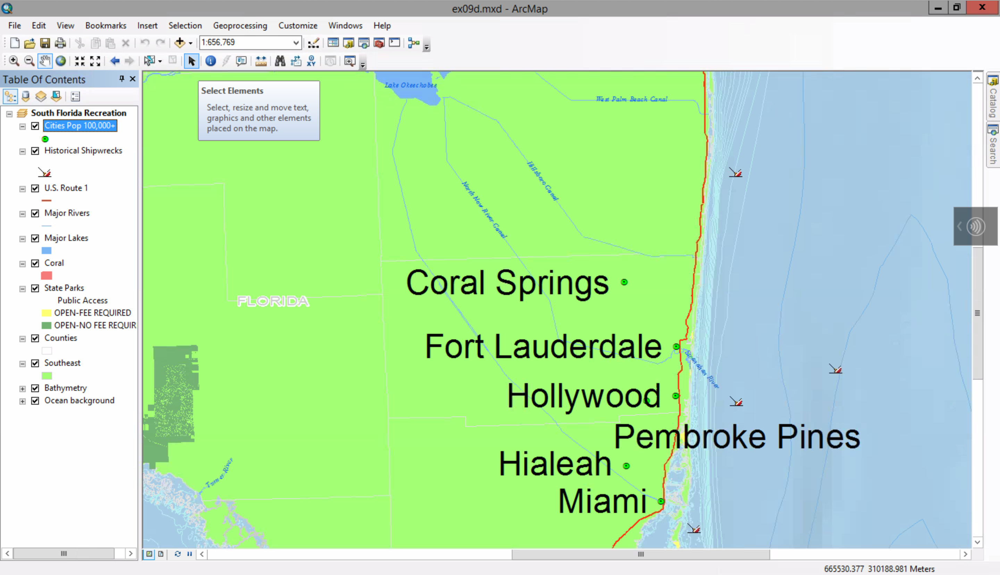
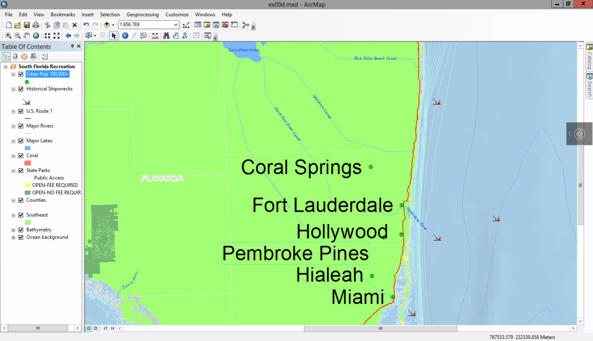
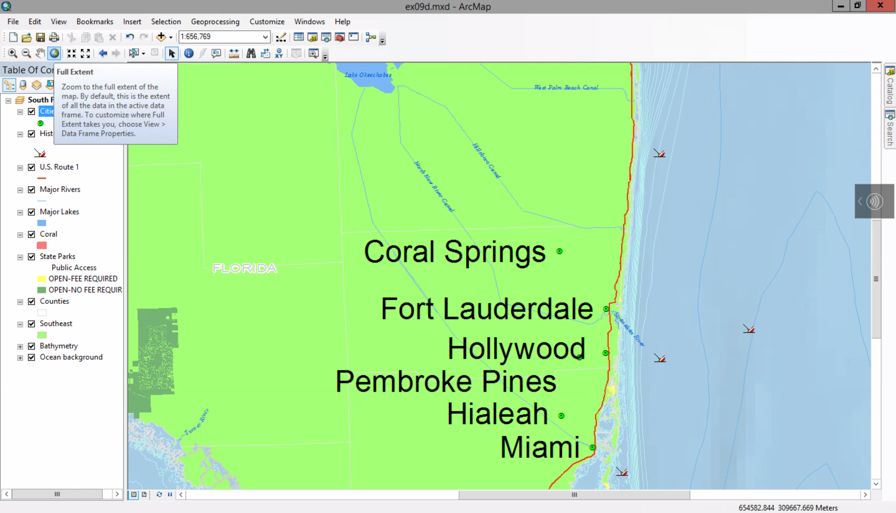
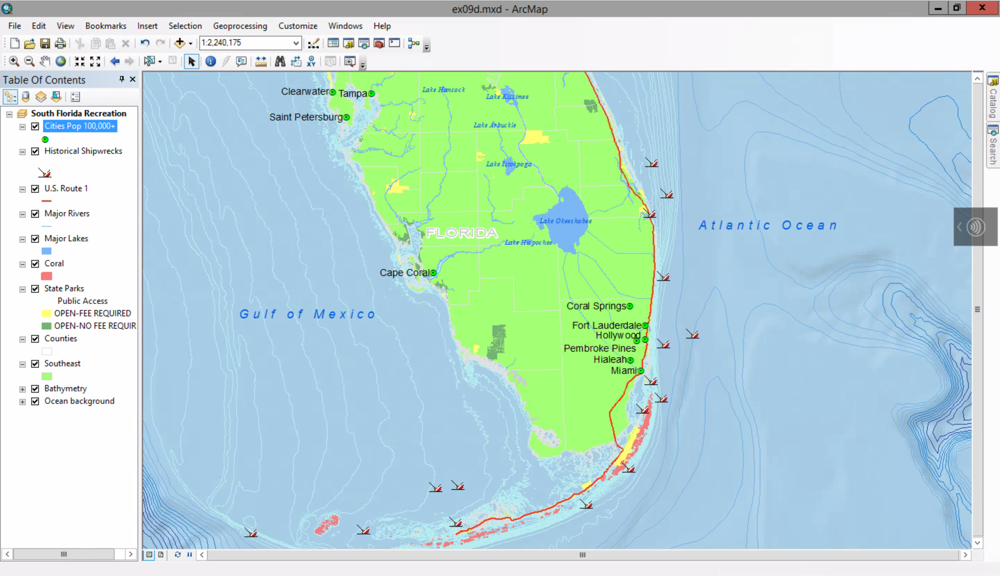

# Converting dynamic labels to annotation

##### 1. Open ex09d map Document.

##### 2. Right-click the Cities pop 100,000+ layer > Convert Labels to Annotation.

##### 3. Click the option to store annotation in the map. Click Convert.

The labels are converted to annotation. In the process, their posisions may have changed slightly. 

##### 4. Zoom to Canals bookmark.

##### 5. Click the Select Elemenet tool. Click the Hollywood label to select it.

##### 6. Drag the label slightly north.

##### 7. Drag the "Pembroke Pine" label to the southeast of the point feature.

##### 8. Return the full extent of the map.

