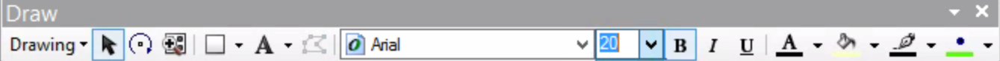
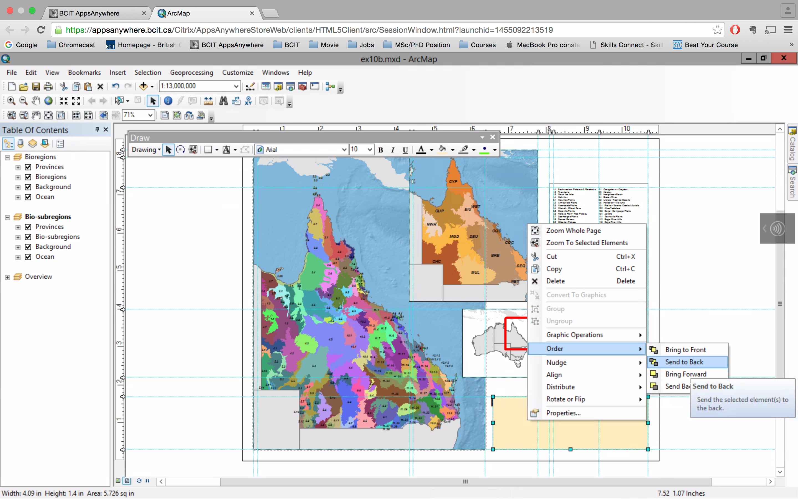

# Adding titles and additional text

##### 1. Open the ex10b map document. Maximize the ArcMap window, and then click the Zoom Whole Page buttom on the layout toolbar.

##### 2. Insert > Title
##### In the text box, type "Bio-subregions", and click OK.

##### 3. Drag the title to the empty white area at the lower-right corner of the layout.

##### 4. Customize > Toolbars > Draw
##### Change the font size to 20, and click the Bold button. Then click OK.

##### 5. Snap the upper-right of the title to the guildes at 1.7 inches (vertical) and 10.7 inches (horizontal).

##### 6. Insert > Title
##### Drag the new title just below the existing title in the lower-right corner of the map.
##### Double click the text box. 
##### On the properties, change the text with "Queensland, Australia".

##### 7. Properties > Change Symbol:
##### Size --> 14
##### click Italic button

##### 8. On the Draw toolbar, click the text button arrow > Rectangle Text

##### 9. Draw a rectangle below the subtitle. Double-click it. Change the text with "This map depicts the biogeographic regions and subregions of Queensland, Australia. Data created by the Queensland Government Information Service." Next click Justify button.

##### 10. Properties > Size and Position > Size:
##### Width: 4
##### Height: 0.65
##### Click OK

##### 11. Select subtitle and right-click it > Nudge > Nudge Up
##### Kepp Nudging until the subtitle is as close to the title as possible. (You can also use the Up Arrow key)

##### 12. Similarly, nudge the description rectangle up.

##### 13. Select All three elements by holding down Ctrl. Right-click > Align > Align Center

##### 14. Right-click > Group

Now anything you do to the group title, such as changing the font size, will affect all of them.

##### 15. On the Draw toolbar, click Rectangle tool.

##### 16. Draw a rectangle around the title.

##### 17. Click the fill color arrow, and select the Sahara Sand.

##### 18. Right-click > Order > Send to Back

##### 19. Select the title group and the rectangle all together.

##### 20. Right-click > Align > Align Vertical Center

##### 21. Right-click > Align > Align Center

##### 22. Right-click > Group

##### 23. Zoom back to the extent of the full page.

