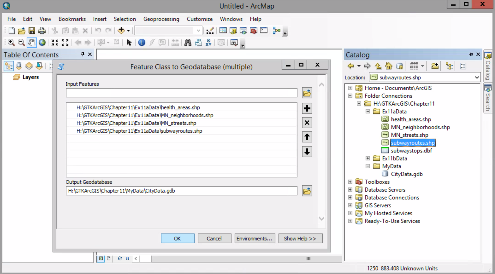

# Creating a geodatabase

##### 1. Open the Blank Map template. Open the Catalog window. Add Chapter11 Folder to the Folder Connection. 

##### 2. Right-click MyData > New > File Geodatabase

##### 3. Rename the geodatabase

##### 4. Right-click > Import > Feature Class (multiple)

##### 5. Drag all shape files from Ex11aData folder to the window.

##### 6. Click OK

##### 7. Expand the CityData.gdb to see the new feature classes

##### 8. Right-click one the feature classes > Item Description. Click the preview tab.

##### 9. Click the other feature classes on the catalog window

##### 10. in Ex11aData folder, right-click subwaystops.dbf > Creat Feature Class > From XY Table

11. X Field --> POINT_X
Y FEILD --> POINT_Y

12. Click Coordinate system of...

13. Import the coordinate system used by one of the other shapfiles in CityData.gdb

14. Click OK. Specify the output as subwaysstops in CityData.gdb

15. Click OK. Then preview the subway stops.

