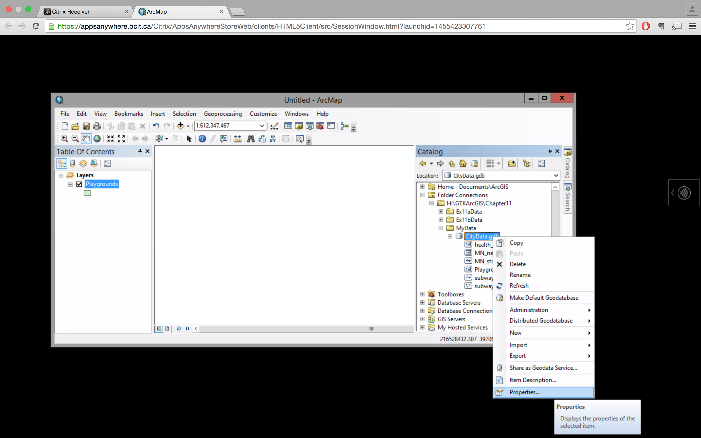

# Creating feature classes

You need to first complete Ex.11a   

##### 1. Open a blank map. Right-click CityData file geobase in the Catalog window > New > Feature

##### 2. Name --> playgrounds

##### 3. Next

##### 4. Add Coordinate system used by one of the other feature classes

##### 5. Next

The XY tolerance defines the minimum distance between two coordinates before they are considered equal.

##### 6. Next

##### 7. Next

##### 8. In the Field Name column, click SHAPE. The feild properties for the SHAPE feild are displayed.

##### 9. add "Inspect_Data" to Feild Name

##### 10. Date Type --> Date

##### 11. Fill as follow

##### 12. Click Finish. New feature class has been added.

##### 13. Right-click CityData.gdb > Properties > Domain tab

##### 14. Fill as follow

You will be picking from a list of these descriptionss when you enter attribute values.

##### 15. OK

##### 16. In Catalog, right-click the playground feature class > properties > Field tab.

##### 17. In the feild name column, click Borough. Set the Domain to NYC_borough.

You have created an attribute domain and applied it to the Borough field.

##### 18. Default Value --> M

##### 19. OK

