# Drawing features

##### 1. Open ex12a map document

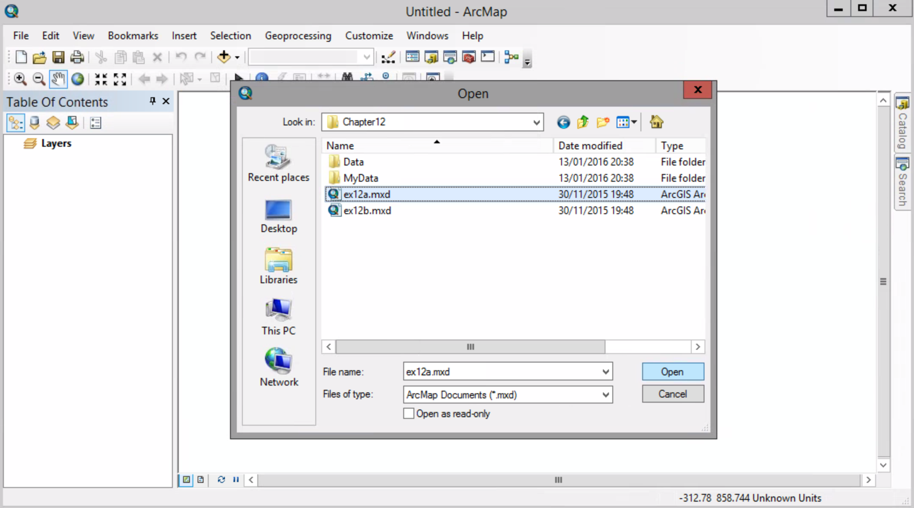

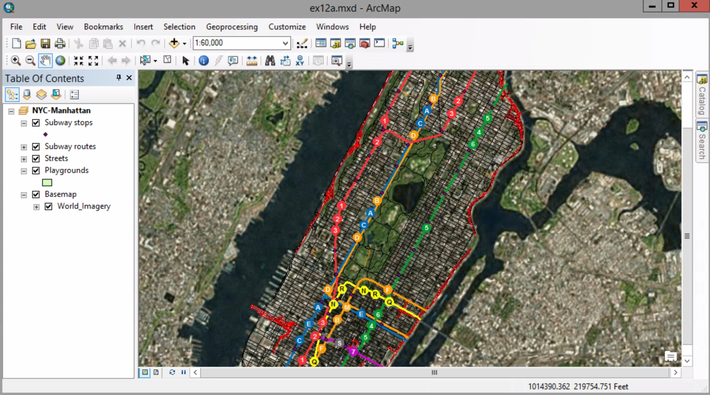

##### 2. Bookmarks > Playgrounds1

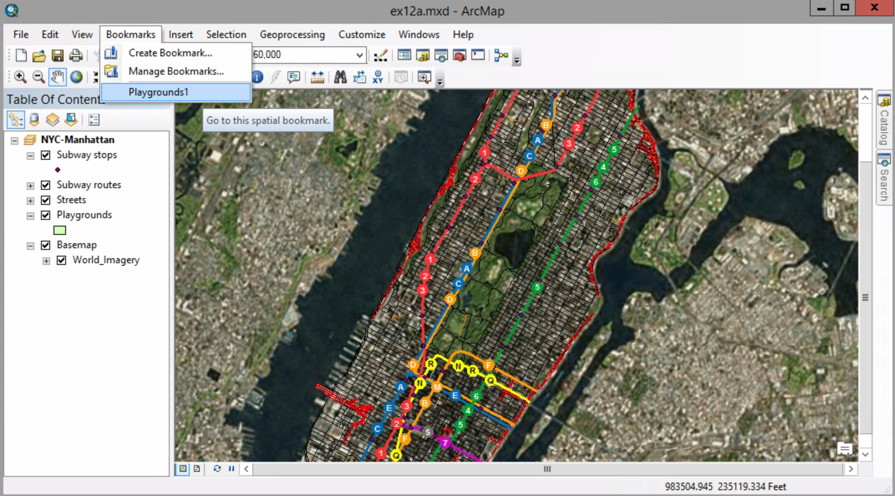

##### 3. Click the Editor Toolbar button

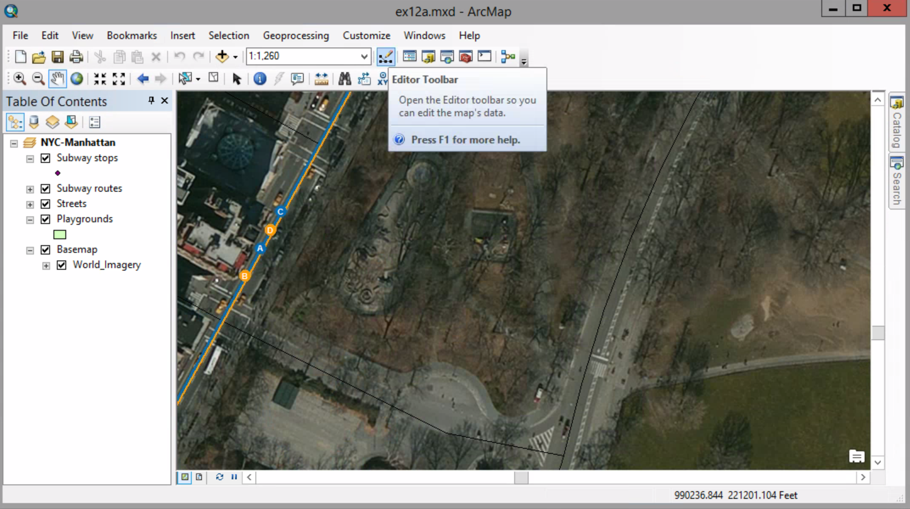

##### 4. On the Editor toolbar > Editor > Start Editing

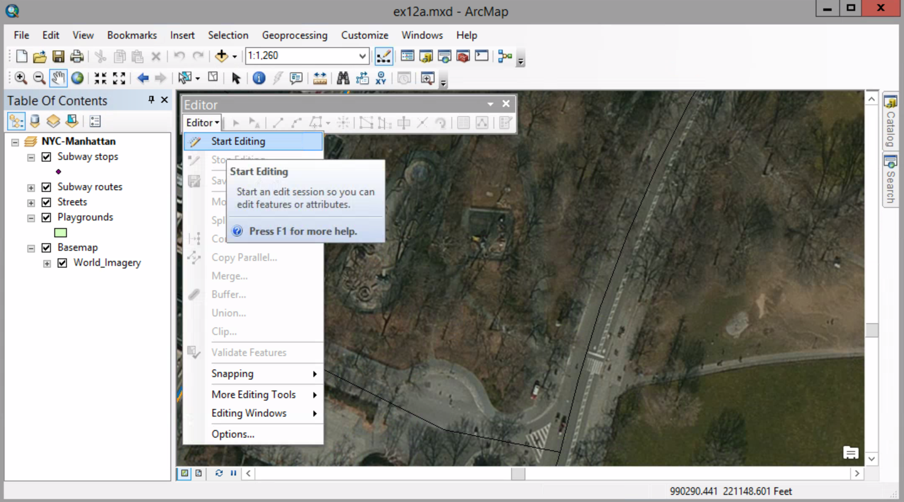

##### 5. On the Editor toolbar > Create Features 

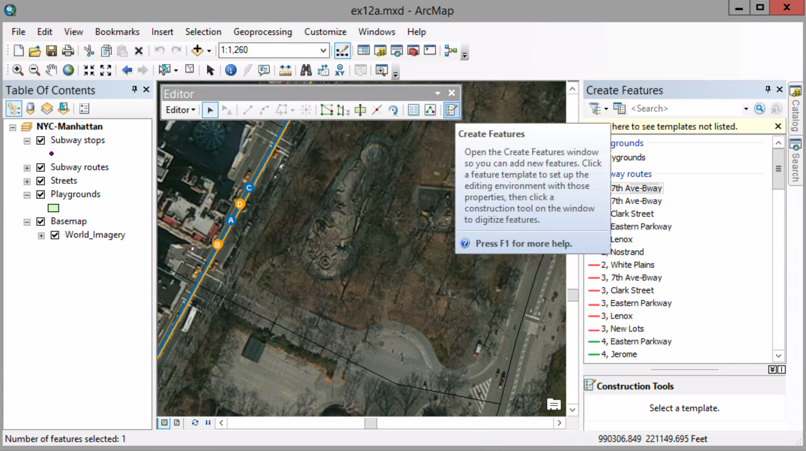

##### 6. Click Playground template. In the construction Tools, click Polygon.

##### 7. Move the mouse pointer over the map. Move it to the middle of the street-side edge of the large playground, and clickto creat the first vertex.

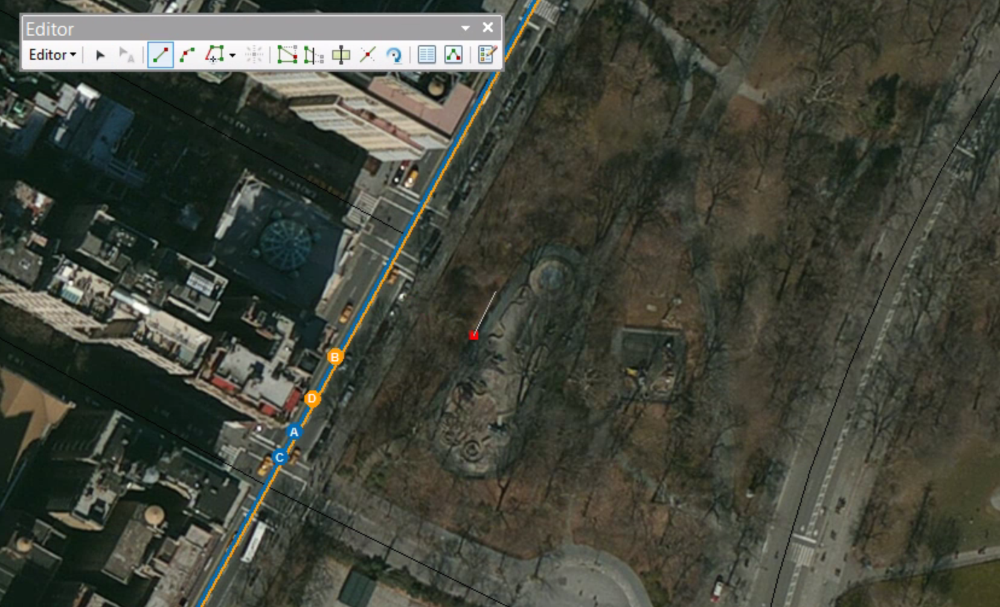

##### 8. Move your pointer to the northermost edge of the playground, just before the curved end, and click.

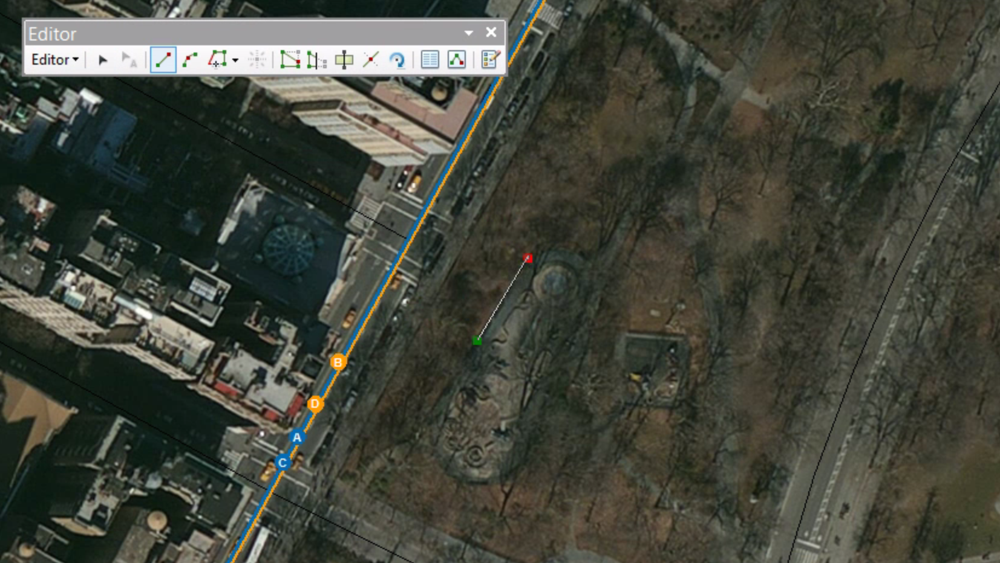

##### 9. On the Editor toolbar, click the End Point Arc Segment tool. Click once to place a vertex on the eastern edge of the curved end. Then move your mouse northward to adjust the curvature of the line.

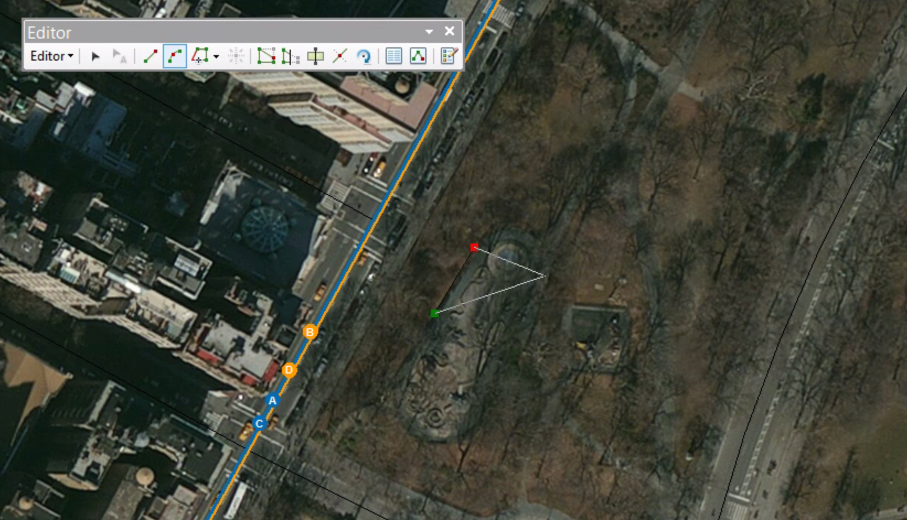

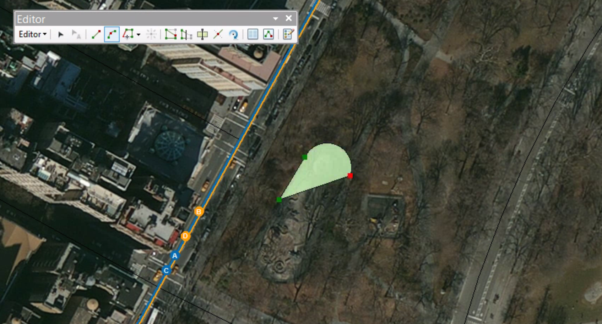

##### 10. Activate the Straight Segment tool. Click to place another vertex just before the southern curved end of the playground.

##### 11. Switch to the End Point Arc Segment tool, and create another curved line to match the image layer. Click to finish the curved line.

##### 12. Right-click > Finish Sketch

##### 13. Digitize the second, smaller playground.

##### 14. With the second playground still selected, on the Editor toolbar, click the attribute button.

##### 15. For the Inspect_Date field, enter today's date. For the Name field, enter Adventure Playground B.

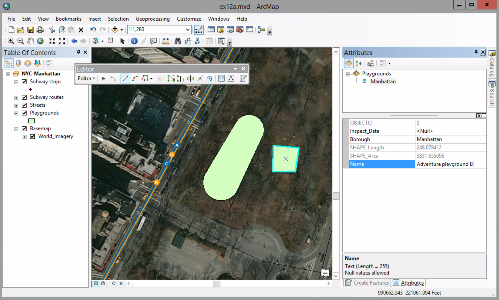

##### 16. Close the table. On the Editor toolbar, click Editor > Stop Editing. Click Yes to save your edits.

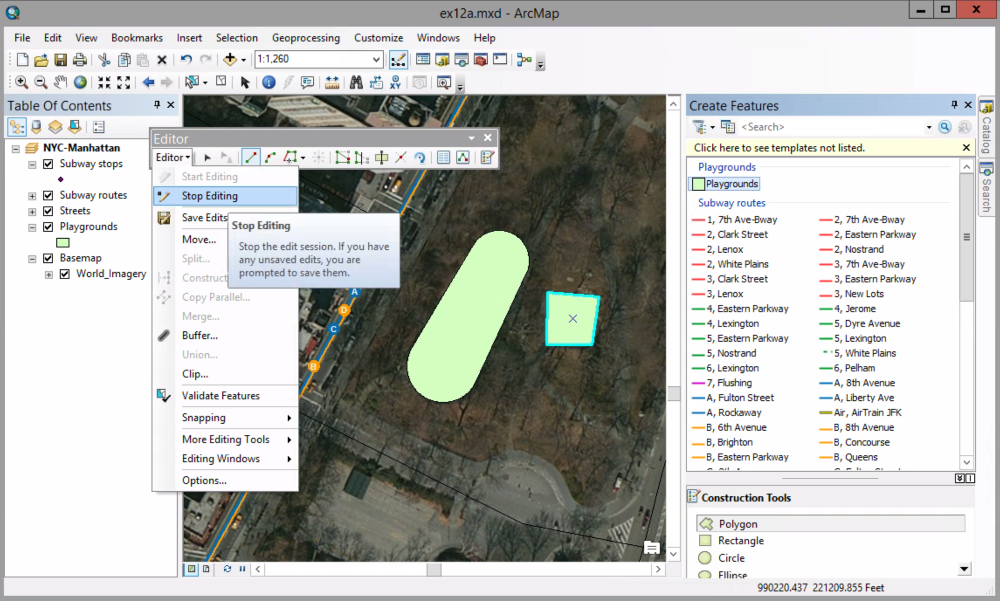

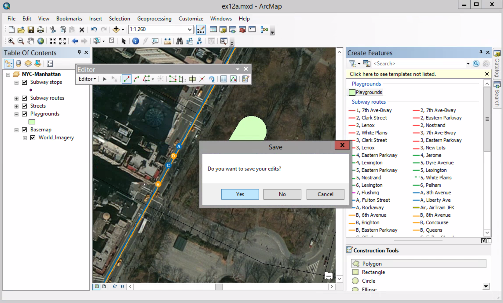

