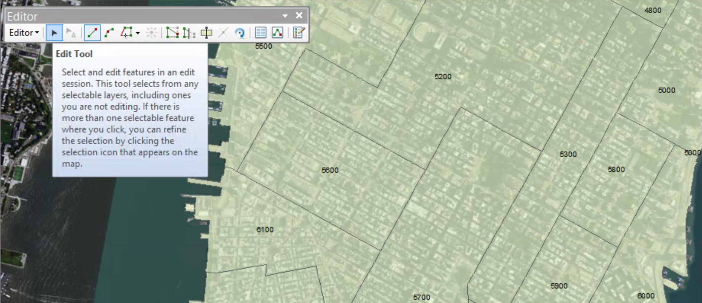

# Splitting and Merging Features

##### 1. Open the map file.

##### 2. Go to the 5700 bookmark

##### 3. On the toolbar, click the identify tool and click health area 5700.

##### 4. Close the identify window.

##### 5. Turn on the Editor toolbar. Start an edit session and open the Create Feature window.

##### 6. In the Create Feature window, click Health areas and the Polygon tool.

##### 7. Active Edit tool

##### 8. Click area 5700 to select it. 

##### 9. Click Cut Polygon tool.

##### 10. Move the pointer to the position shown in the graphic. When the cursor snaps to the intersection, click the mouse button.

##### 11. Move your pointer over the second intersection. When the cursor snaps to it, double-click to end the split line.

##### 12. Clear the selection, and then save your edits.

##### 13. Click the identify tool. Click each of the two new parcels, and examine the Shape_Area values.

##### 14. Close the identify window. Pan slightly to the east, so health areas 6700 and 6300 are in the view.

##### 15. Active edit tool, and select both area 6300 and area 6700 by holding Shift.

##### 16. Click Editor > Merge. On the Merge dialog box, click 6700, and then click OK.

##### 17. Open the sttribute table for the Health areas layer. Click on Show selected records button of the table to display the selected records.

##### 18. Click Editor > Stop Editing. Click yes to save your edits.

