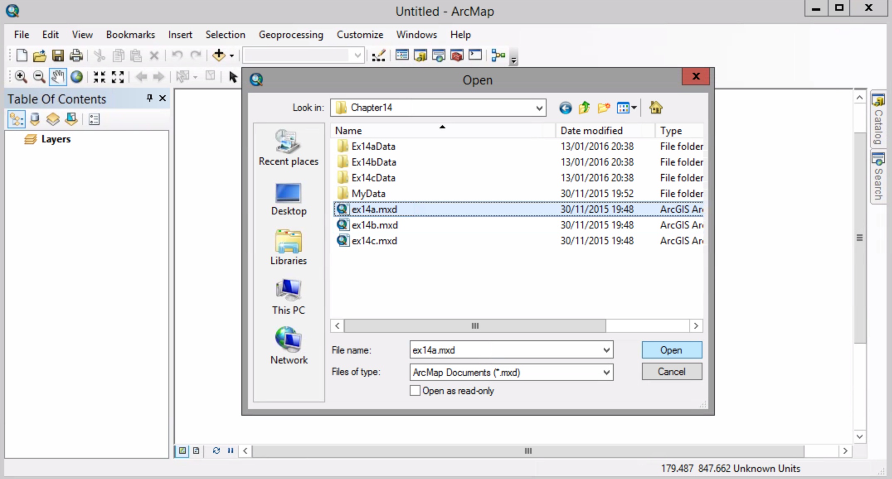
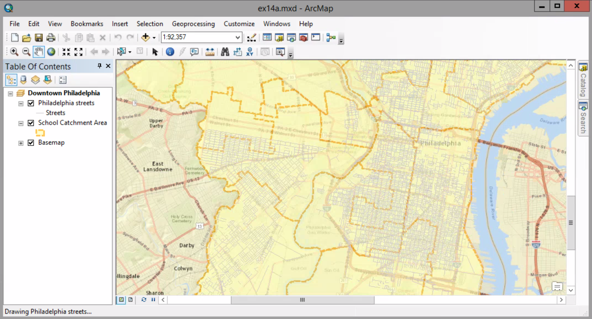
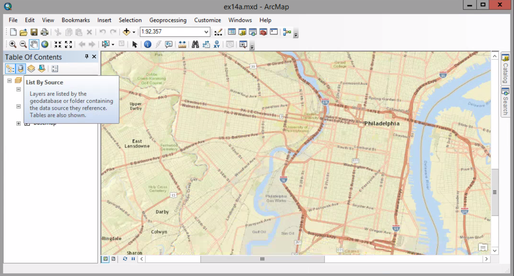
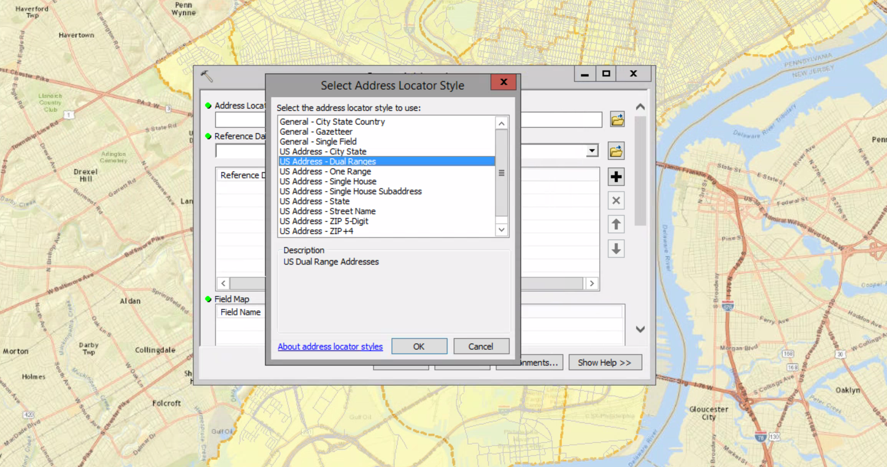
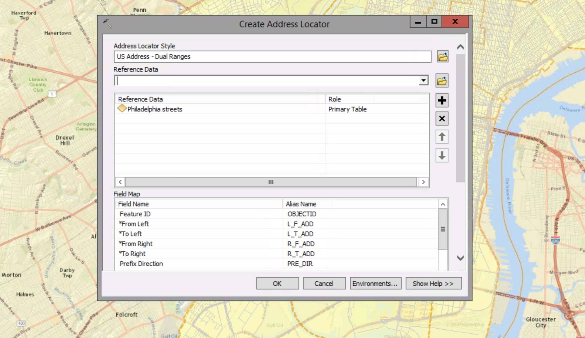
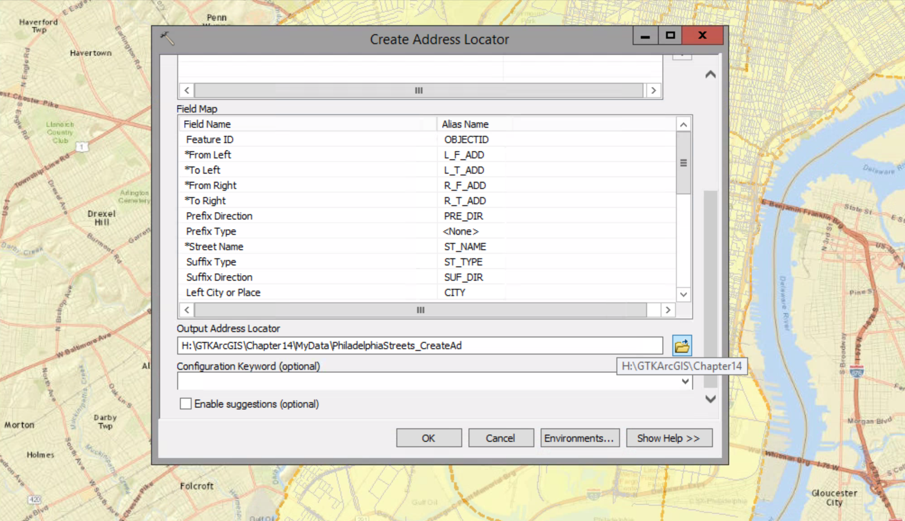
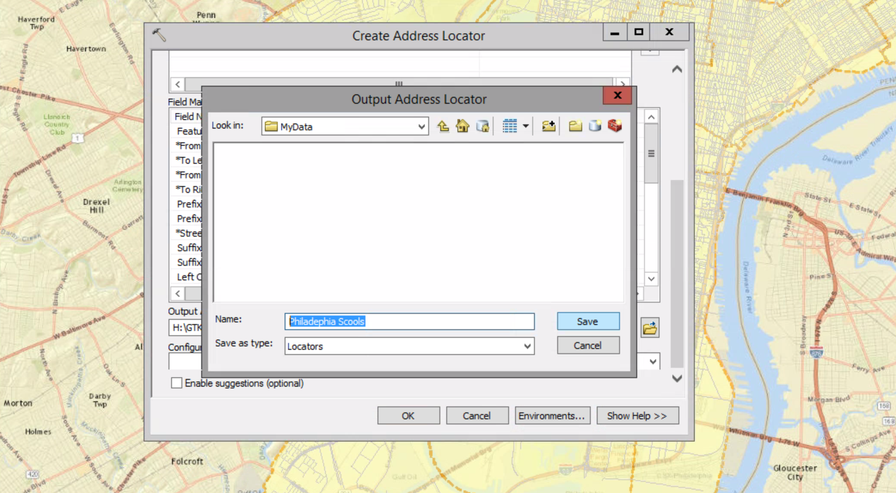
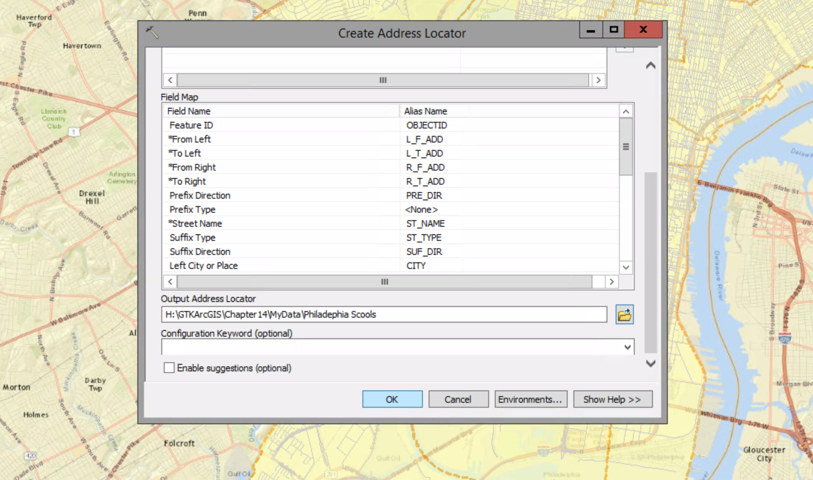

# Creating an Address Locator

The process of creating map features from addresses, place-names, and similar information is called **geocoding**.

Geocoding requires:
- an address table
- reference data ( To find the location of address points) 
- an address locator

An address locator is a file that contains the refrence data and various geocoding rules and tolerances (which are defined by an address locator style)

##### 1.Open the ex14a map document.

##### 2. At the top of the table of contents, click the List By Source button.

##### 3. Open the School table.

##### 4. Open the table for the Philadelphia streets layer.

The attributes in the streets table most closely match the **US Address-Dual Ranges** addresss locator style. 

##### 5. Open the Catalog window in ArcMap.

##### 6. Navigate to \Chapter14\MyData. Right-click MyData and click New > Address Locator.

##### 7. Click the Browse button next to the Address Locator Style box. Choose US Address-Dual Ranges, and click OK.

The Dual Range style is used for address ranges tath have data for both sides of a street segment. 

##### 8. Click the Reference Data box drop-down arrow and choose Philadelphia streets. 

##### 9. Scroll down to view the Field Map list.

##### 10. Click the Browse button next to the Output Address Locator box. Save it as Philadephia School in MyData Folder.

##### 11. Click Ok To create the address locator.

