# Matching Addresses

Now that you have created an address locator in exercise 14a, you can compare the table of addresses to the reference data attribute and look for matches.

##### 1. Open the ex14b map document.

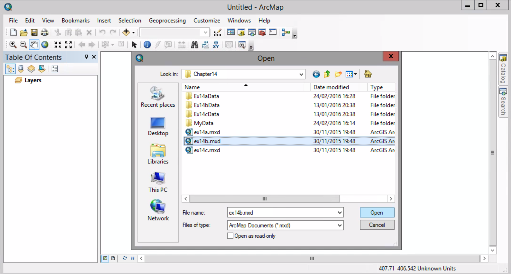

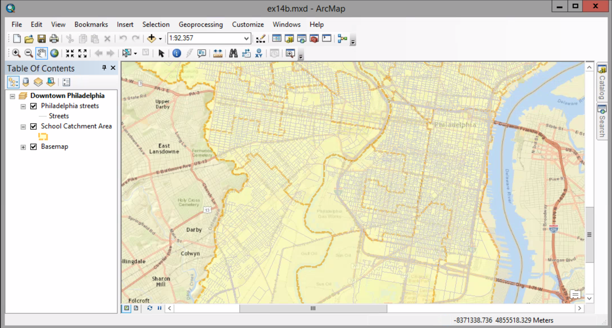

##### 2. Click Customize menue > Toolbars > Geocoding

##### 3. Click the Select Address Locator arrow and click Manage Address Locators...

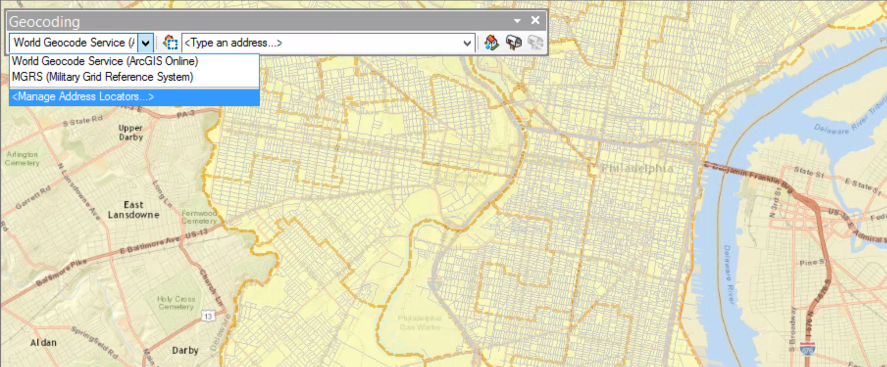

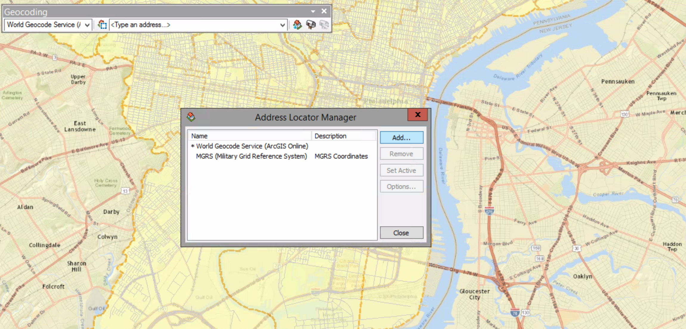

##### 4. Click Add. Navigate to MyData folder. Click the Philadephia Schools address locator you created before in Ex.14b and click Add. 

##### 5. Close the dialog box.

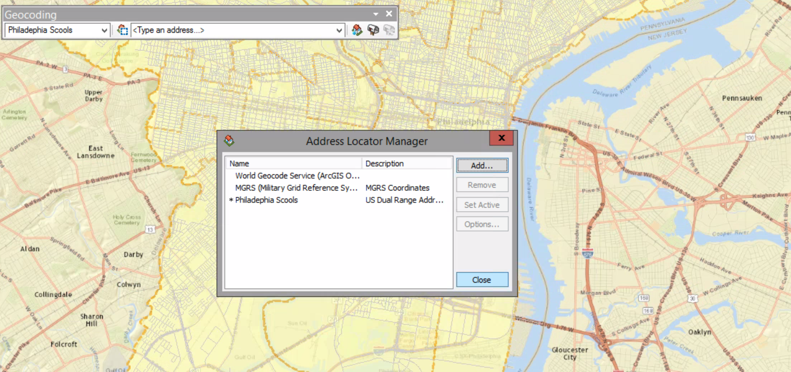

##### 6. Click the Find button. On the dialog box, click the location tab. The Philadelphia Schools address locator is displaed in the Choose a locator list. If isn't select it.

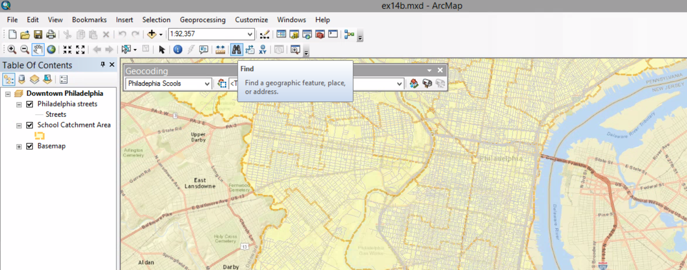

##### 7. In the full Address box, type 2101 South Broad St Philadelphia, the address of South Philadelphia High School, and then click Find.

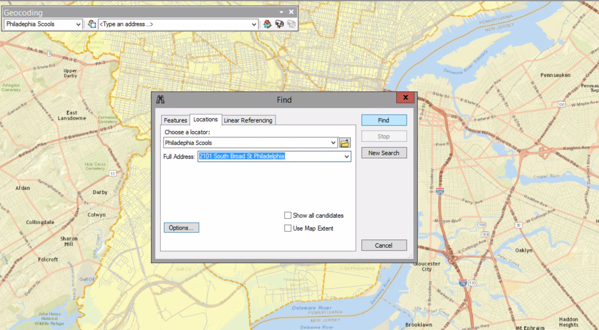

##### 8. Scroll across the dialog box and look at the candidates' address information.

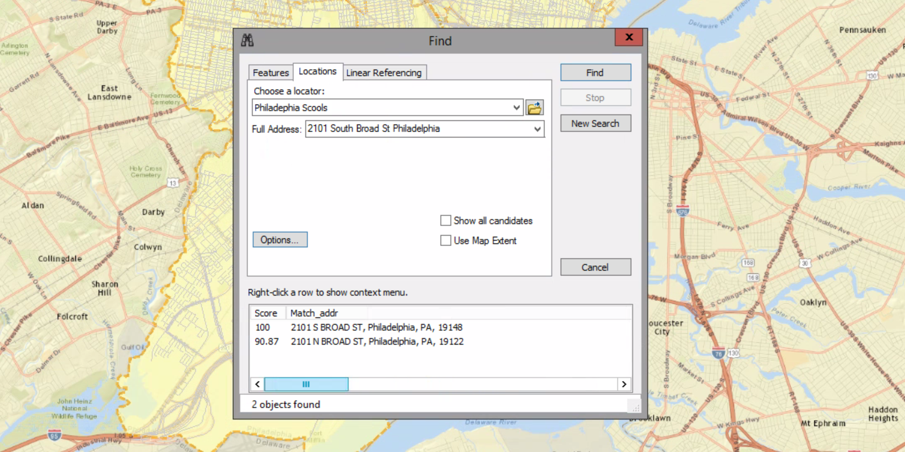

##### 9. Click the first candidate to highlight it. Righ-click on that > Add point. Close the Find dialog box.

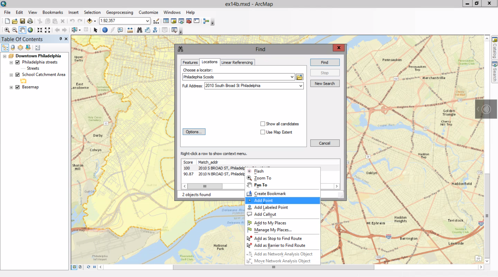

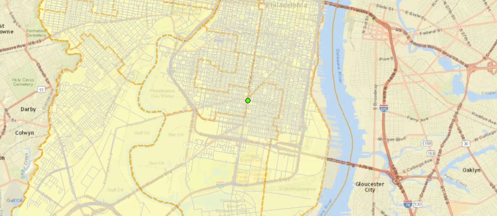

ArcMap places a colored dot on the map at the location of the candidate.

This point is actually a graphic, not a feature associated with a shapefile.

##### 10. Click the Select Element tool. Click the graphic to select it.. Press Delete.

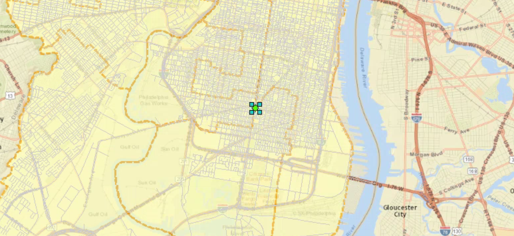

##### 11. In the table of contents, make sure the Schools.csv table is highlighed. On the Geocoding toolbar, click the Geocode Addresses tool.

On the "Choose an address Locator to use" dialog box, the Philadelphia Schools address locator is highlighted.

##### 12. Click OK to open the Geocode Addresses dialog box.

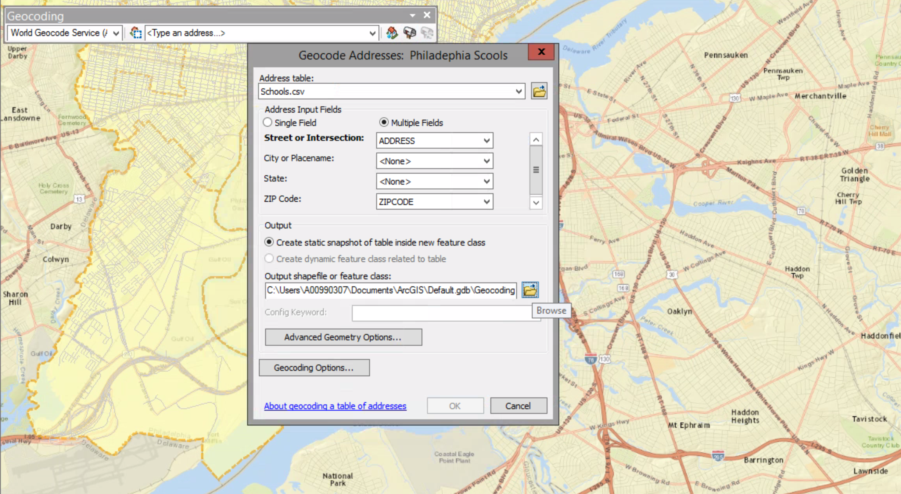

##### 13. Click the Browse button next to the Output shapefile or feature class box.

##### 14. On the Saving Data dialog box, browse to MyData folder name the output Geooded_Schools.shp. Make sure the Save as type list is set to Shapefile and click Save.

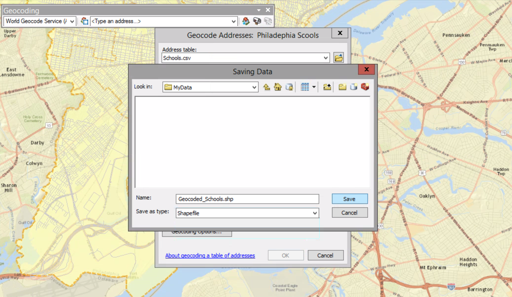

##### 15. Click Ok to begin the process.

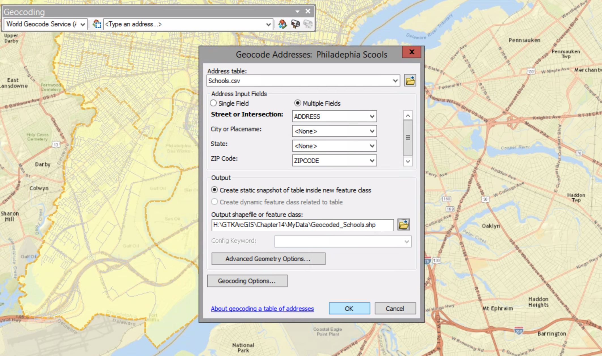

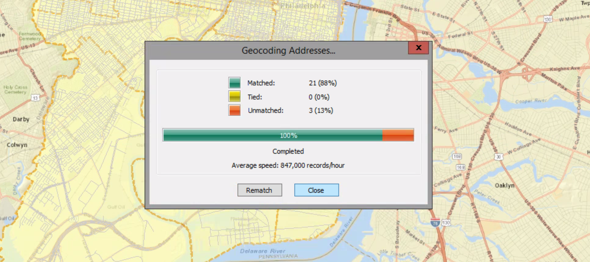

##### 16. Close the resulting window.

Now you can see the resulted Geocoded layer listed at the top of the table fo contents.

##### 17. Open the attribute table for the Geocoding Result: Geocoded_Schools layer.

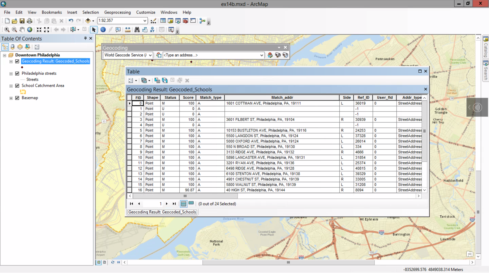

The table contains 24 records, one for each address in the Schools table.

The Status attribute tells you whether each address was matched (M), unmatched (U), or tiled (T).

Point geometery is created for records with M only.

