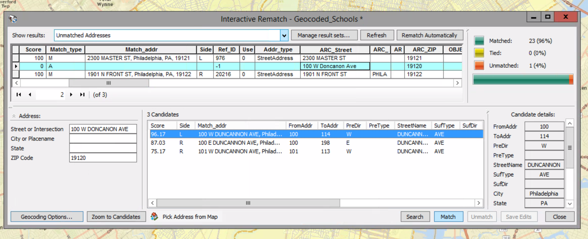

# Rematching Addresses

When you geocode at the street address level, it is common to have addresses that aren't matched.

##### 1. Open the ex14c map document.

##### 2. Click the Add Data button to add Geocoded_Schools.shp from the MyData folder which you created before in Ex.14b. If a Warning dialog box appears, click Close.

##### 3. In the table of contents, make sure the Geocoded_Schools layer is highlighted. Open the Geocoding toolbar, and click the Review/Rematch Address button.

Here you see the results from Ex.14b.

##### 4. Click the Show results arrow and click Unmatched Addresses. Horizontally scroll to the right to see the actual addresses of the Unmatched records.

##### 5. Ensure the record with the address "2300 Masterst" is selected. In the Address panel, insert a space in between the R and ST. And press Enter.

##### 6. Make sure the candidate is highlighted and click Match.

The candidate is matched now.

##### 7. Select the record with the address "1901 N Front St". In the Address panel, type Philadelphia into the City or Placement box. And press Enter.

##### 8. In the candidates table, horizontally scroll to the right and notice that the ZIP Code for the top candidate is 19122.

##### 9. In the address panel, highlight the ZIP Code value 19125 and type 19122. Then press Enter.

##### 10. Make sure the first candidate is highlighted and click Match.

The candidate is matched.

##### 11. Select the record with the address "100 W Doncanon Ave" and click the Geocoding Options button. Change the Spelling sensitivity to 50 and click OK.

##### 12. Make sure the first candidate with the score 96.17 is selected and click Match.

The candidate is matched.

##### 13. Close the dialog box.

##### 14. Active lable features of the Geocoded_Schools layer.

##### 15. Open the attribute table for the layer.

All the records have the value M in the Status field.

