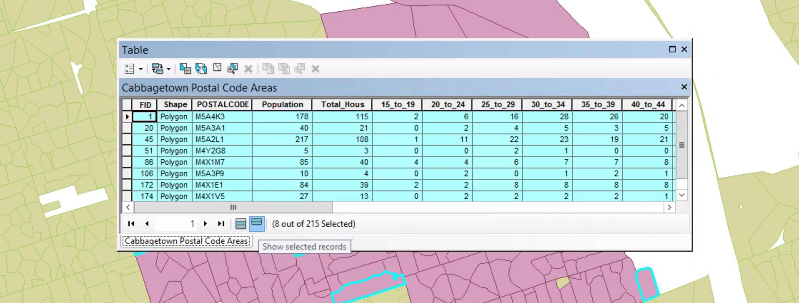

# Selecting anf Finding Features

##### 1. Open the map document.

##### 2. Click the HTML Pop-up tool. The mouse pointer becomes a hand and pointer finger.

##### 3. On the map, click a postal code feature.

The HTML pop-up window displays the feature's attribute values. 

##### 4. Click a few more postal code areas. A new HTML pop-up window appears each time you click a feature. Arrange them side by side.

##### 5. Close the HTML pop-up windows. In the table of contents, click the List By Selection button.

##### 6. For both the Roads and Surrounding Postal Code Area Layers, click the toggle key to make them not selectable.

##### 7. Selection menu > Selection Options.

On the Selection Option dialog box, the selection tolerance is set to 3 pixels. Because you are working with small features, you will reduce it.

##### 8. Reduce the selection tolerance from 3 to 0, and click OK.

##### 9. Selection menu > Interactive Selection Method > Add to Current Selection

The Add to Current Selection option allows you to click features without the need to press and hold Shift.

##### 10. Click the Select Features tool.

##### 11. On the map, click the postal code areas shown in the graphic, one at a time. The table of the contents shows how many postal codes are selected and the name of each postal code.

##### 12. Open Attribute table of the Cabbagetown Postal Code Areas laye.

##### 13. Click the Show selected records button.

##### 14. Schroll to the right in the table to see its attributes. Right-click the Total_Hous field name. On the shortcut menu, click Sort Descendind.

##### 15. Click the gray tab to the left of the first record.

The record is highlighted in yellow, as is the corresponding map feature.

##### 16. Close the attribute table. On the menu bar, click Selection > Clear Selected Features.

##### 17. In the table of contents, switch back to the List by Drawing Order view and open the properties of the Cabbagetown Postal Code Areas layer. On the Layer Properties dialog box, click Display tab > Hiperlink frame >

##### select the "Support Hyperlinks using field" check box. 

##### Below the check box, click the field list arrow and click IMAGE. 

##### Below the list, make sure the Document option is selected.

##### Click OK.

##### 18. On the Tools toolbar, click the Hyperlink tool.

Hyperlinked features are outlined in blue. Pausing the mouse pointer over a feature that is hyperlinked displays the path location to the document (in this case, a photo). 

##### 19. Click any hyperlinked feature to display a photograph of the property. 

Prior to your work in ArcGIS, your coworker suggested that you investigate the average household income of a postal code M4X1C5.

##### 20. Click the Find tool. On the Feature tab, in the Find box, type M4X1C5.

##### 21. Click the "In" arrow and select Cabbagetown Postal Code Areas. Under Search, click the In field option, and then click the arrow below and click POSTALCODE. Then click Find.

##### 22. In the lower portion of the dialog box, right-click M4X1C5 > Identify

##### 23. In the Identify window, scroll down to view the average household income.

