# Using Attribute Queries

##### 1. Open the map document

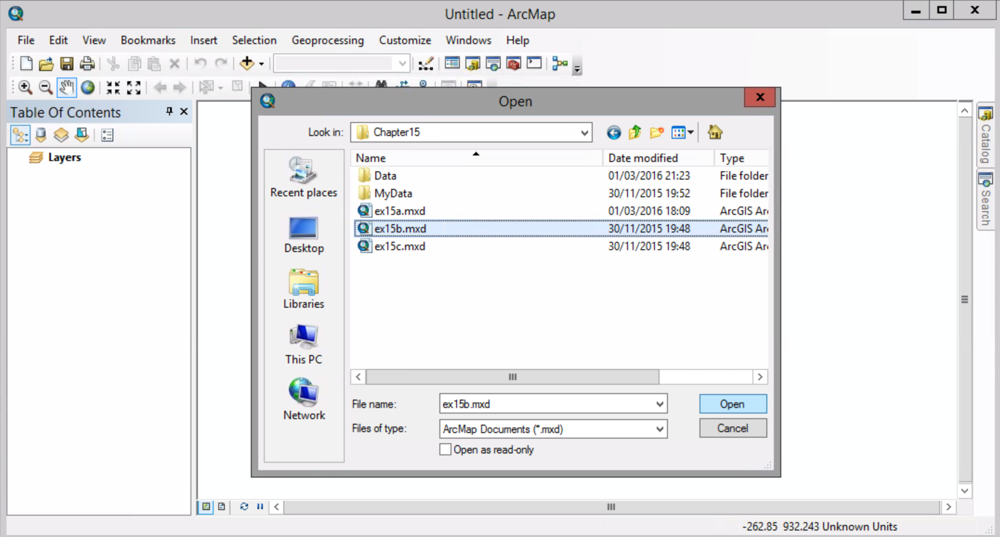

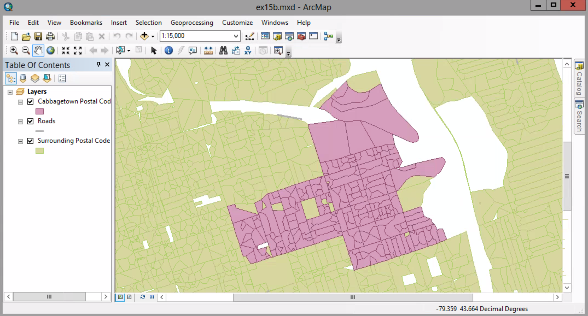

##### 2. Selection menu > Select By Attributes. On the Select By Attributes dialog box, set the Layer option to Cabbagetown Postal Code Areas.

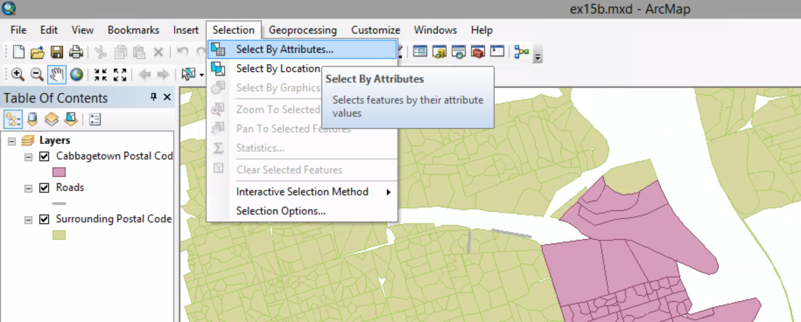

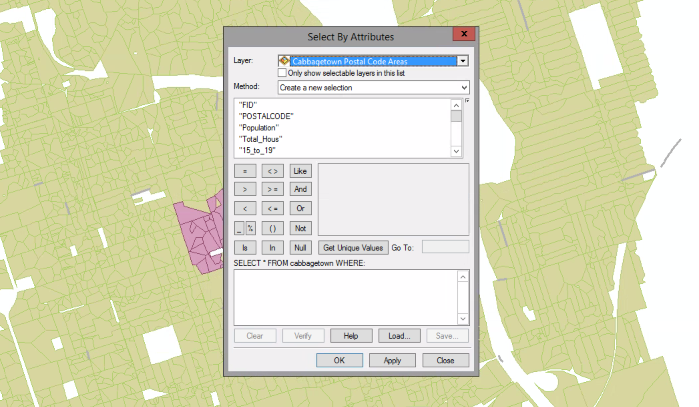

The first target you want to find is postal code areas with less than 5 percent of households purchasing groceries online.

##### 3. In the Fields list, scroll to "GROCERY" and double-click it. In the lower portion of the dialog box type as you see in the graph.

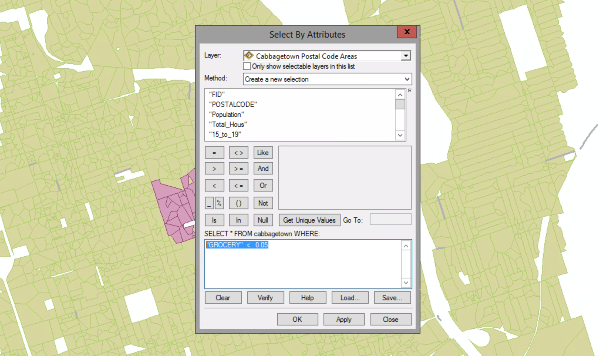

##### 4. Click OK

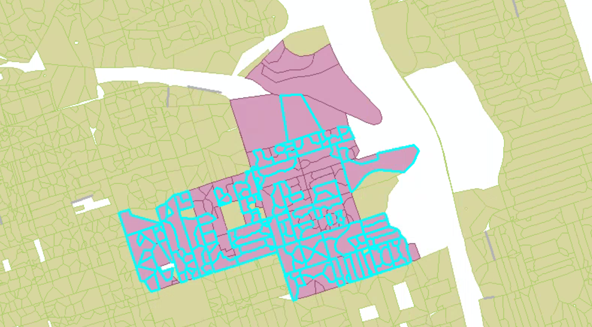

##### 5. Right-click the Cabbagetown Postal Code Areas layer and click Selection > Create Layer From Selection Features.

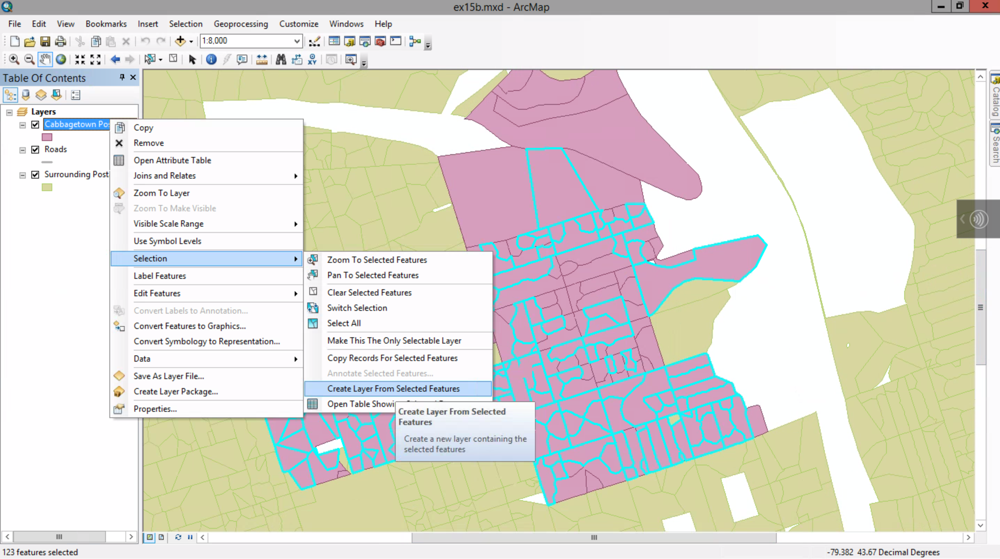

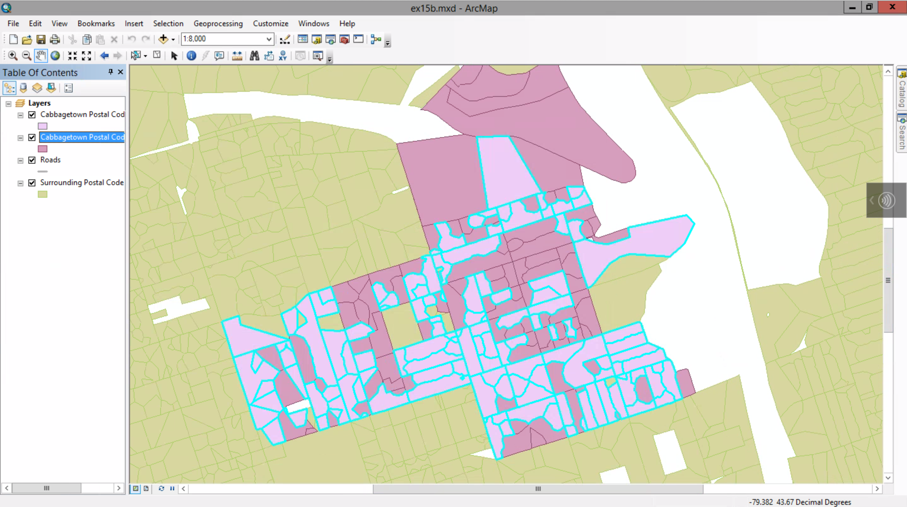

##### 6. Rename the new layer Grocery target.

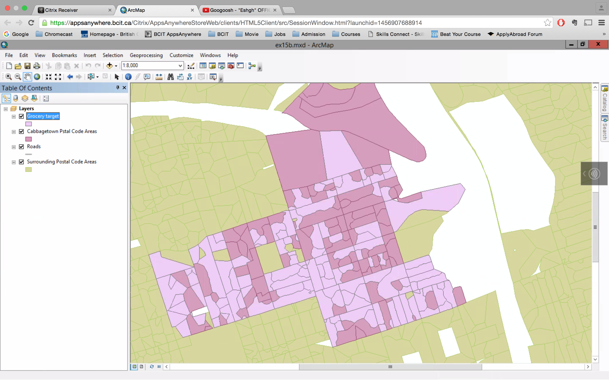

##### 7. Selection menu > Clear Selected Features

##### 8. Turn off the Grocery target layer. Click Selection menu > Select By Attributes. Make sure Cabbagetown Postal Code Areas is chosen in the layer list. Click the Clear button to clear the previous query.

##### 9. Type as you see in the graph. Click Apply.

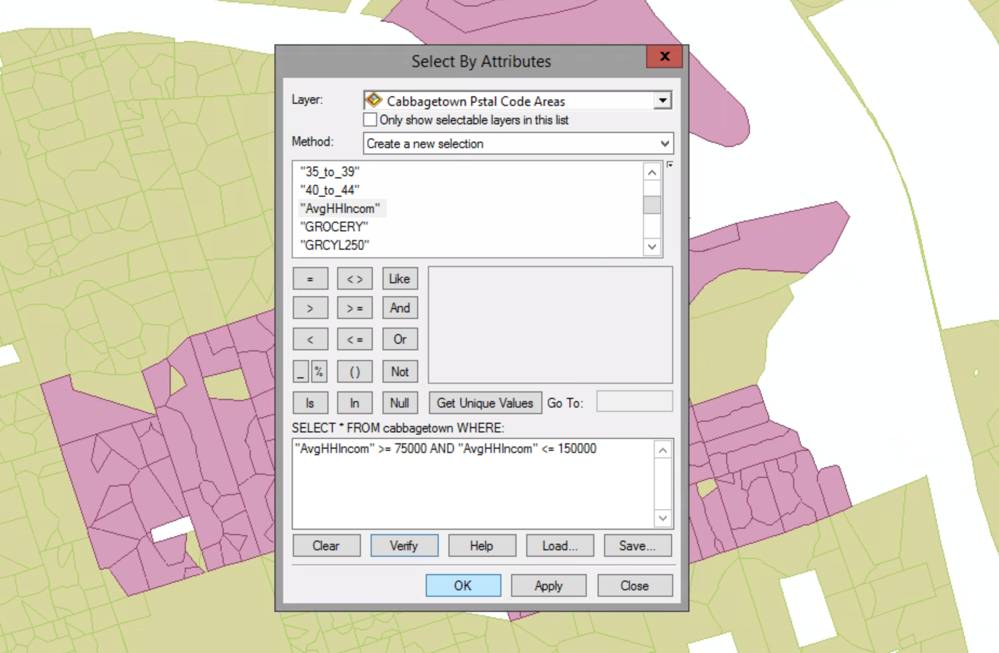

##### 10. Add "HMGRG250" > 0 to the query.

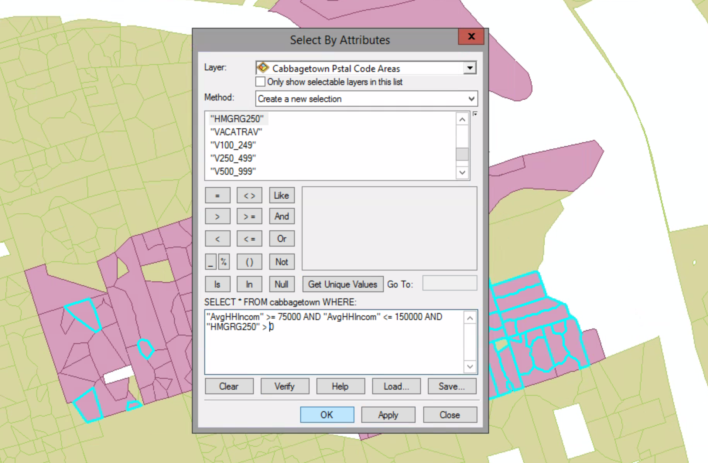

##### 11. Right-click the Cabbagetown Postal Code Areas layer and click Selection > Create Layer From Selected Features.

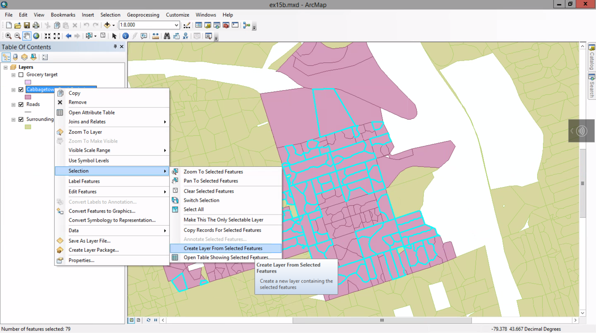

##### 12. Rename the new layer to Home and Garden target.

##### 13. Switch to the List By Selection view. In the Selectable category, click the Click to clear layer selection button for the Cabbagetown Pstal Code Areas layer. After that switch back.

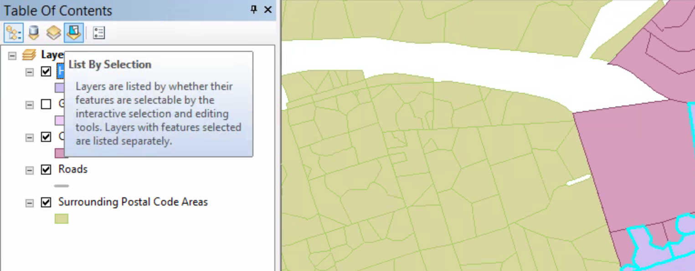

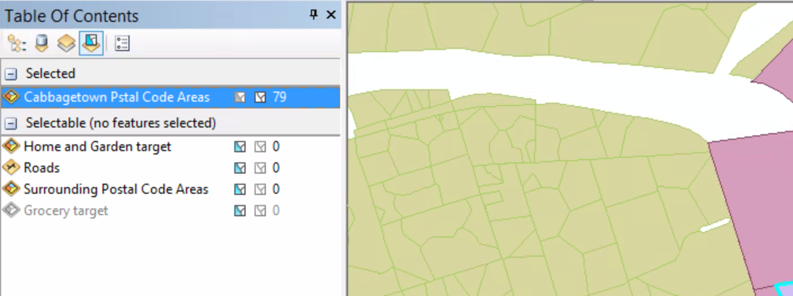

##### 14. Turn off the Home and Garden target layer. On the menu bar, click Selection > Select By Attributes. Make sure Cabbagetown Pstal Code Areas is chosen and clear the previous query.

##### 15. Type the query you see in the graph. 

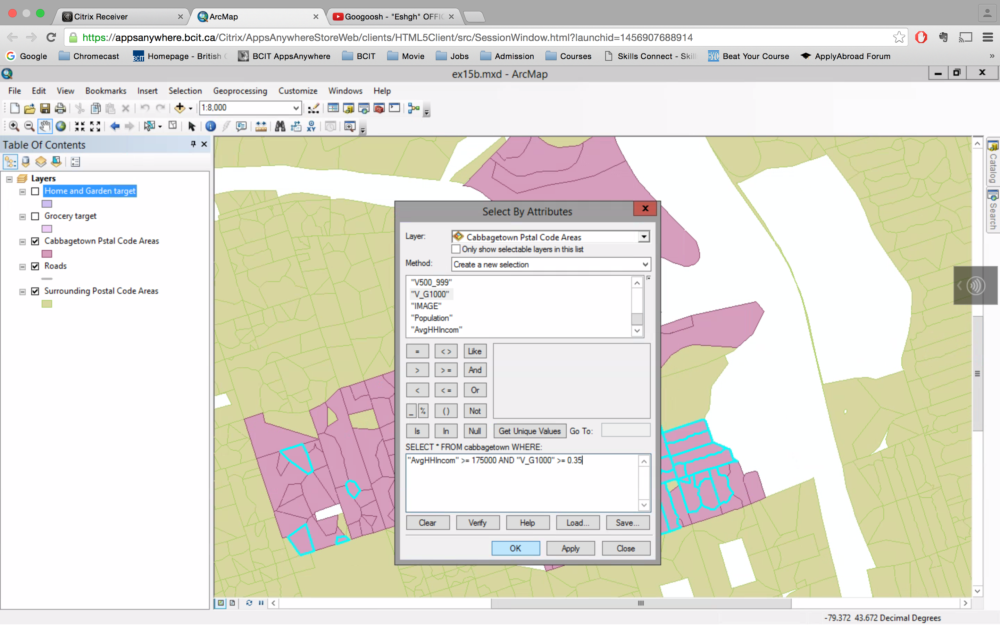

##### Click OK.

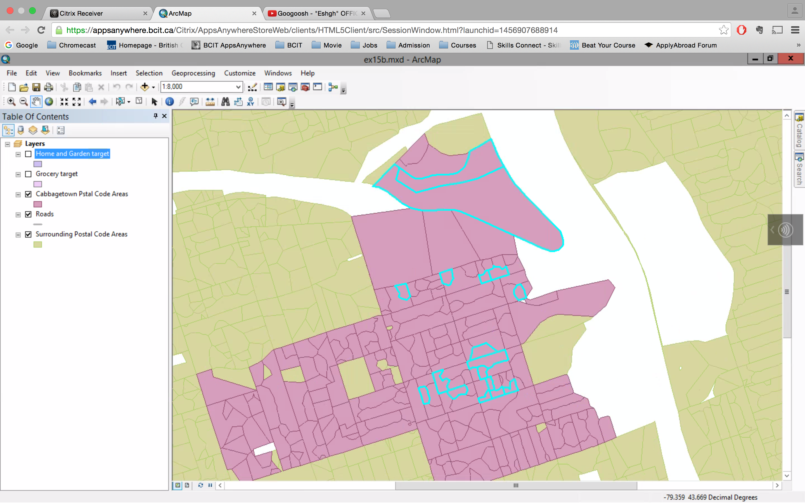

