# Creating Reports

##### 1. Open the map document.

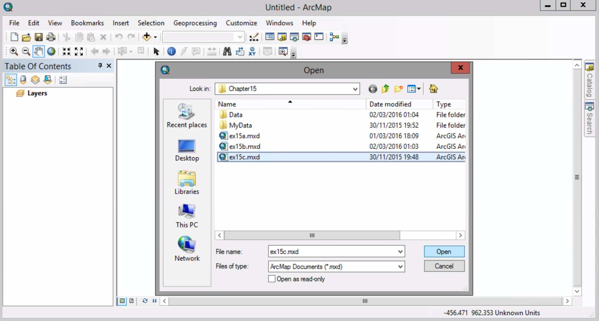

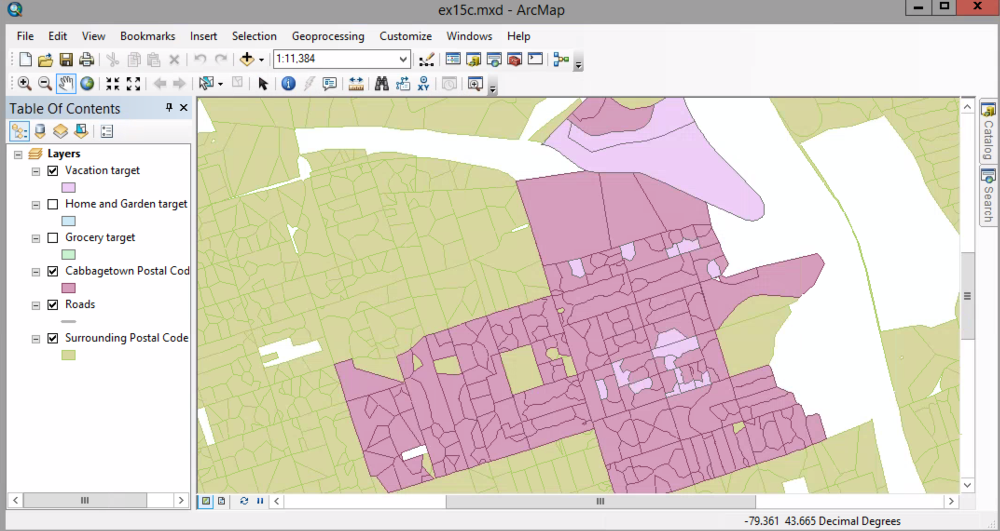

##### 2.  View menu > Reports > Create Report.

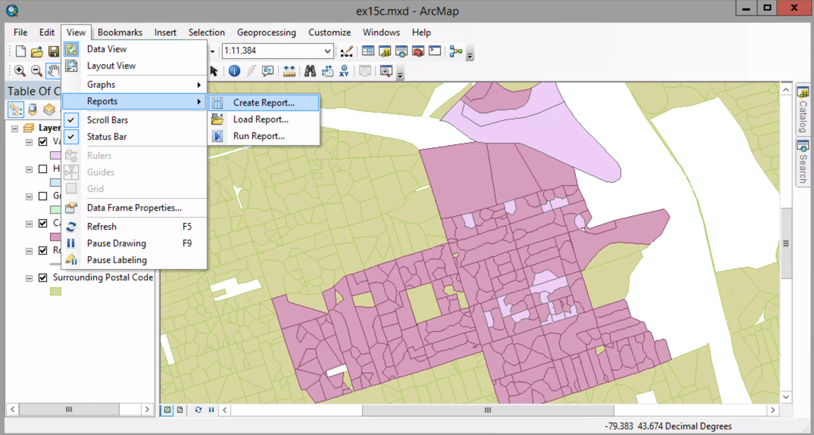

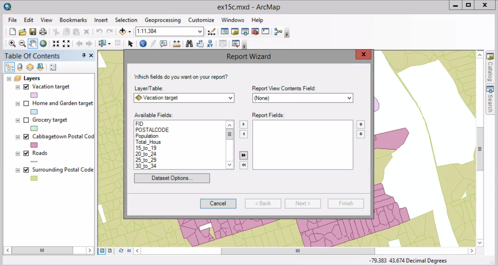

##### 3. Make sure the Layer/Table list shows Vacation target. In the Available Fields list, click POSTALCODE. Click the Add field button.

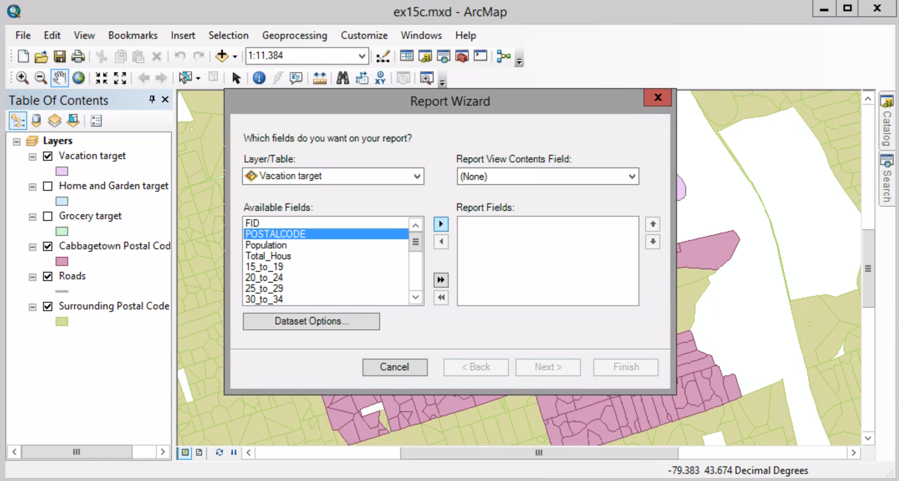

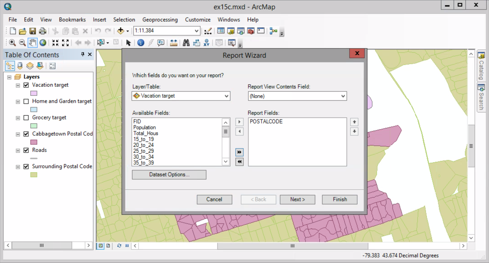

##### 4. Add some others as you see on the graph.

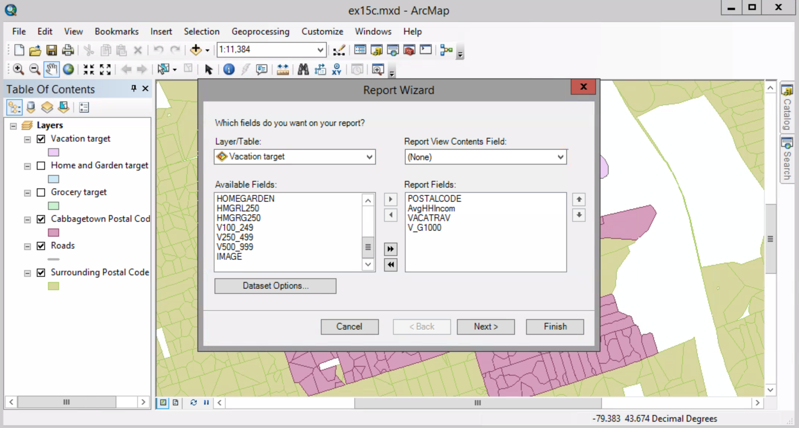

##### 5. Click the Report Viewer Contents Field arrow and click POSTALCODE. This means this field will be displayed when you preview the report.

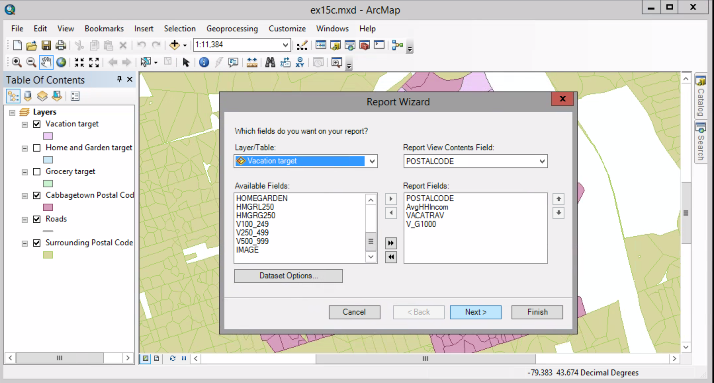

##### 6. Click Next,

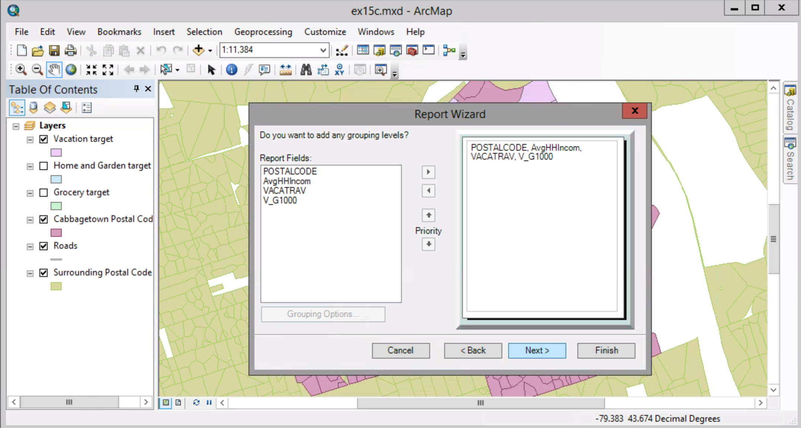

#####  and then Next agian

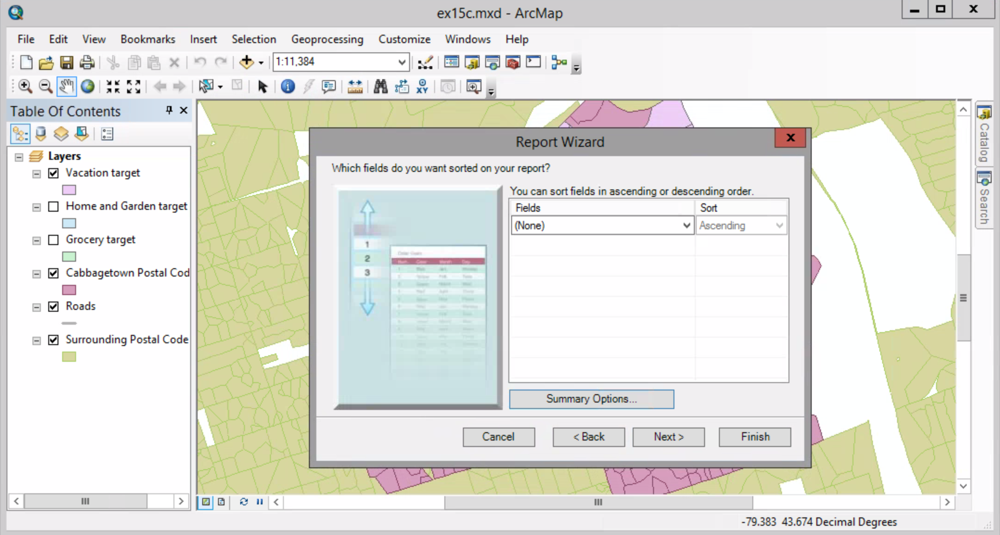

##### 7. In the Field column, select V_G1000 from the drop-down list and in the Sort column, select Descending from the drop-down list in the first row. Click Next.

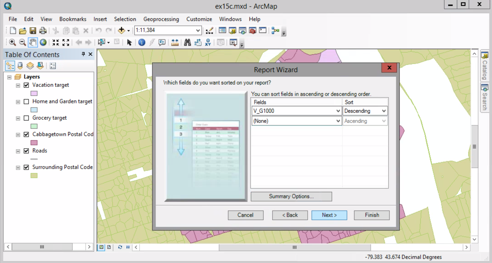

In the report, target postal code areas will appear in order from the highest to the lowest proportion of households that spent more than $1000 annually on online vacation travle. 

##### 8. In the next panel, set the orientation to Landscape, and then click Next.

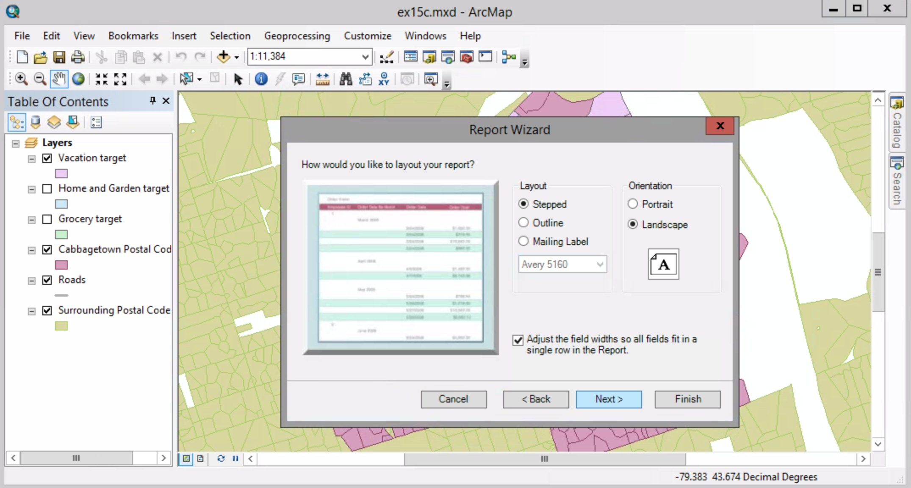

##### 9. Select Toronto style.

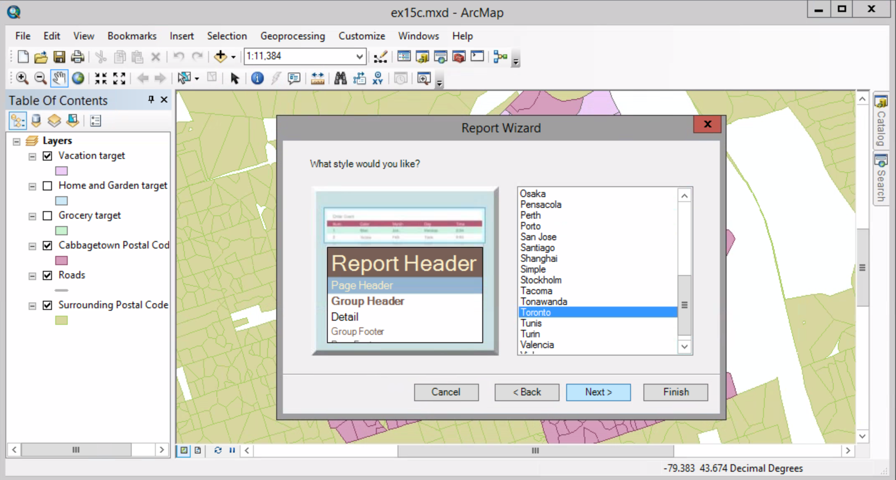

##### 10. Replace the text in the title box with ...
##### Make sure the "Preview the report" option is selected and click Finish.

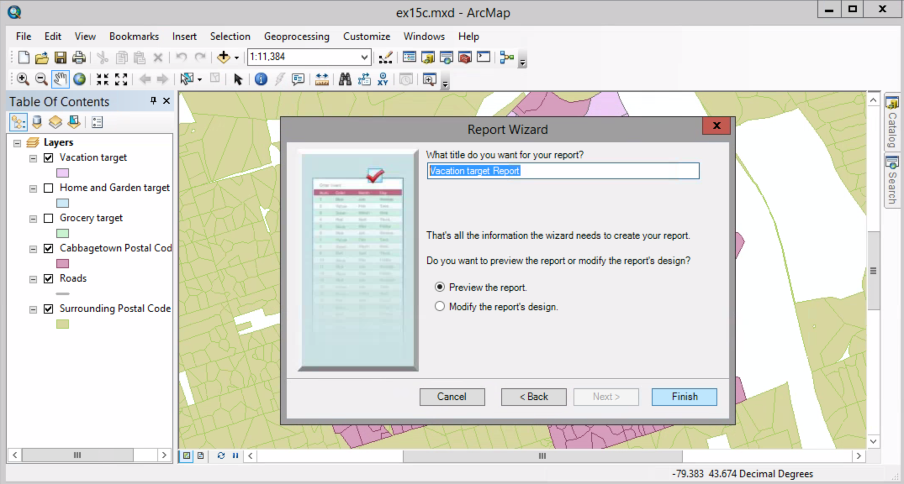

##### 11. In the uper-left corner of the Report Viewer window, click the Edit button.

##### 12. Click the AvgHHlncom pageHeader component.

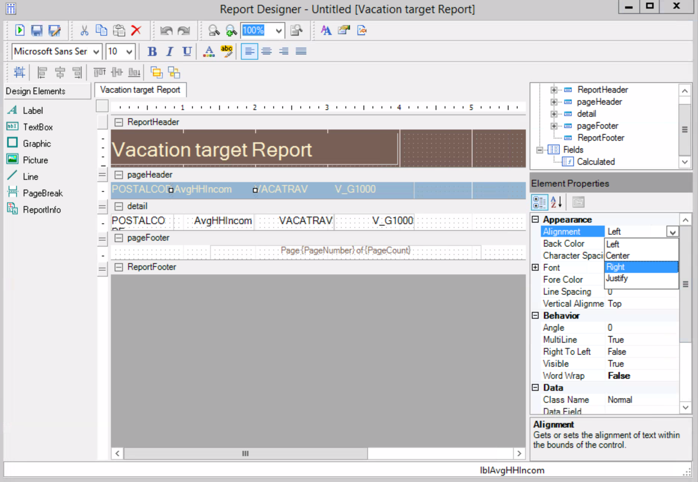

##### 13. Change the Alignment to Right

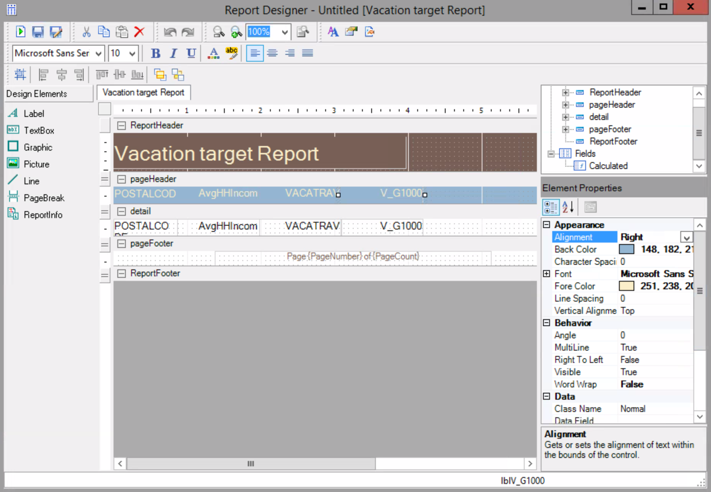

##### 14. Repeat the same right alignment for the VACATRAV and V_G1000 pageHeader component. Then, click the Run Report button.

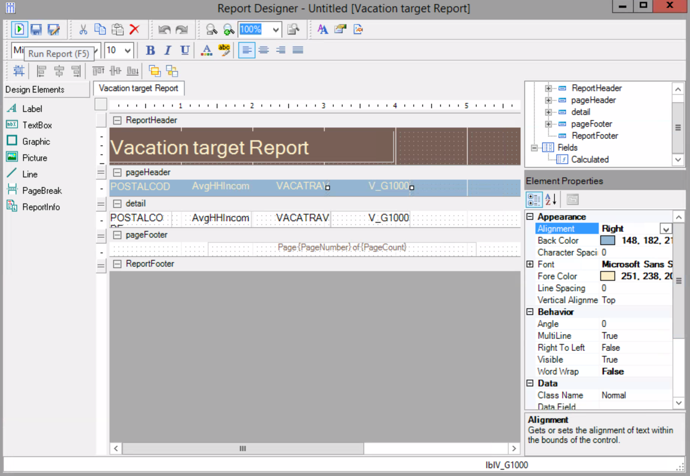

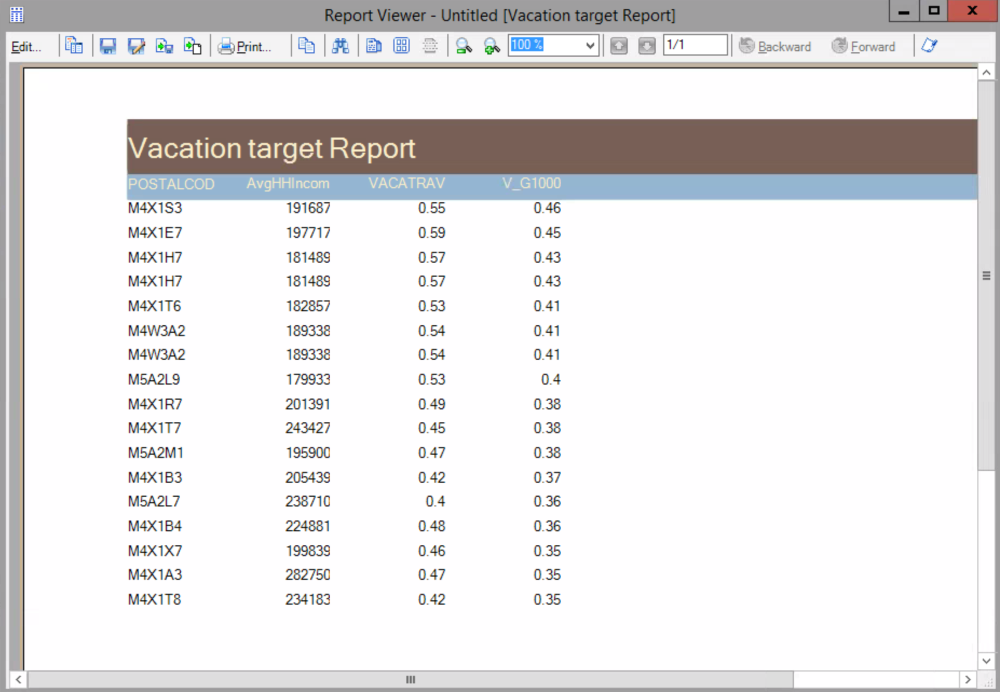

