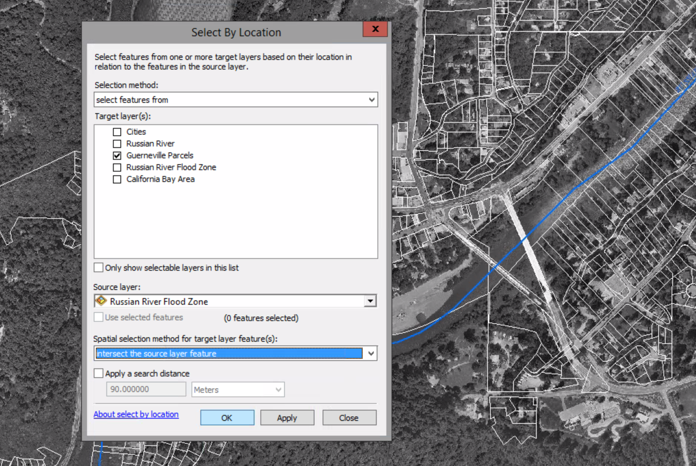

# Using location queries

##### 1. Open the map document

##### 2. Go to the Guernevile1 bookmark.

##### 3. Turn on the Russian River Flood Zone layer.

##### 4. Zoom to the Guernevile2 bookmark. Turn off the Cities and Russian River Flood Zone layer.

##### 5. Selection menu > Select by Location

##### 6. On the dialog box, do these settings:
##### Selection method --> select feature from
##### Target Layer(s) --> Guernevile Parcels
##### Source layer --> Russian River Flood Zone
##### Spatial selection method for target...  --> intersect the source layer feature
##### Click OK

##### 7. Turn on Russian River Flood Zone again.

You can see that tge parcels that intersect the flood zone are selected, even even if it's just a corner or a boundary in the parcel that intersects the flood zone.

##### 8. One the attribute table of the Guerneville Parcels and dock it (by double-click).

##### 9. Open the Select By Location tool dialog box. Again, select Guerneville Parcels as the Target layer and Russian River Flood Zone as the source layer. For the spatial selection method, again select "intersect the source layer feature."

##### 10. Select the "Apply a search distance" check box and set the search distance to 400 feet.

##### 11. Click Apply.

##### 12. For the spatial selection method, click the arrow, schroll to the bottom of the list, and click "have their centroid in the source layer feature."

This will weed out the parcels that have only a small part of land in the danger zone.

##### 13. Clear the "Apply a search distance" check box. Click Apply.

