# Combining attribute and location queries

##### 1. Open the map document.

In this exercise, you will select parcels that zoned residential (an attribute query) and that intersect the flood zone (a location query). 

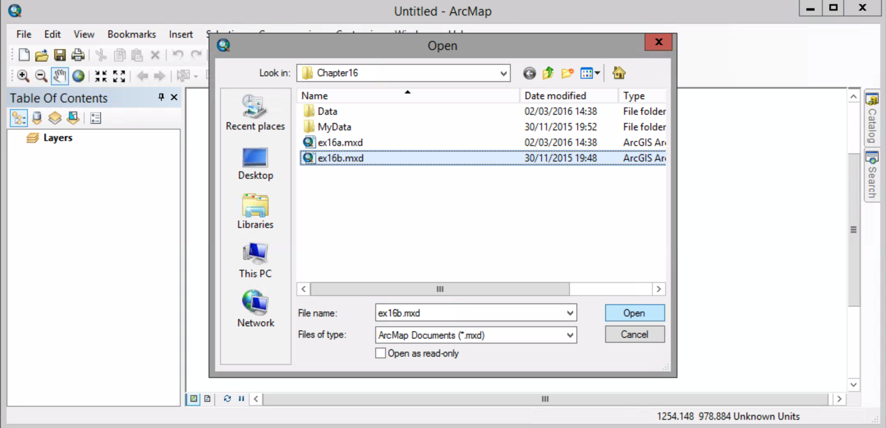

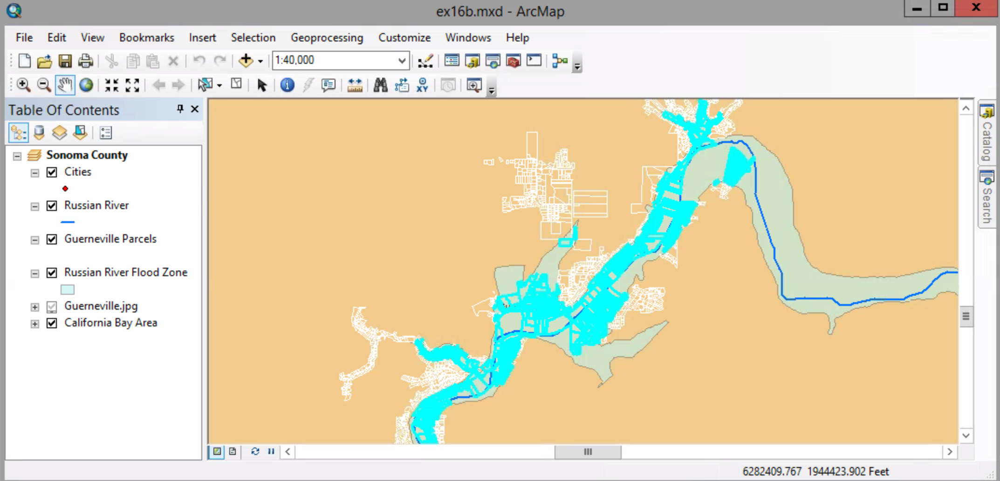

This map shows the results of ex. 16a, through step 7. The Guerneville parcels that intersect the flood zone have been selected.

##### 2. Active "Select By Attribute" dialog box.

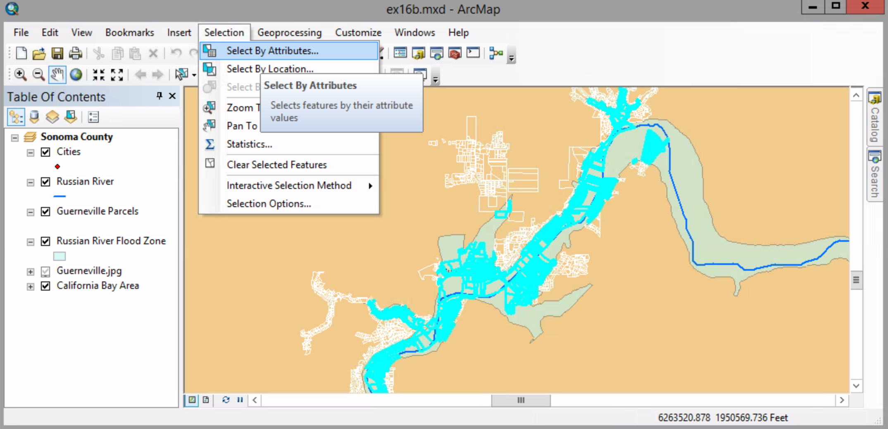

##### 3. Do these settings:
##### Layer --> Gueneville Parcels
##### Method --> Select from current selection

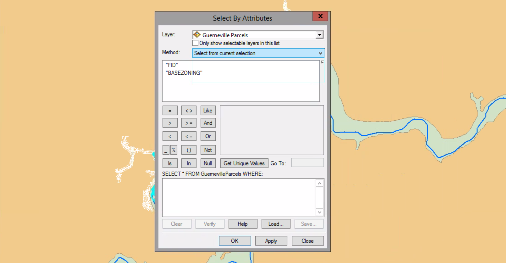

##### 4. In the fields list, double-click "BASEZONING" to add it to the expression box. Click the equals sign (=) to add it to the expression.

##### 5. Click Get Unique Values. The values for the BASEZONING field are listed.

##### 6. In the list of values, double-click 'Residential' to add it to the expression. Click OK to make the selection.

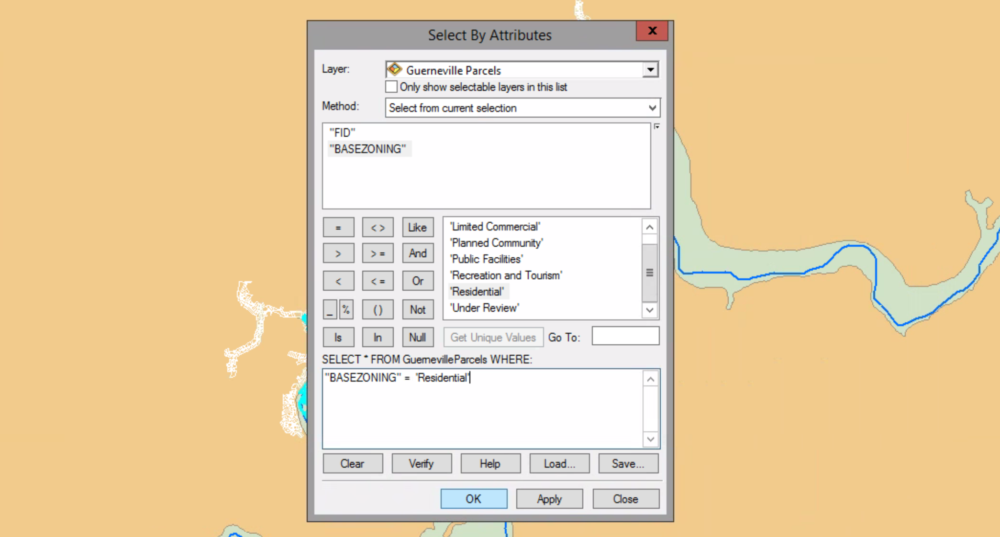

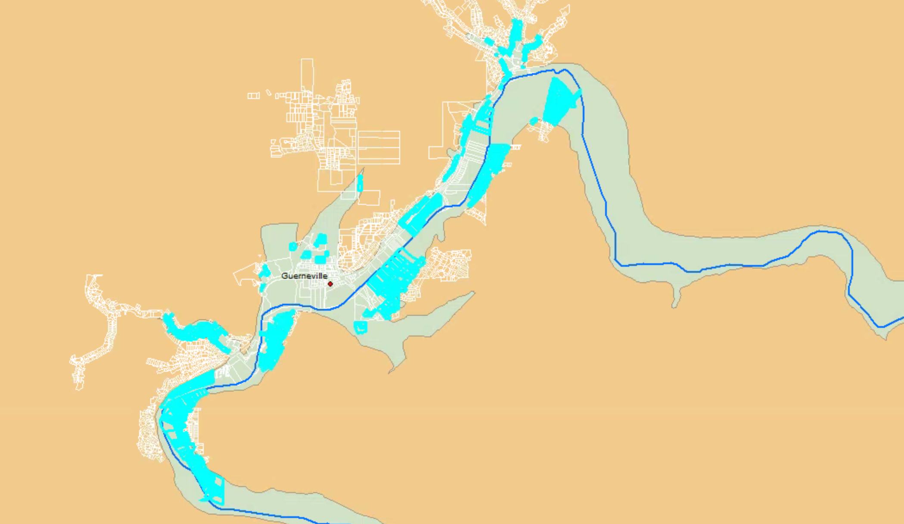

The selection now indicates parcels that are within the flood zone and zoned as residences. 

##### 7. Open the attribute table of Guerneville Parcels.

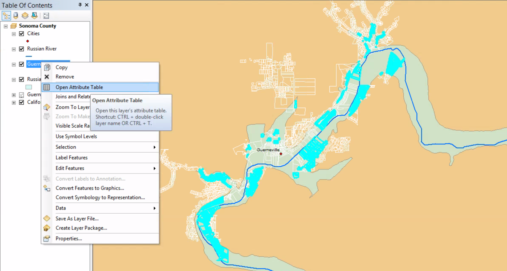

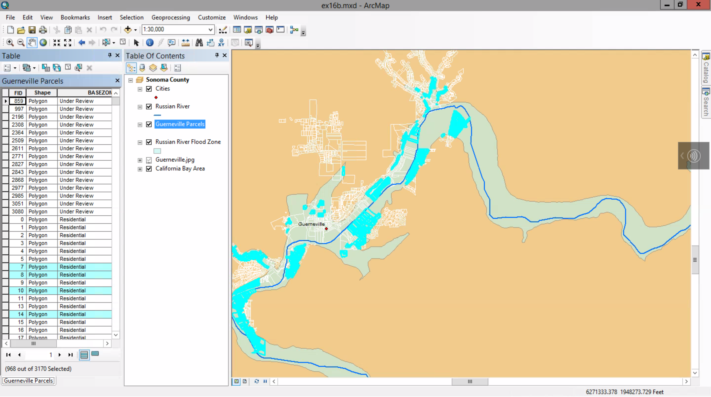

See how many parcels are currently selected.

Next, you will save the selection as a new layer.

##### 8. In the table of contents, right-click Guerneville Parcels > Selection > Create Layer From Selected Features.

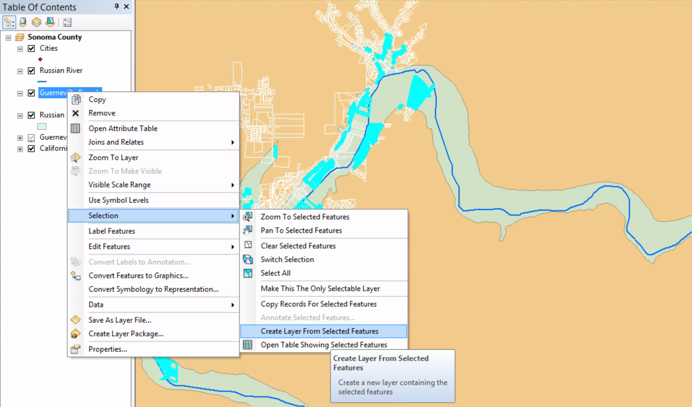

##### 9. Close the attribute table, clear the current selection, and turn off Guerneville Parcels.

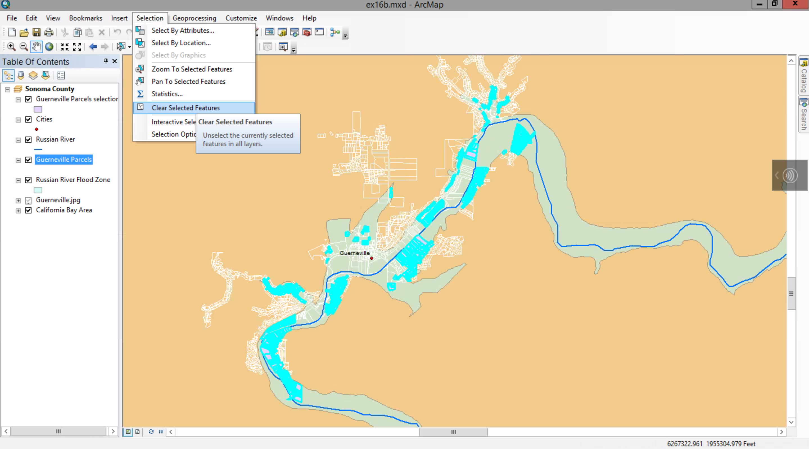

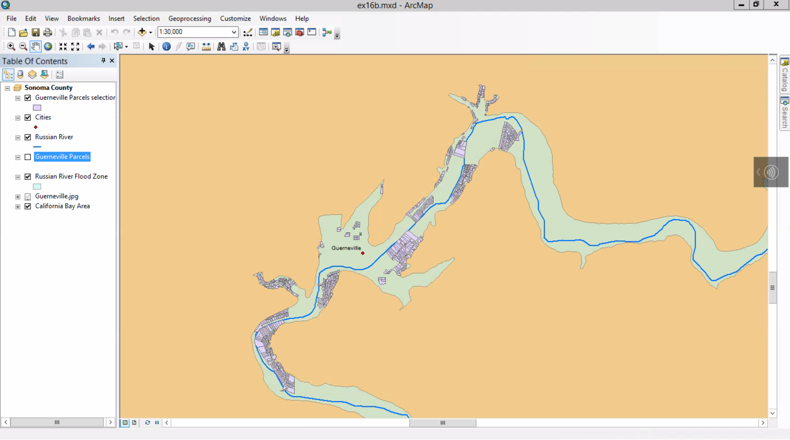

##### 10. Change the default polygon symbol for the new layer. Use a hollow fill (no clolor) and a red outline, and then click OK.

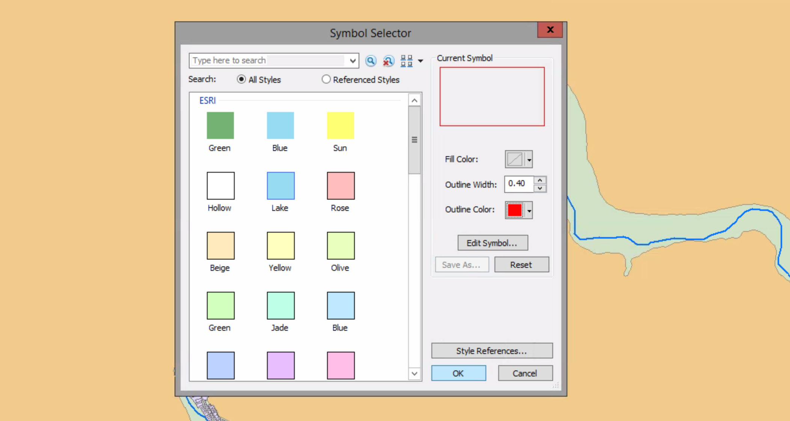

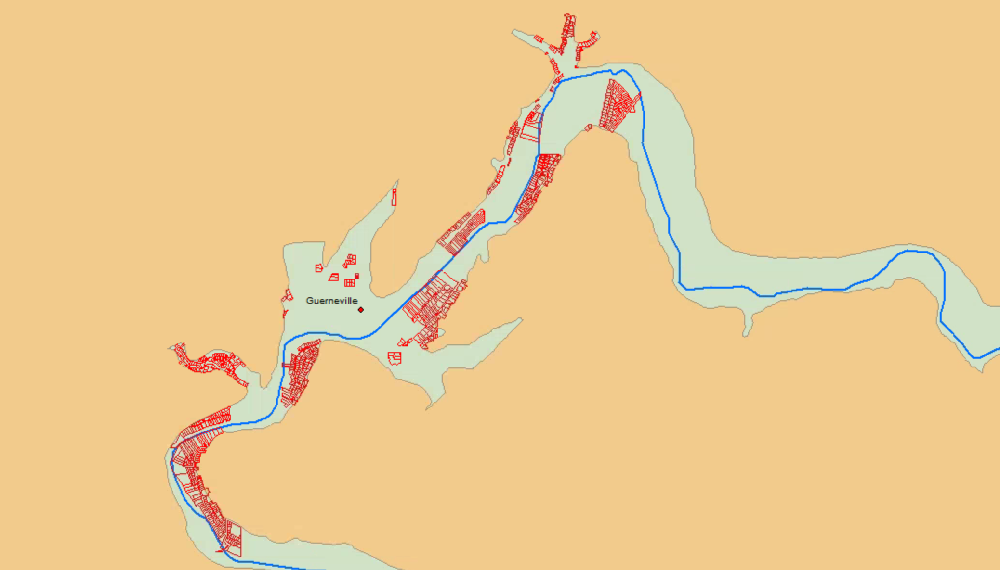

##### 11. Zoom to the Guerneville2 bookmark and turn off the flood zone layer.

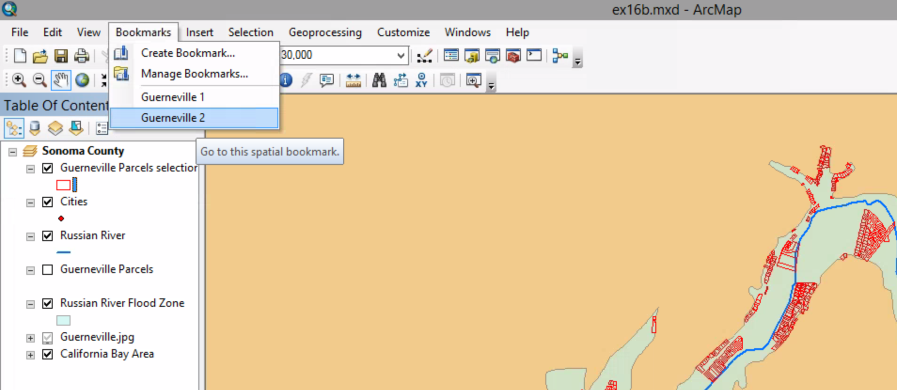

