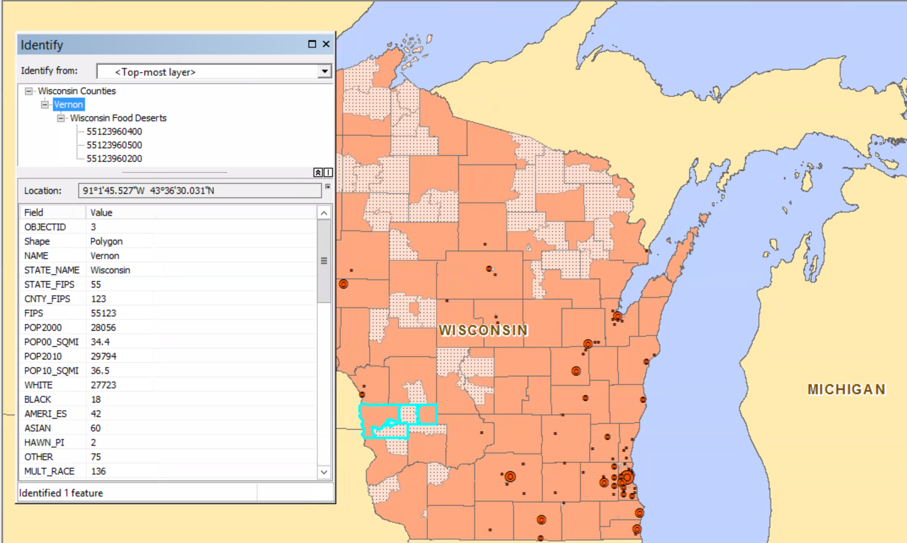

# Relating data

##### 1. Open the ex17b map document.

##### 2. Turn the Wisconsin Food Deserts layer off and on to get an idea of where the food desert tracts are in relation to county boundaries.

Next, you will use the Select Features tool to get a better nderstanding of the data before relating tables.

##### 3. Change the table of contents view to List By Selection.

##### 4. On the Tools toolbar, click the Select Features tool.

##### 5. On the map, click any county that looks, at this scale, as if it has multiple food desert census tracts.

##### 6. Click around the map to select other counties, one at a time. 

##### 7. Clear any selections and switch the table of contents to List by Drawing Order view.

##### 8. On the Tools toolbar, click the Select Elements tool to activate it.

##### 9. Open the layer Properties for Wisconsin Counties and click the Display tab. Verify that the Display Expression Field option is set to NAME. Select the "Show MapTips using the display expression" check box. Click OK.

##### 10. Now pause your mouse over any county on the map. Notice that a MapTip apears quckly.

##### 11. Go to the Southeast bookmark.

##### 12. Add Wisconsin Cities.lyr to the map.

##### 13. Zoom to the full exten of the map.

##### 14. In the table of contents, right-click Wisconsin Counties > Join and Relates > Relate.

##### 15. Follow the setting as you see in the graph and click OK.

##### 16. Open the Wisconsin Counties attribute table. Be sure the Show all records button at the bottom of the table is activated.

##### 17. Select the third record, for Vernon County, by clicking the gray tab to the left of the OBJECTID column.

##### 18. At the top of the attribute table, click the Related Tables arrow and click the only related table, Related1: FoodDeserts

##### 19. Again, click the Related Tables arrow and click Related1: Wisconsin Counties. Only the selected record is shown.

##### In this way, you can switch back and forth between related tables.

##### 20. Click the identify tool and click Vernon County, which is selected. Make sure you select the county not the food desert.

##### 21. In the identify window, notice the plus sign (+) symbol next to Vernon, in the upper  panel. Expand the contents of Vernon. Now expand the contents of Wisconsin Food Deserts.

##### 22. Close the window. Clear the selection. Close the table.

