# Dissolving features

##### 1. Open the map document.

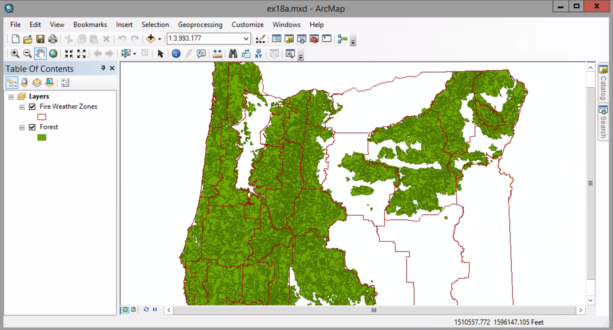

##### 2. Open the attribute of the Fire Weather Zones layer.

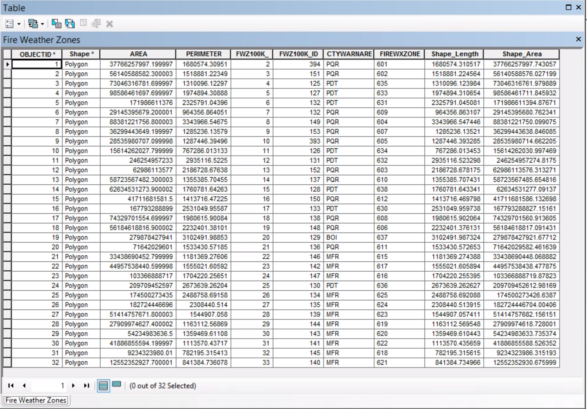

##### 3. Close the table. 
##### Geoprocessing menu > Search For Tools

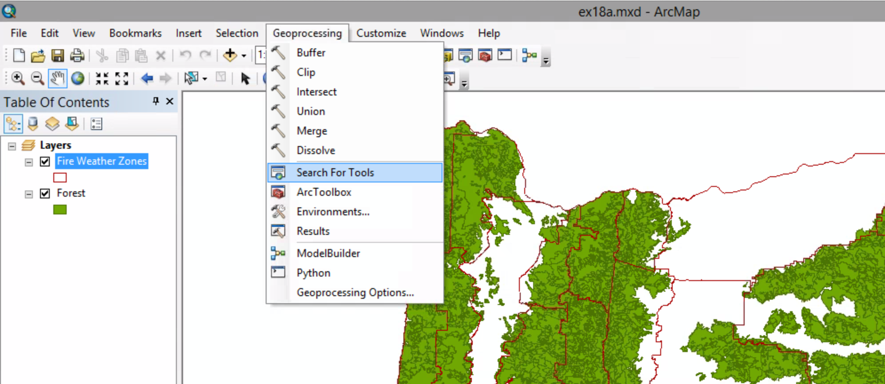

##### 4. In the Search window, type dissolve and press Enter.

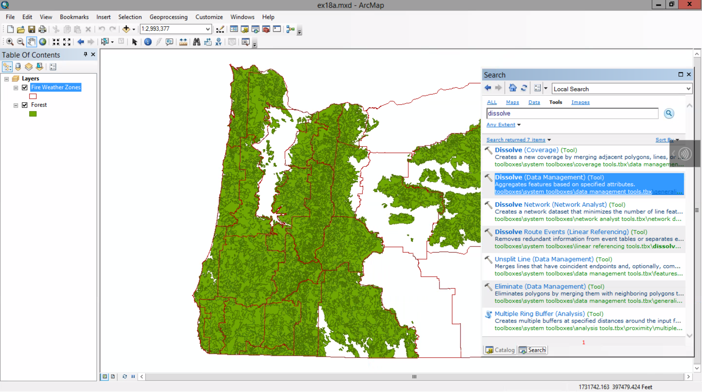

##### 5. In the Search results, click Dissolve (Data Management). Be sure to click the title to open the tool dialog box.

##### 6. In the Input Features list, click Fire Weather Zones.

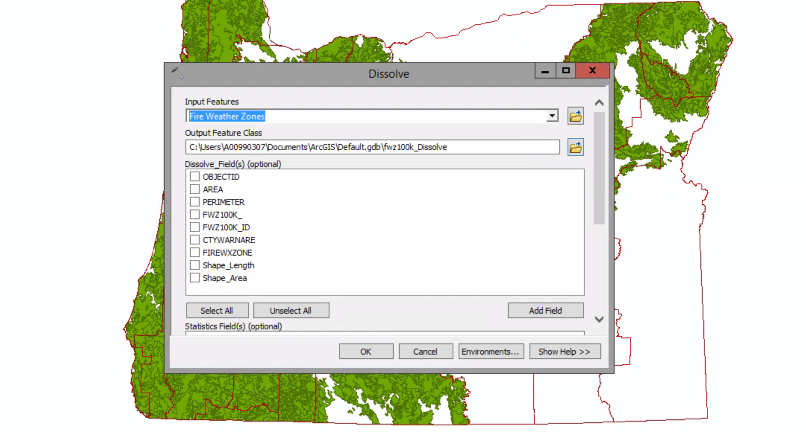

##### 7. Click the Browse button next to the Output Feature Class box. On the dialog box, browse to your MyData folder. Double-click MyOregonForest.gdb.

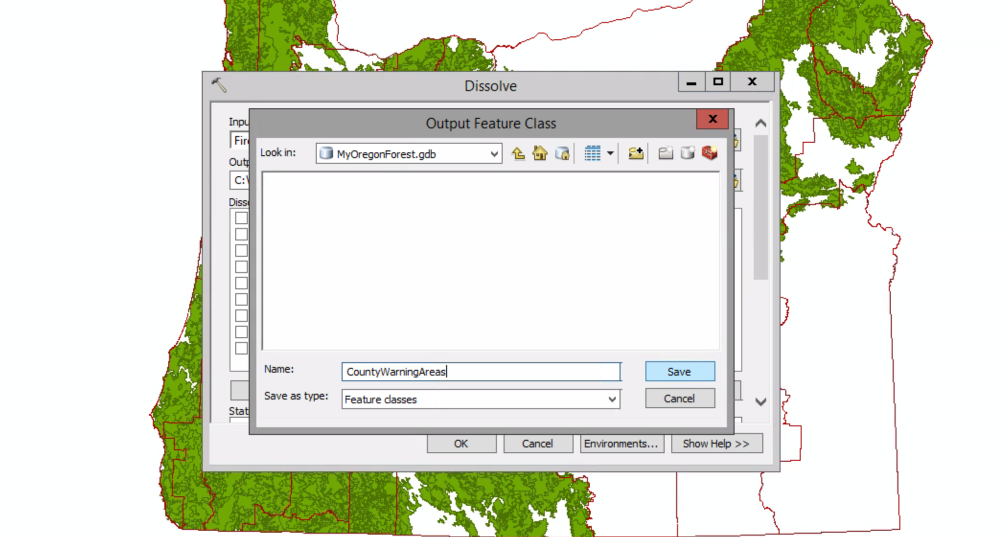

##### 8. In the name box, type CountyWarningAreas, and then click Save.

##### 9. In the Dissolve_Field(s) box, select the CTYWARNARE check box.

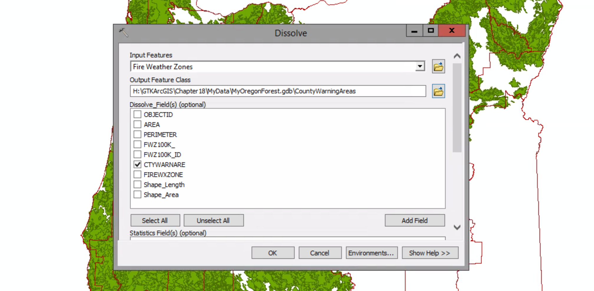

##### 10. Scroll down to the Statistics Field(s) area. Click the Statistic Field(s) arrow and click AREA to add it to the list.

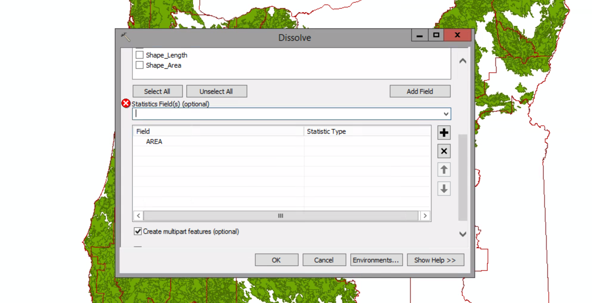

The red circle with a white X indicates that you still need to specify the type of statistic you want.

##### 11. Click the first cell in the Statistic Type column. Then click the arrow and click SUM.

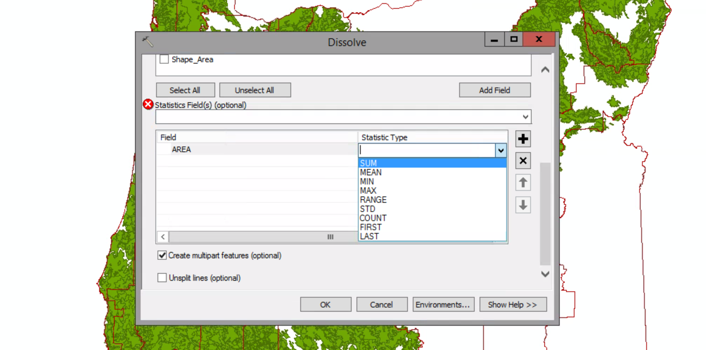

##### 12. Click OK to run the tool.

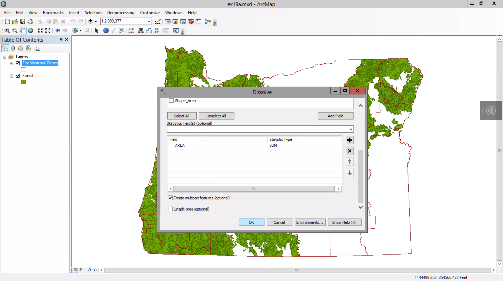

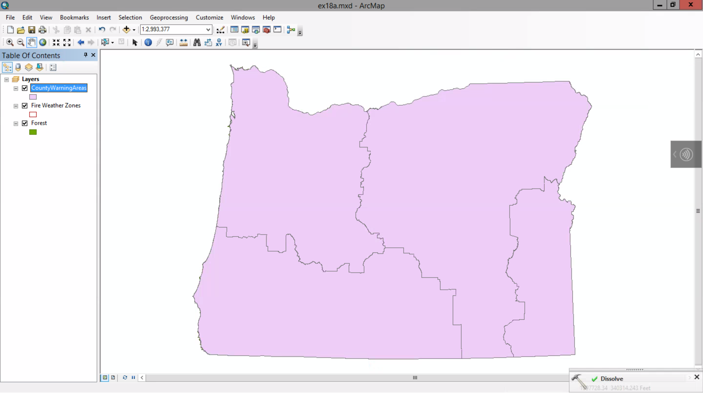

##### 13. Open the attribute table of the CountyWarningAreas layer. If necessary, resize the table to show all fields.

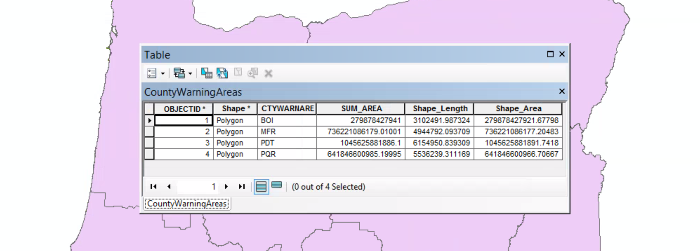

