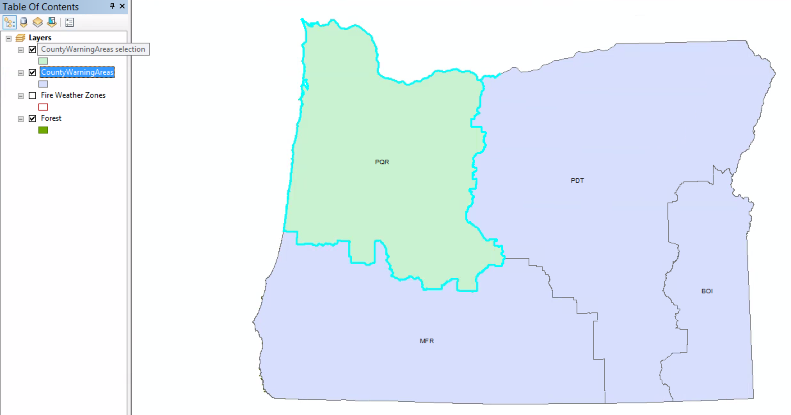
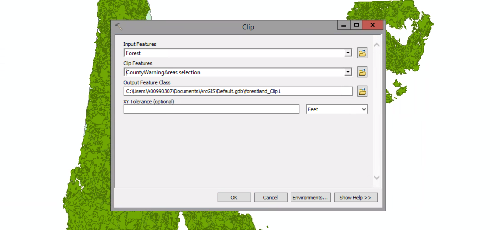
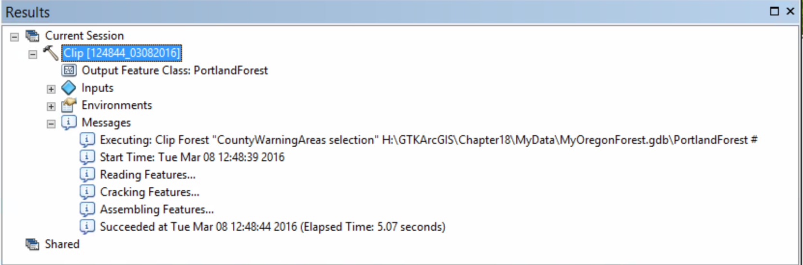

# Clipping layers

##### 1. Open the map document.

##### 2. In the table of contents, click the List By Selection button. Click the toggle key next to Fire Weather Zones and Forest to make them not selectable.

##### 3. On the Tools toolbar, click the Select Features tool.

##### 4. On the map, click PQR to select it. It is outlined in cyan.

##### 5. In the table of contents, right-click the CountyWarningAreas layer and click Create Layer From Selected Features.

##### 6. Click any white area of the map to clear the feature slection.

##### 7. In the table of contents, click the list By Drawing Order button. Turn off the CountyWarningAreas layer and drag the CountyWarningAreas selection layer to the bottom of the table of contents.

##### 8. On the menu bar, click Geoprocessing > Clip.

##### 9. Input Features --> Forest
##### Clip Features --> CountyWarningAreas selection

##### 10. Click the Brose button next to the Output Feature Class list. On the dialog box, browse to the contents of MyOregonForest.gdb in your MyData folder. In the Name box, type PortlandForest, and then click Save.

##### 11. Click OK to run the Clip operation. When the Clip tool processing is complete, a pop-up notification will appear in the notification area. Click the Clip link in the pop-up notification to view the Clip tool's results report.

##### 12. Review the information in the Results window, and then close ot.

##### 13. Turn off the Forest layer.

##### 14. Open the attribute table of the PortlandForest layer.

The clip operation has reduced the number of Forest layer features from 3,771 to 1,514.

##### 15. Close the table.

