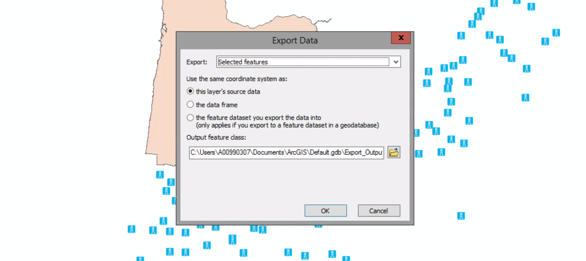
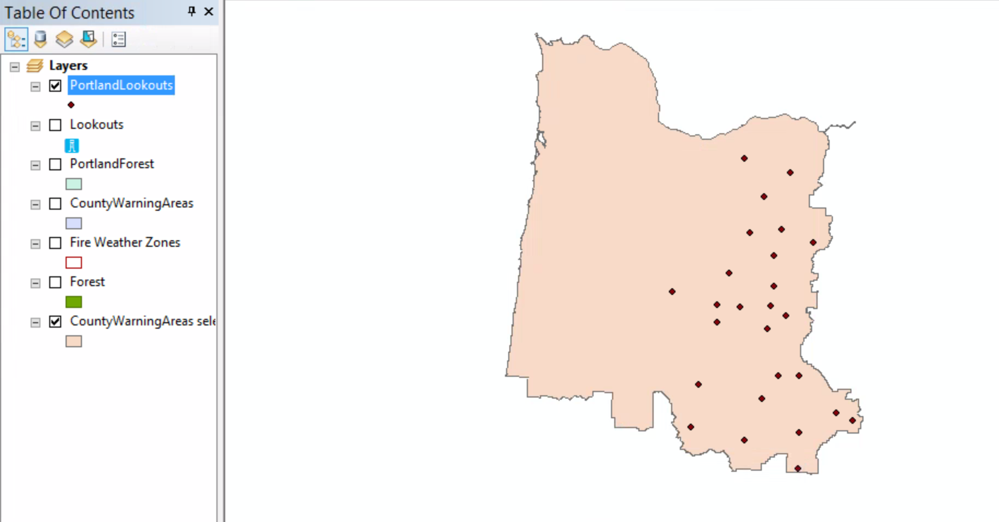

# Creating a data subset

##### 1. Open the ex18c map document.

##### 2. Click Selection menu > Select By Location.
##### If necessary, click the Selection method arrow and click "select features from."

##### 3. For Target layer(s), select the "Lookouts" check box.

##### 4. For Source layer, click CountyWarningAreas selection.

##### 5. For the Spatial selectiom method, click "are completely within the source layer feature", and then click Apply.

##### 6. Close the Select By Location box. In the table of contents, right-click the Lookouts layer and click Data > Export Data.

##### 7. Click the Browse button next to the Output feature class box. 
##### On the Saving Data dialog box, make sure the Save as type list is set to "File and Personal Geodatabase feature classes."
##### Browse to the contents of MyOregonForest.gdb in your MyData folder for chapter 18. In the Name box, replace Export_Output with PortlandLookouts, and then click Save.

##### 8. On the Export Data dialog box, click OK.

##### 9. Click Yes.

##### 10. Turn off the Lookouts layer.

##### 11. Open the PortlandLookouts layer Properties dialog box. On the Symbology tab, click Import.

You want to import symbology from another layer in the map, so the first option is set correctly. 

The layer list is also set correctly to Lookouts.

##### 12. Click OK.

##### 13. On the Layer Properties dialog box, click Ok to apply the changes.

