# Buffering features

##### 1. Open the ex19a map document.

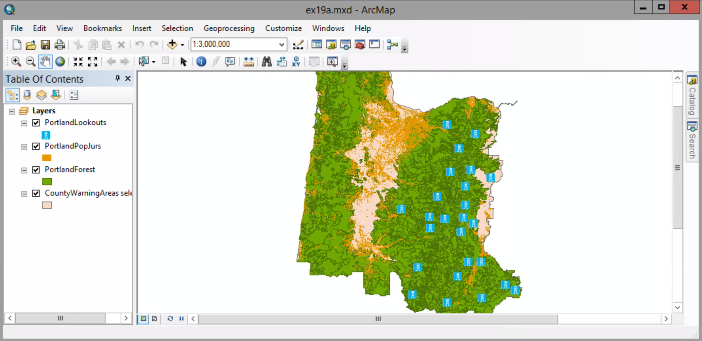

##### 2. Click Geoprocessing menu > Buffer

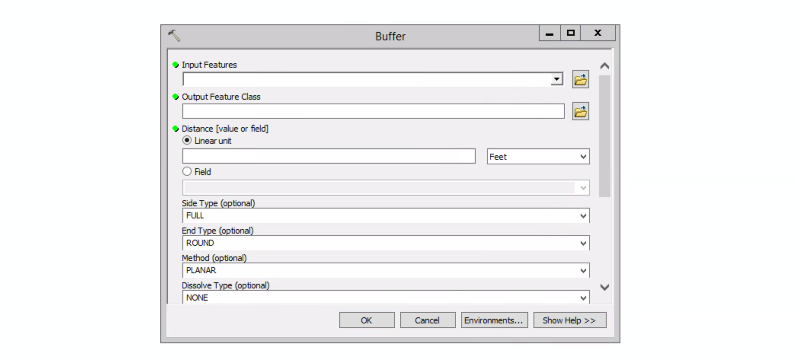

##### 3. Click the Input Features arrow and click PortlandPopJurs. 

(Alternatively, drag the PortlandPopJurs layer from the ArcMap table of contents to this location)

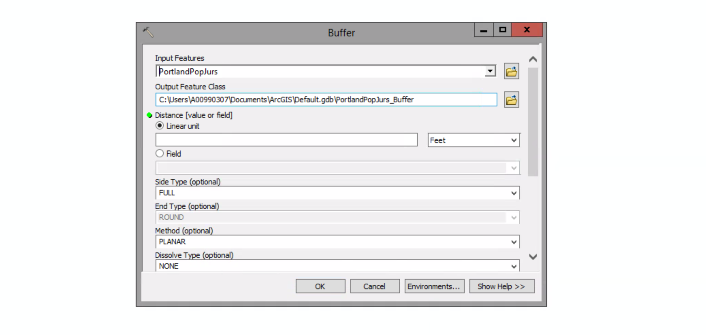

##### 4. Click the Brows button next to the Output Feature Class box. On the dialog box, navigate to MyData folder and double-click MyOregonForest.gdb. In the Name box, type PopJursBuffer, and then click Save.

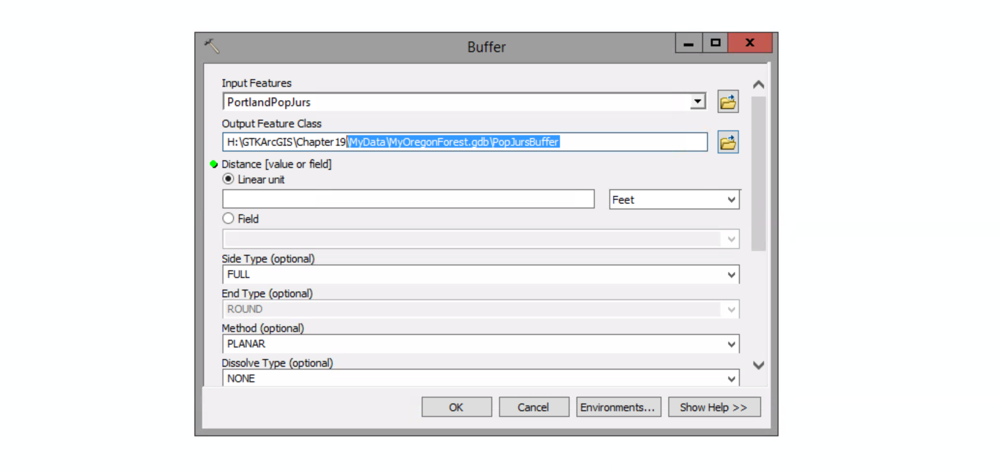

##### 5. For the buffer distance, make sure the linear unit option is selected. In the Linear unit box, type 1000. Maintain Feet as the measurement unit. Scroll down, if necessary, and make sure Dissolve Type is set to NONE.

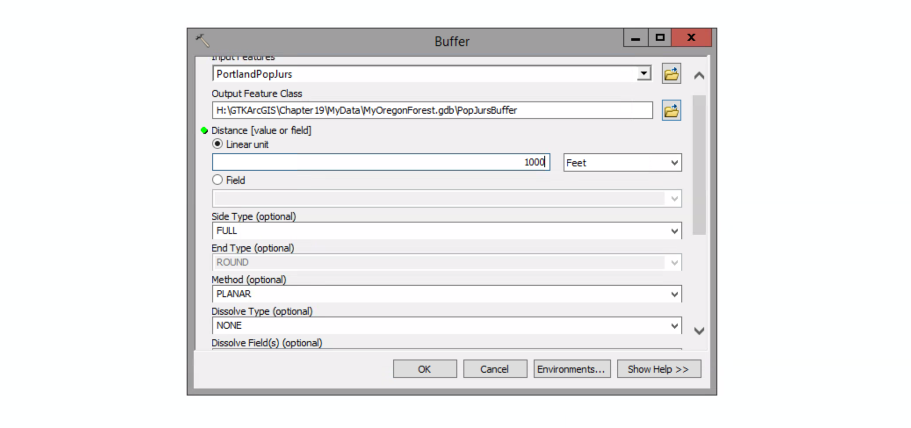

##### 6. Click OK.

##### 7. Change the color of both the buffer fill and outline to Anemone Violet.

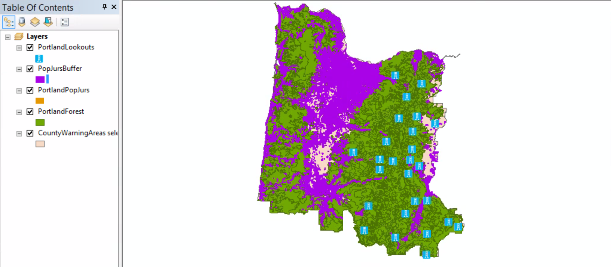

##### 8. Open the attribute table of the PopJursBuffer layer.

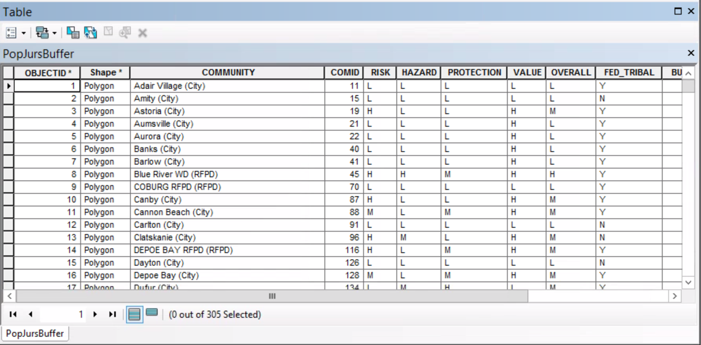

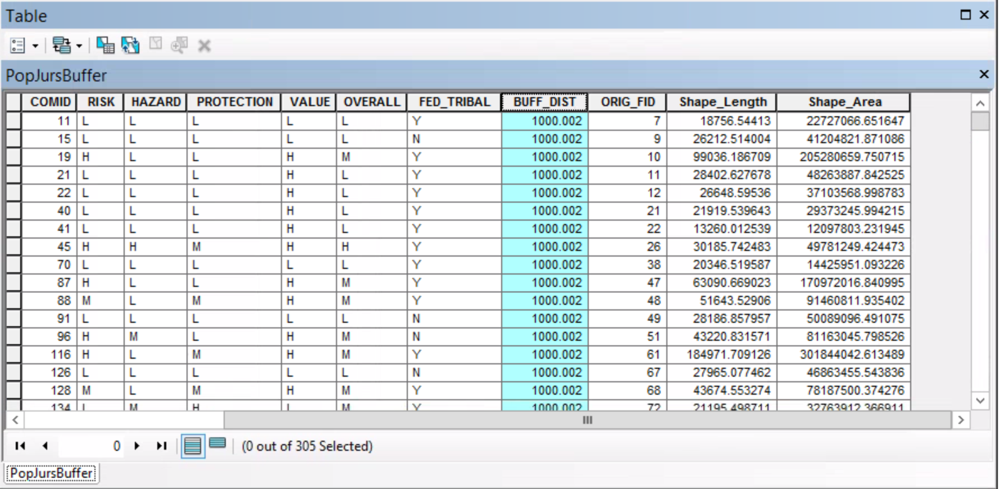

In addition to its standard attributes, the output table has attributes from the input table. An attribute called BUFF_DIST is added to the table, which shows the buffer distance you specified.

##### 9. Close the PopJursBuffer attribute table.

##### 10. Open the attribute table of the PortlandLookouts layer.

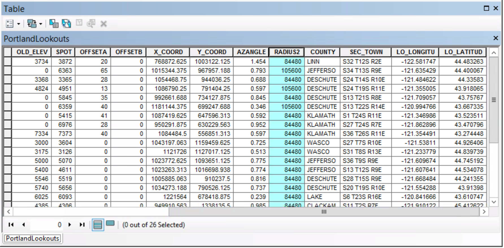

The attribute table contains an attribute called RADIUS2, which is the visibility range value of each tower.

##### 11. Close the PortlandLookouts attribute table.

##### 12. Click Geoprocessing menu > Buffer.

##### 13. On the Buffer tool dialog box, click the Input Features arrow and click PortlandLookouts.

##### 14. Save the output feature class as LookoutsBuffer to MyOregonForest.gdb.

##### 15. For the buffer distance, click the Field option. In the Field list, click RADIUS2.

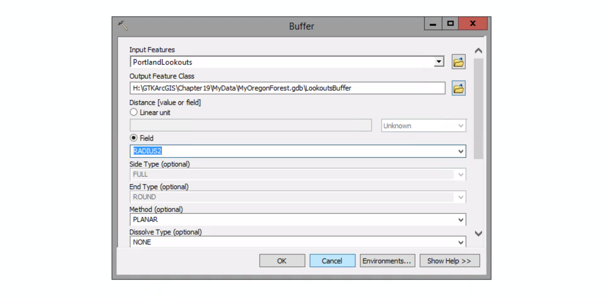

##### 16. Click the Dissolve Type arrow and click All. Then click OK.

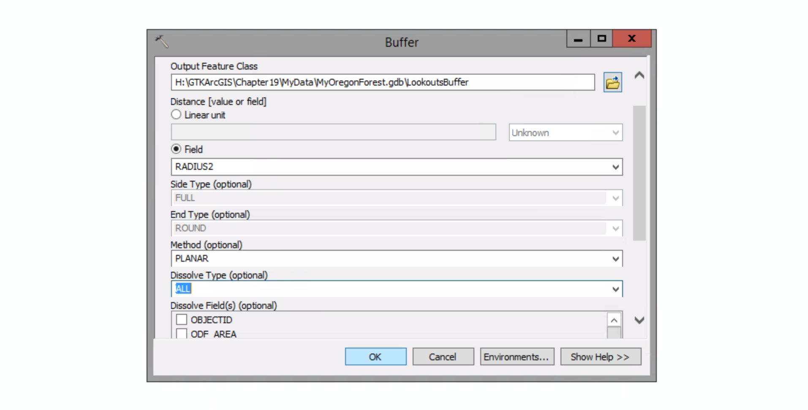

When the operation is completed, the new LookoutsBuffer layer is added to the map.

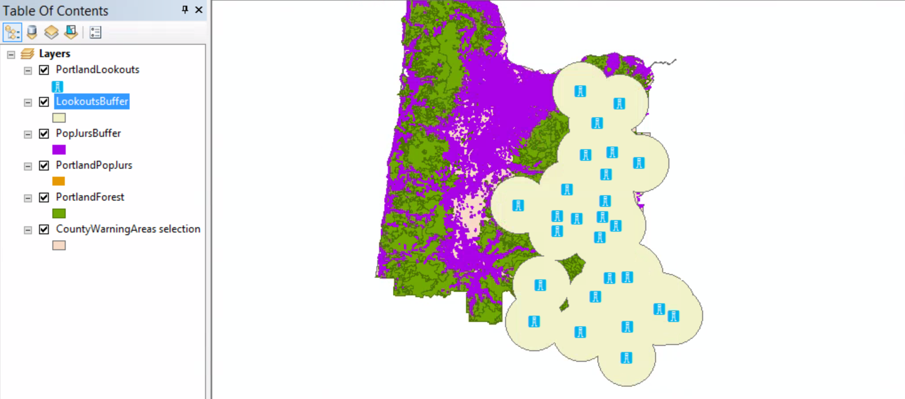

##### 17. If necessary, change the color of the buffers so they are visible against the background. In the table of contents, drag the LookoutsBuffer layer below the PopJursBuffer layer.

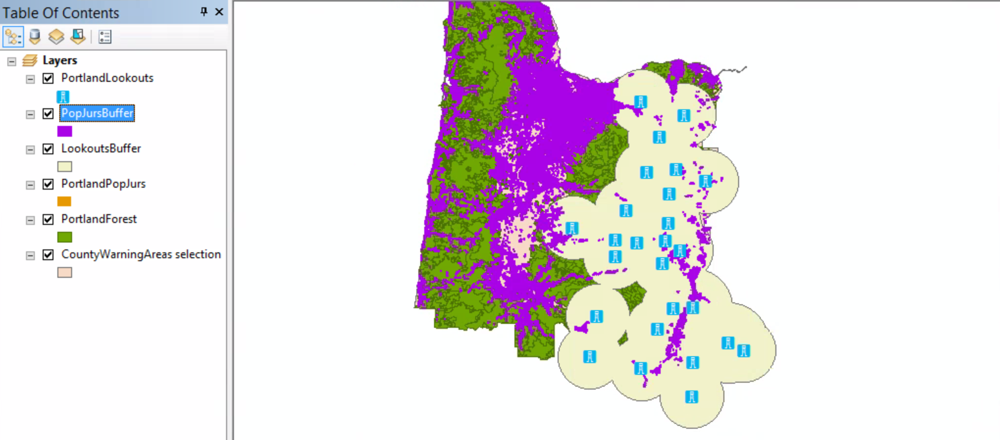

##### 18. Open the attribute table of the LookoutsBuffer layer.

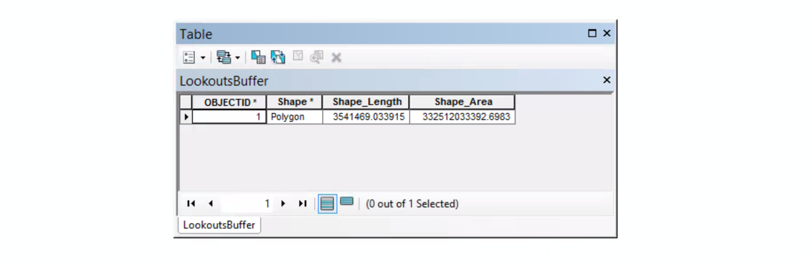

Because of the dissolve, none of the PopJursBuffer layer attributes are passed to the output table.

##### 19. Close the attribute table.

