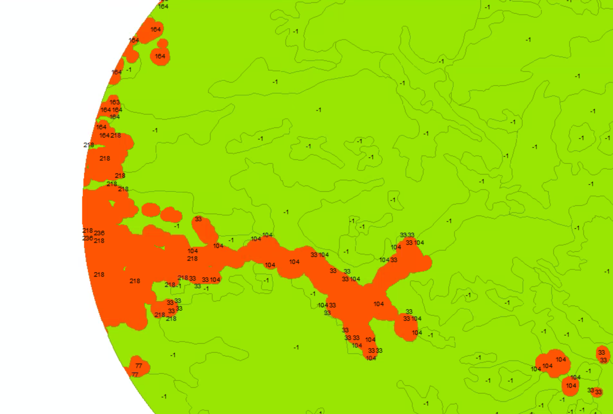

# Overlaying data

##### 1. Open the ex19b map document.

##### 2. Click Geoprocessing menu > Union.

##### 3. On the dialog box, click the Input Features arrow and click PopJursBuffer.

##### 4. Click the Input Features arrow again and click PortlandForest.

##### 5. Save the output feature  class as AreaAtRisk to MyOregonForest.gdb.

##### 6. For the JoinAttributes parameter, make sure ALL is selected. Click OK to run the tool.

##### 7. Open the attribute table of the AreaAtRisk layer.

The table contains all the attributes included in both unioned layers. Along with the four standard polygon feature class attributes, the table contains the renamed identifier attributes from the input layers: FID_PopJursBuffer and FID_PortlandForest.

##### 8. Close the table. Turn on the LookoutsBuffer layer, and then drag it above the AreaAtRisk layer. 

This gives you a better view of how this layer will look after the union overlay.

##### 9. Click Geoprocessing > Union.

##### 10. Click the Input Feature arrow and click AreaAtRisk to add it to the list of input layer. Do the same for LookoutsBuffer.

##### 11. Save the ouput feature class as Final to MyOregonForest.gdb.

##### 12. Click OK to run the tool.

##### 13. Open the attribute table of the Final layer.

The FID_AreaAtRisk attribute is the renamed OBJECTID from the AreaAtRisk layer. If a record has a value other than -1 in this field, it means the output features coincides spatially with a buffer feature-in other words, it is an area at risk of fire.

##### 14. Close the Final attribute table. In the table of contents, turn off all layers except Final.

##### 15. Double-click the Final layer. Click the Definition Query tab, and then click Query Builder. In the Query Builder window, use the input to build the query: FID_AreaAtRisk <> -1 AND FID_PrtlandForest <> -1 AND FID_LookoutsBuffer = 1. Then click OK.

##### 16. Move the layer Properties window aside to see the main ArcMap window and click Apply.

##### 17. On the Layer Properties dialog box, click the Symbology tab. Under Show, click Categorie, and then click Unique values. In the Value Field list, click FID_PopJursBuffer, and then click Add Values.

##### 18. On the Add Values dialog box, in the Select the value(s) to add list, click -1, and then click OK.

##### 19. Double-click the -1 value color chip, and change the fill color to Macaw Green and the outline color to Tarragon Green.

##### 20. Similarly, double-click the "all other values" color chip, and change the fill color to Fire Red and the Outline color to No Color.

##### 21. Finally, click the tabel value for "all other values" and replace it with Communities at risk. Click the Heading label and type Not at risk. For the second item in the list, change the lable value -1 to Forested area.

##### 22. Click Bookmark > Close-up.

##### 23. Open the Layer Properties dialog box of the Final layer. Click the Labels tab. Select the "Label features in this layer" check box. In the Text String frame, click the Label Field arrow and click FID_PopJursBuffer. Then click OK.

On the map, red polygons labeled with values not equal to -1 represent community areas at risk.

