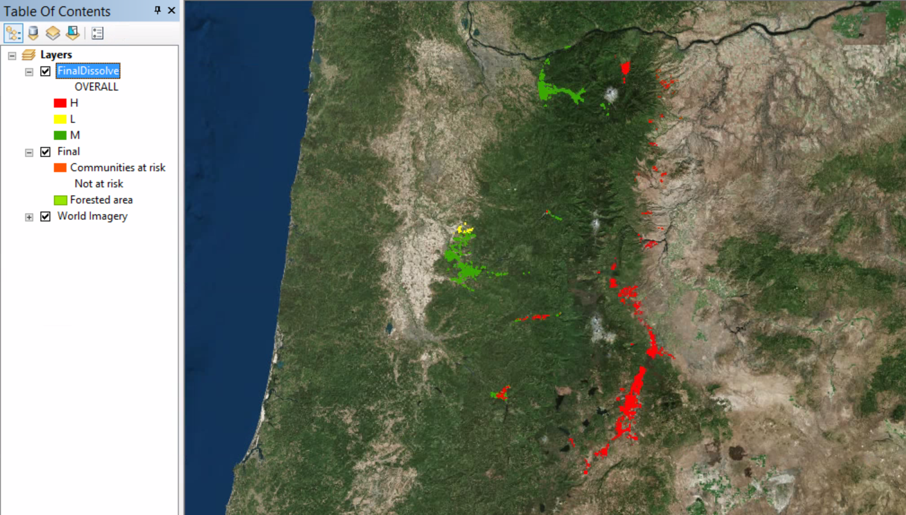

# Calculating attribute values

##### 1. Open the ex19c map document.

##### 2. Go to File > ArcGIS Online. Search for world imagery and add it as basemap by clicking the Add button.

##### 3. In the table of contents, double-click the Final layer. On the Layer Properties dialog box, click the Definition Query tab.

##### 4. Click Query Builder to open the Query Builder dialog box.

##### 5. In the expression box, click the white space so that the cursor appears at the end of the expression. Click the And button, and then in the Field box, double-click FID_PopJursBuffer to add it to the expression box. Click the not equal to (< >) button, and then click Get Unique Values list, double-click -1. Click OK.

##### 6. On the Layer Properties dialog box, click OK.

These are communities at risk in the Portland forest within visibility of a lookout tower.

##### 7. Open the attribute table of the Final layer.

Take a look at the COMMUNITY field of the first three records in the attribute table. These three records are for a single community. 

##### 8. Close the Final attribute table.

##### 9. On the manu bar, click Geoprocessing > Dissolve.

##### 10. On the Dissolve tool dialog box, in the Input Feature list, click Final. Save the output as FinalDissolve to MyOregonForest.gdb. In the Dissolve Field(s) box, select the check boxes for COMMUNITY, RISK, HAZARD, PROTECTION, VALUE, and OVERALL, and then click OK.

##### 11. Open the FinalDissolve Layer Properties dialog box. On the Symbology tab, click Import.

##### 12. Click the Layer Browse button and browse to Data folder, click FinalDissolve.lyr, and then click Add.

##### 13. On the Import Symbology dialog box, click OK. On the Import Symbology Matching Dialog box, make sure the Value Field list is set to OVERALL and click OK.

##### 14. Click OK.

##### 15. Open the attribute table of the FinalDissolve layer.

The Shape_Area attribute value is shown in square feet, but next you will creat a new field and calculte it in acres. (One acres is equal to 43,560 square feet.)

##### 16. Above the table title bar, click the Table Options button and click Add Field.

##### 17. On the Add Field dialog box, in the Name box, type ACRES. In the type list, click Double and click OK.

##### 18. Scroll to the far right of the attribute table. Right-click the field name ACRES and click Calculate Geometry. If necessary, click Yes on the message warning that you cannot undo the calculation. 

##### 19. Make sure Area is selected in the Property list. In the Units list, select Acres US [ac] and click OK. If necessary, click Yes on the message warning that you cannot undo the calculation.

##### 20. Right-click the ACRES field name and click Statistics.

##### 21. Close the Statistics window and the FinalDissolve attribute table.

