# Creating graphs

##### 1. Open the ex19d map document.

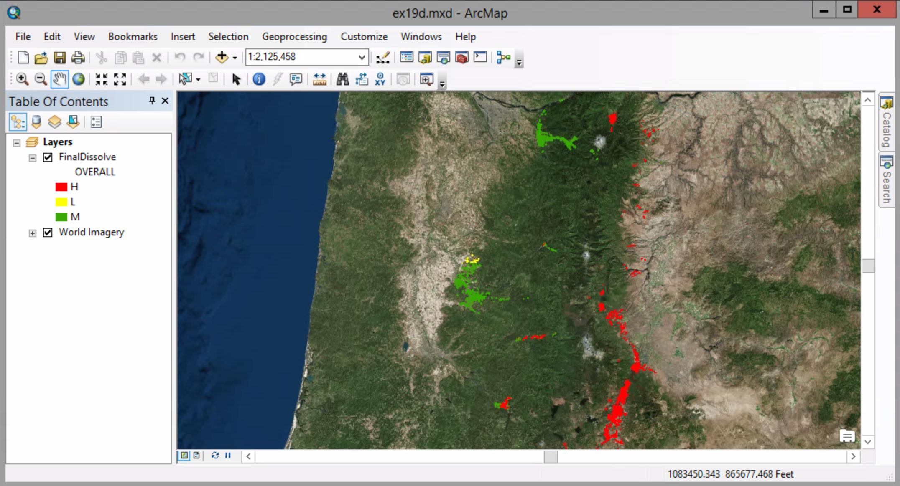

##### 2. On the view menu, click Graphs > Create Graph.

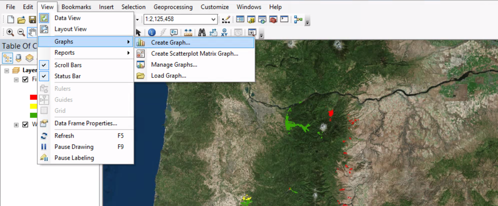

##### 3. Click the Graph type arrow and click Horizontal Bar. Make sure Layer/Table is set to FinalDissolve. Click the Value field arrow and click ACRES.

##### 4. Click the Y label field arrow and click COMMUNITY.

##### 5. Clear the "Add to legend" check box. Make sure the wizard matches the graphic, and then click Next.

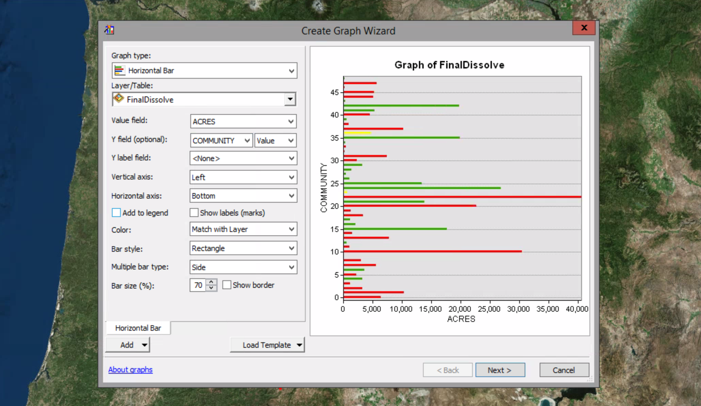

##### 6. In the General graph properties frame, in the Title box, replace Graph of FinalDissolve with Overall Fire Risk Area. In the Footer box, type includes 1000 ft buffer.

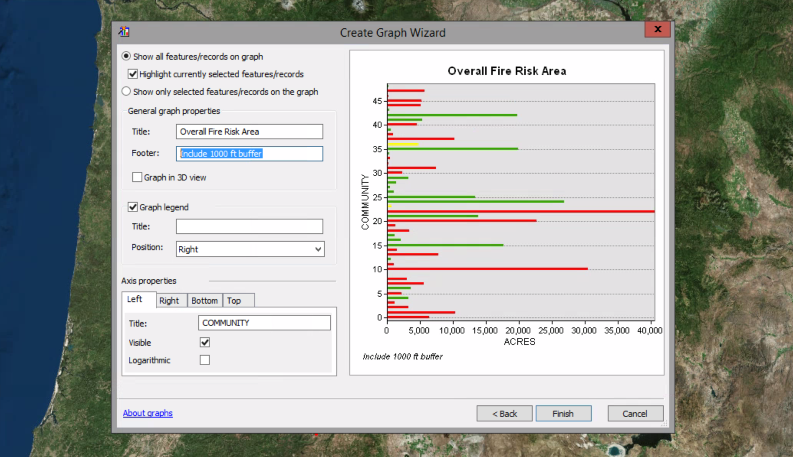

##### 7. In the Axis properties frame, make sure the Left tab is selected. In the Tilte box, replace COMMUNITY with Community. Click the Bottom tab, and in the Title box, replace ACRES with Acres. Make sure the "Visible" check box is selected.

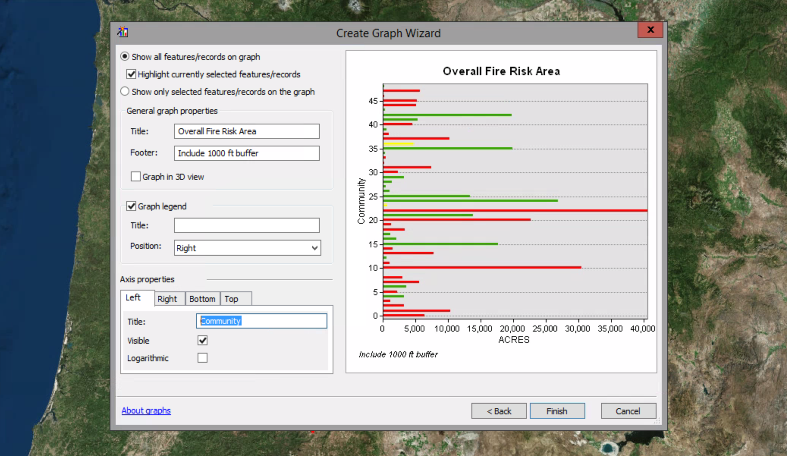

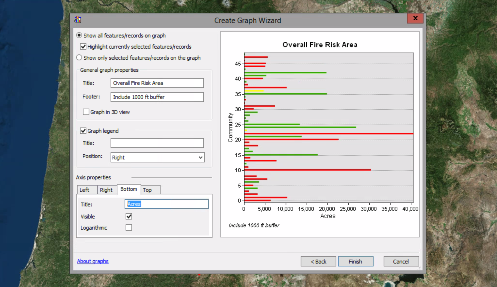

##### 8. Click Finish.

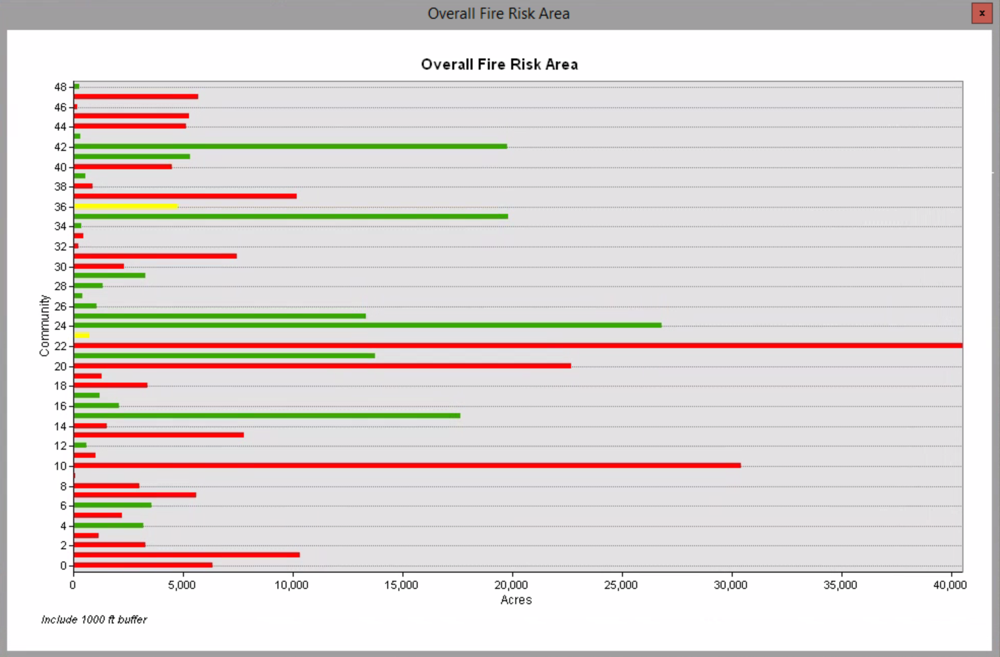

##### 9. Right-click the graph title bar. On the shortcut menu. click Add to Layout. Close the graph window.

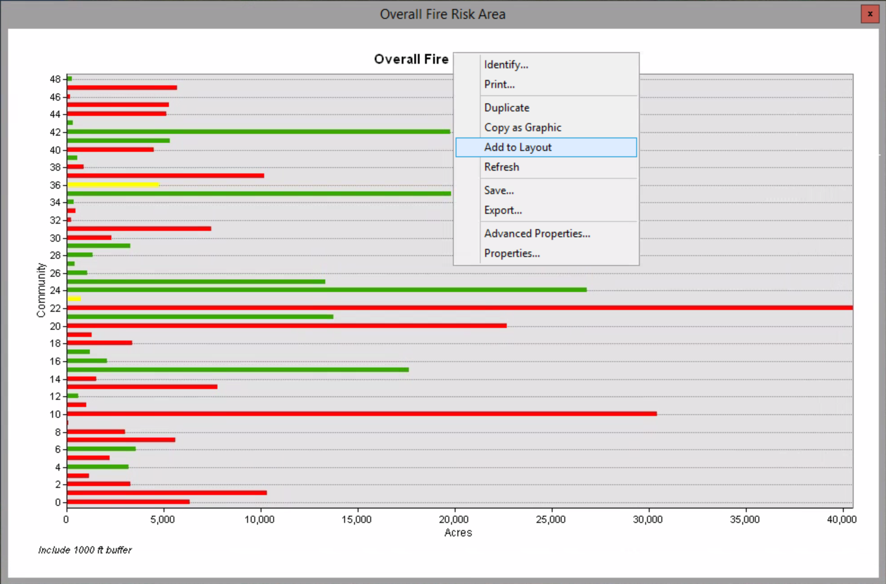

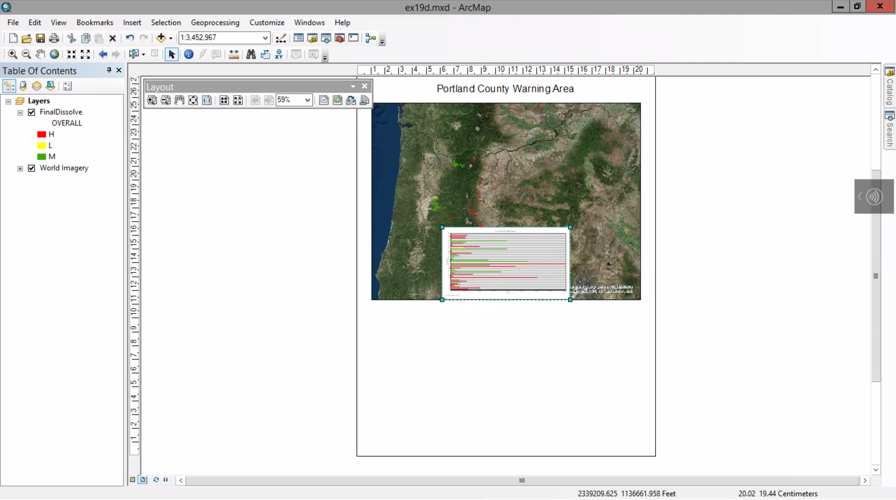

##### 10. On the Tools toolbar, make sure the Select Elements tool is selected. Drag and resize the graph to fill the lower part of the layout, as shown in the graphic. Click outside the layout page to clear the graph selection. 

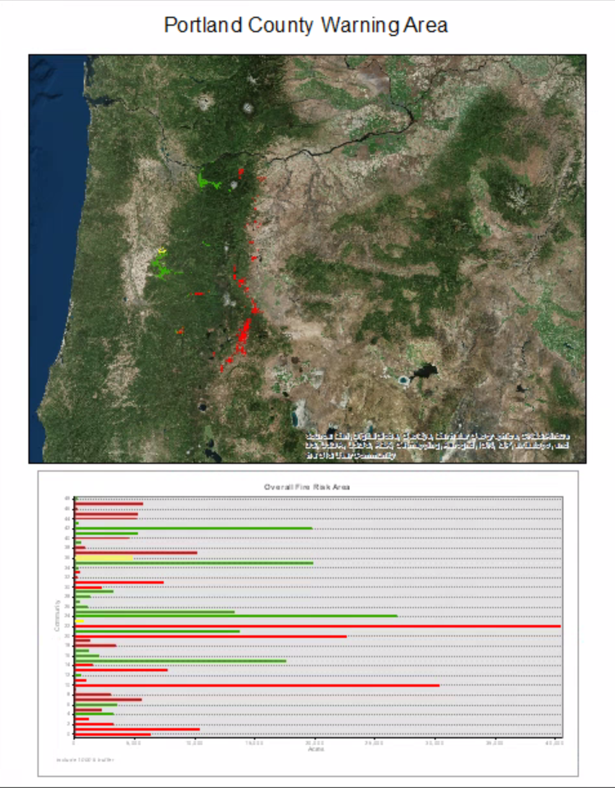

##### 11. Add the CountyWarningAreas layer from \Data\OregonForest.gdb. Remove the fill, give the outline stroke an appropriate color, and label it.

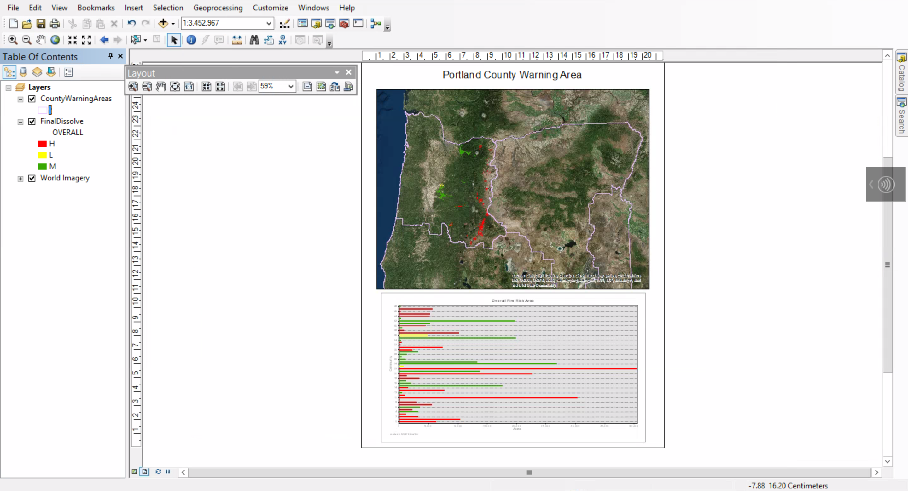

##### 12. Add the PortlandLookouts layer and give it an appropriate sized symbol.

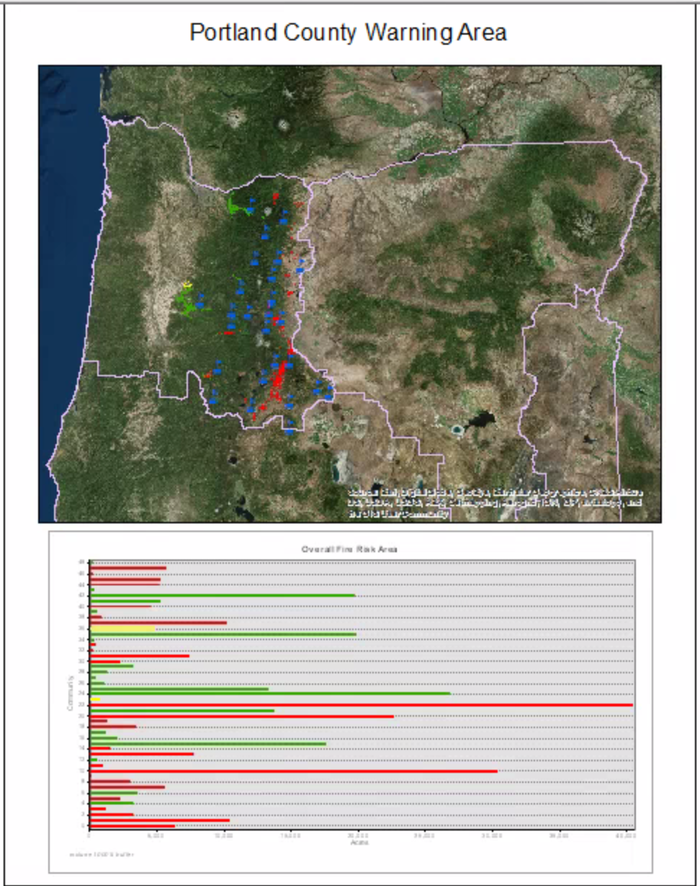

