# C - Zoom and Pan Tools

## C.1 The Overview Window

##### From the Tools pull-down menu in Focus, select Options

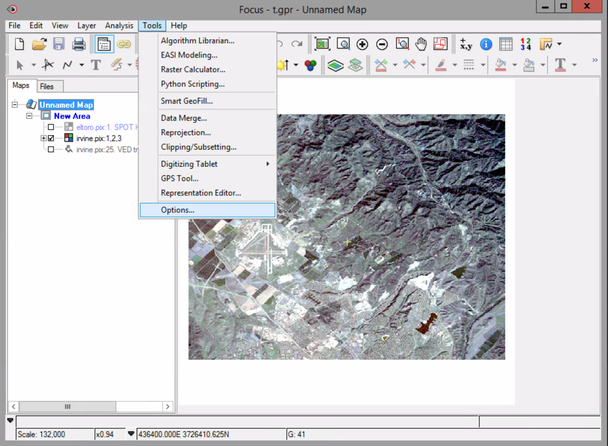

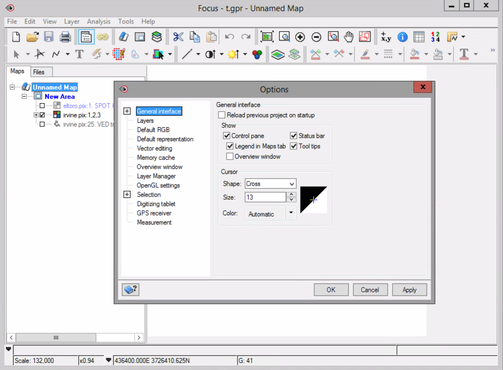

##### From the list on the left, select General Interface.

##### In the Show section, select the Overview Window box.

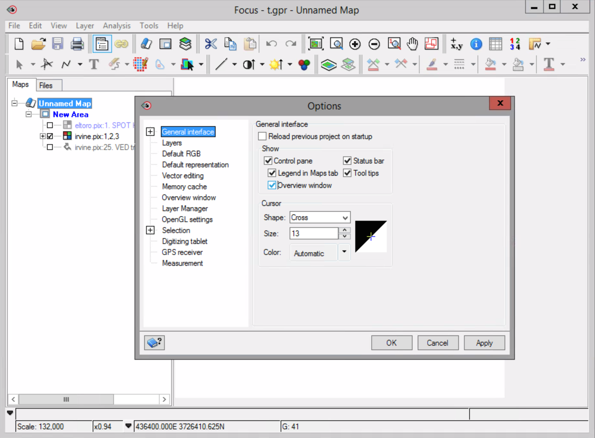

##### Click Ok in the bottom of the Options window.

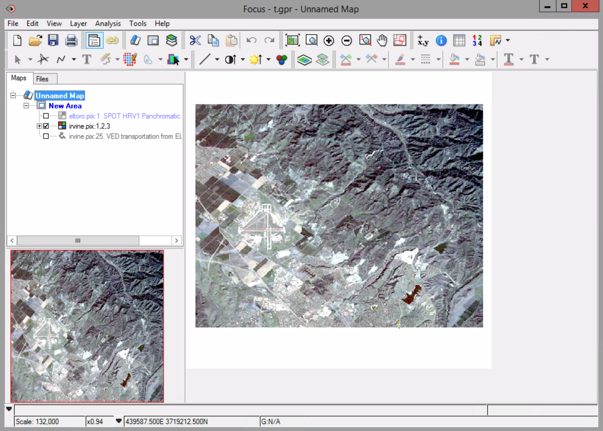

The Options window closes and an Overview window appears in the bottom left corner of the Focus interface.

##### Move your mouse pointer over a corner of the red bounding box in the overview window.

##### When your mouse pointer changes to a double-headed arrow, click and hold so you can drag the bounding box in from the corner. 

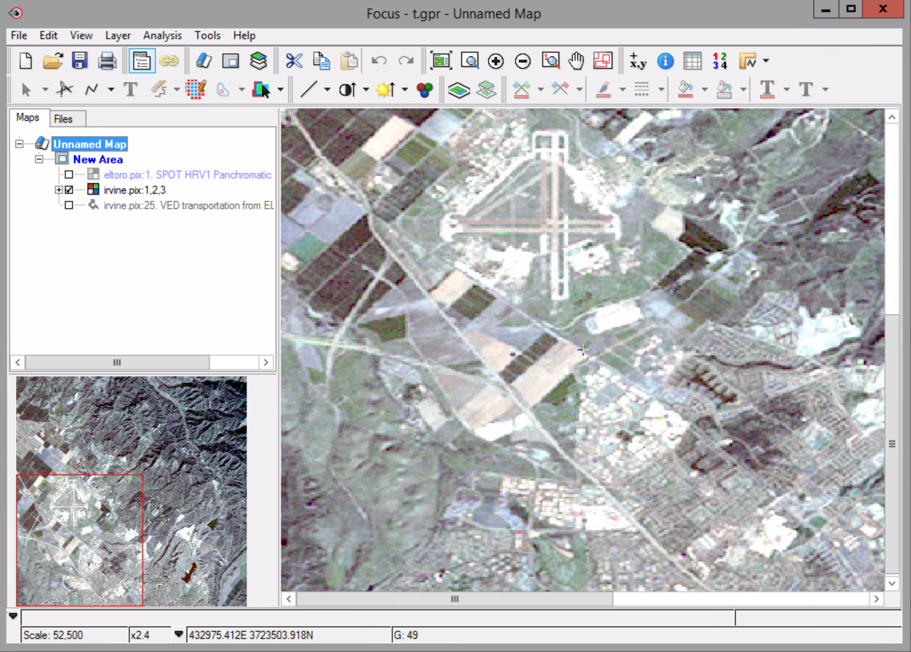

The bounding outline resizes and the irvine.pix image in the view area zooms in or out relative to the area defined by the bounding outline.

When the bounding outline is smaller than the image in the Overview window, you can click inside it and pan through the image in the Focus view area.

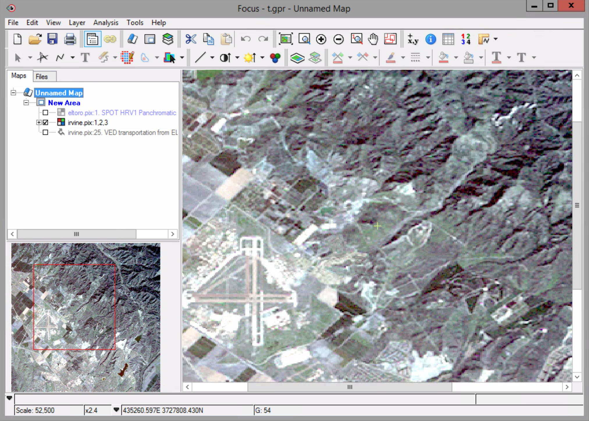

## C.4 Zoom Tools

##### Click the Zoom to overview button to display the entire image in the focus view area.

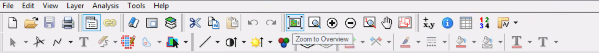

##### Click on or near the airport (t-shaped object) in the Focus view area.

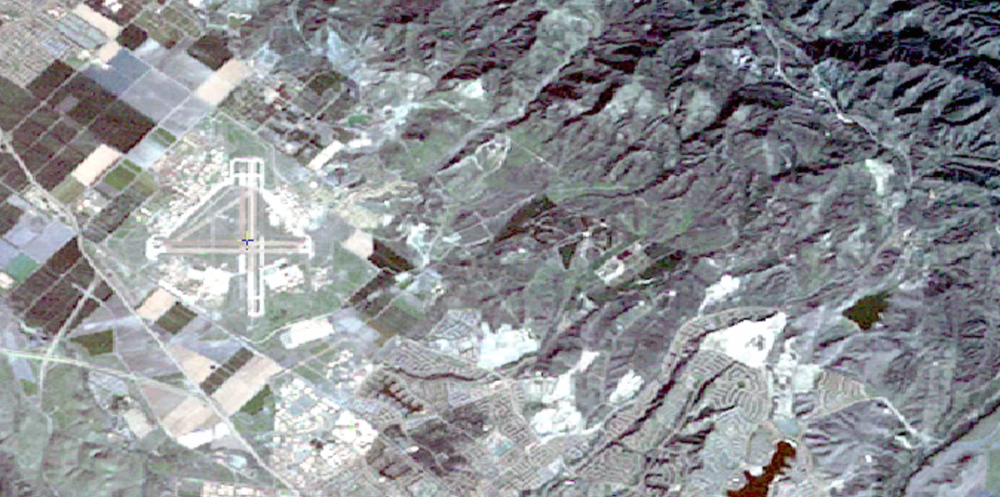

The cursor moves to the location in the image you clicked.

##### On the Zoom tools toolbar, click the Zoom 1:1 Image Resolution button.

##### On the Zoom tools toolbar, click the Zoom IN button. The image zooms in by a factor of 2. Indicated by an x2.0 in the status bar.

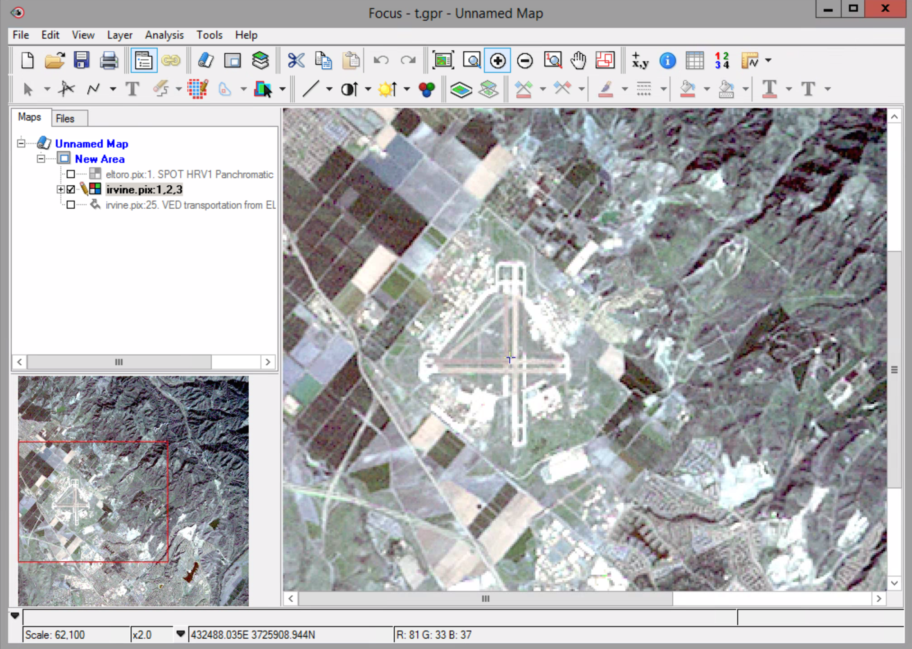

##### Now try the Zoom out button. The image zooms back by a factor of 2.

##### Zoom to 1:1 Image resolution.

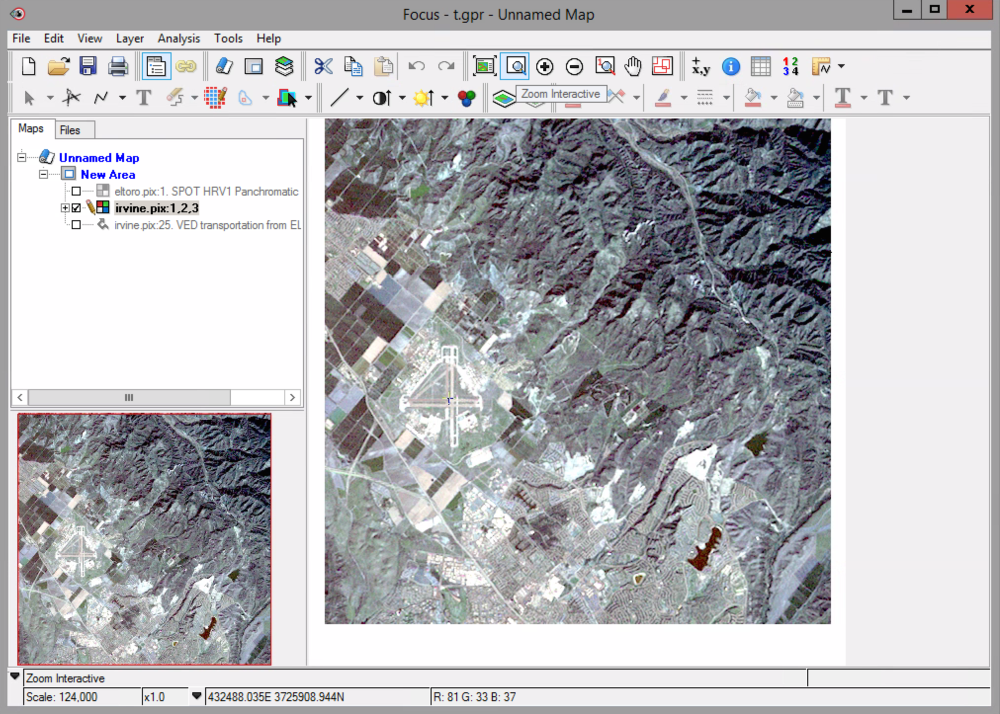

##### Select the zoom interactive button. Click and hold in the view window, move the mouse a little – notice the ‘marquee’ box – drag your mouse to the right to select an area to zoom to. Let go of the mouse. Notice the display changes to match your selected region.

## C.5 Pan Tool

## C.6 Named Regions

##### Use the Zoom tools on the Focus toolbar, to zoom into the airport.

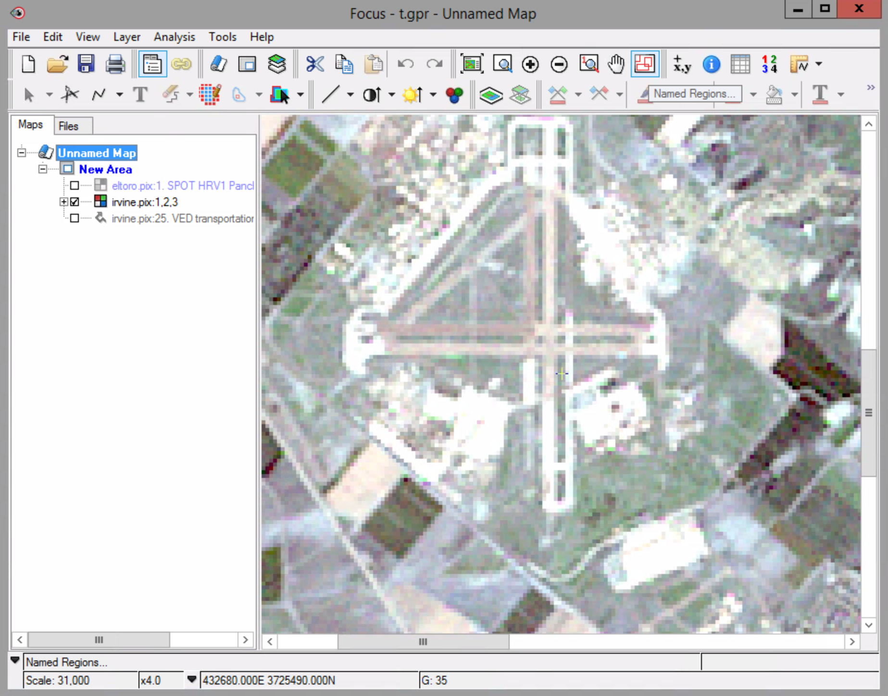

##### From the View menu, select Named Regions. Or click the Named Regions command button in the Focus toolbar.

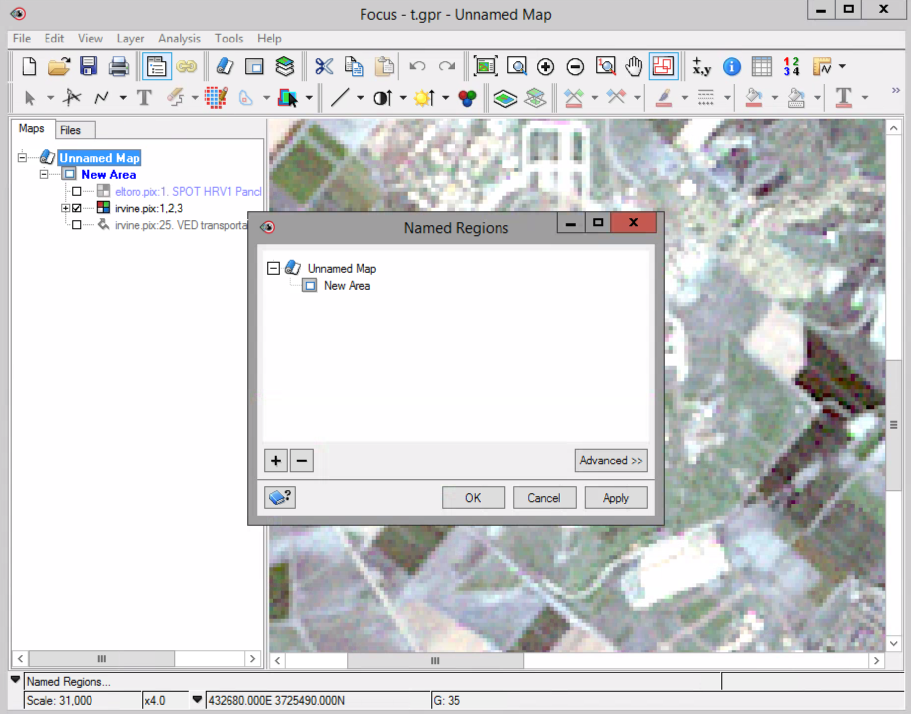

##### In the lower-left of the Named Regions dialog box, click the + button.

A new Named region is added to the Named Regions tree list. The new Named Region is automatically shown as Named Region 1.

##### If necessary, click the Named Region 1 to highlight it.

##### Click the Named Region 1 again to activate.

##### At the insertion point, type a new name for your region, in this case “Airport”.

##### On your keyboard, press Enter or Return.

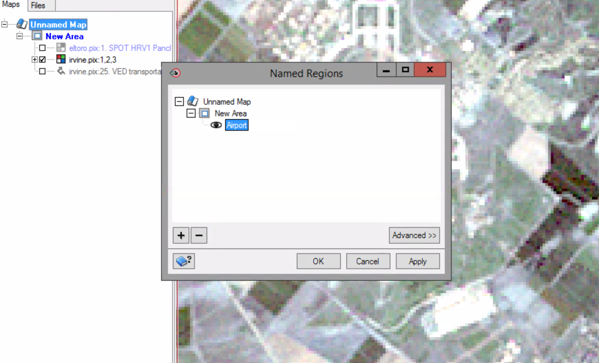

##### Click Zoom 1:1 button.

### To display a Named Region in the Focus view area:

##### On the Focus toolbar, click on the Zoom to Overview command button.

##### In the Named Regions dialog box, click the Airport region. Click Apply.

## C.7 Cursor control

##### On the toolbar, click the Cursor Control icon. 

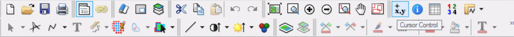

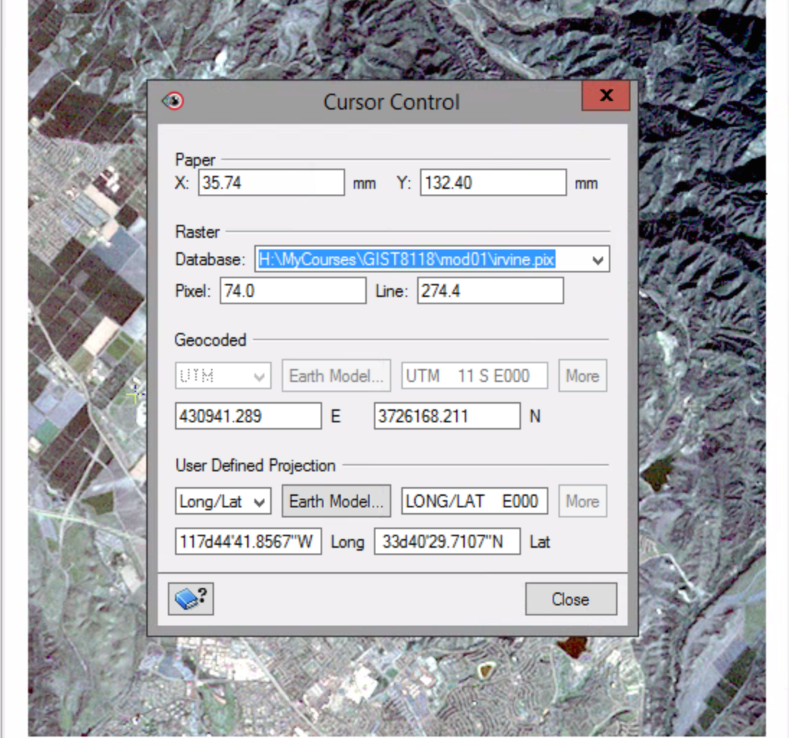

The cursor control information shows both the location on the map page and the georeferenced ground location represented in the image.

##### In the Pixel: box enter 128 and the Line: box enter 283 then press the TAB button. Make sure the Database: is set to IRVINE.PIX.

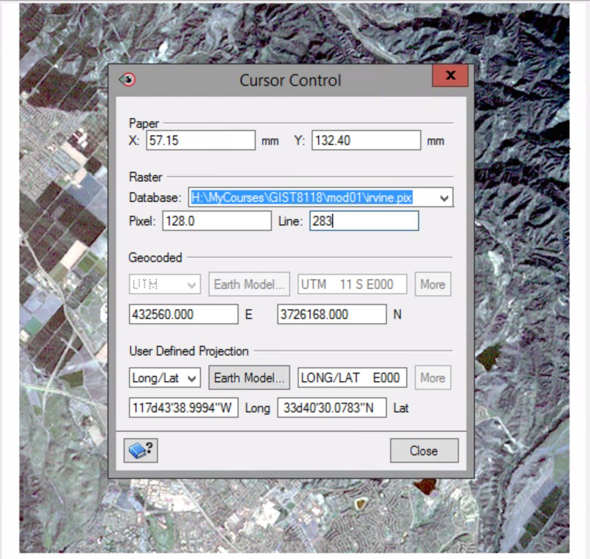

##### Notice the cursor will move to the airport.

