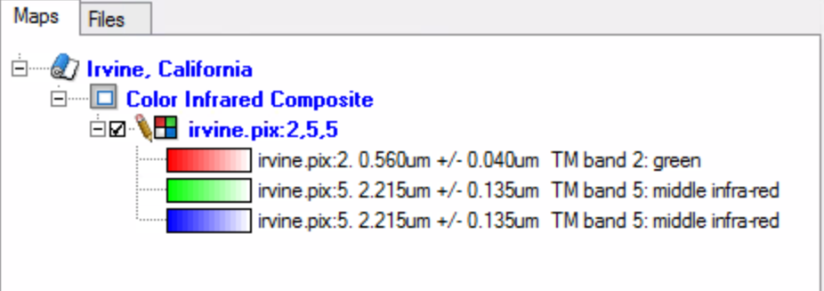
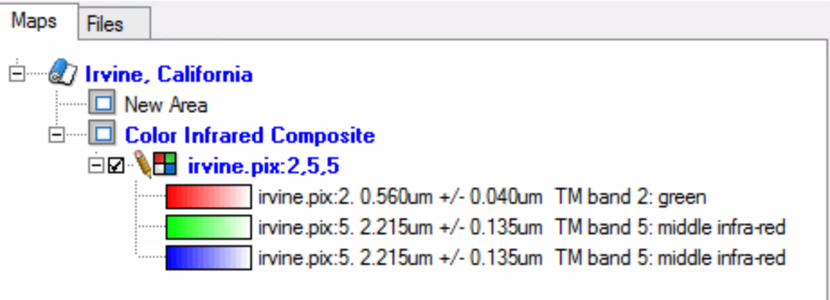
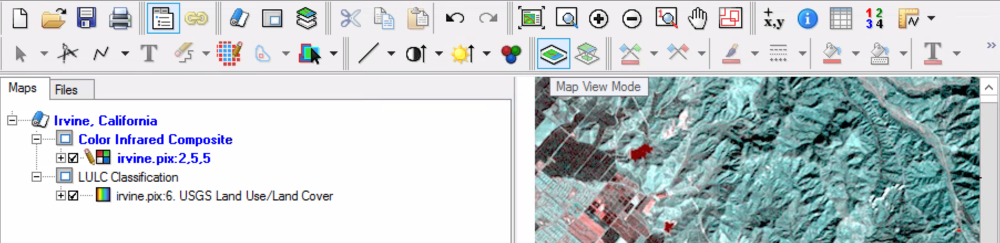

### 1 - Create a new Map

##### Make sure Focus is running and start with a new project (File -> new project).

##### On the Maps toolbar, select the New Map button to establish a map and area within the viewer.

The Maps tree should have two entries: one for a map and one for an area within the map. Notice that each layer has a specific symbol attached to it.

### 2 - Rename

##### Rt-Click on the Unnamed Map, and select properties.

##### In the Map Properties, in the Name: section of the General tab Change the name from Unnamed Map to “Irvine, California”.

##### Click OK to close the dialog and apply the changes.

##### Double-click the new area layer to open the Area Properties dialog box. In the Name text field in the Generic section on the General tab enter the following text: “Color Infrared Composite”. Click OK to accept the text change, and close the dialog box.

### 3 - Add Data to a map

##### On the maps toolbar, click the Add Layer button to open the Add Layer Wizard. Select the RGB option then click next>. Click Browse to locate and open irvine.pix from your working directory. Once opened, a list of all the available channels in irvine.pix will appear in the list box. Select (click once on) channels 5, 3 and 1 for the red, green and blue color guns, respectively. Click Finish.

##### This layer has been assigned a default name. Use the steps outlined above to rename the layer to read: “TM Bands 5,3,1”

##### Click the + next to the RGB layer to display the list of data that the layer is comprised of.

### 4 - Add a second Area to the map

##### On the Maps toolbar, click the New Area button in order to add a second area within the map.

##### As before, by default, it will be labeled “New Area”. Change this area’s text to read: “LULC Classification”.

##### Select this newly created area (it will be highlighted) then on the maps toolbar, select the the Add Layer Wizard button.

##### From the Add Layer Wizard select the Pseudocolor option then click next>. A list of all the available image channels in irvine.pix will appear in the list box. Select channel 6 (USGS Land Use / Land Cover). Click Finish.

You have now entered a pseudo-colored layer to the LULC Classification area in the Irvine California Map displayed in the Maps tree. The symbol for this layer is shown accompanying the layer’s tree
entry. 

A pseudo-color layer is an image with different colors (red, green, blue etc) assigned to different digital numbers within the same image layer.
Pseudo-color layers are used to display a thematic map. The image you are displaying is a land use/ land cover thematic map for the Irvine area.

##### Click on the plus next to the pseudo-color layer to view the legend. You should see a legend like the partial display below.

##### Look at the image and the legend; notice the different colors for the different land use/land cover classifications.

### 5 - Geomatica Project Files

Focus project files (GPR file extension) will store Maps, Areas, Layers, display settings and ‘map’ elements.

GPR files also include all path information to your data, your viewing preferences, such as the last zoom level you worked at, and all associated map elements.

Project files DO NOT contain the actual data (rasters or vectors). They contain pointers to the data.

### 6 - Reorder map areas

##### Click on the Color Infrared Composite area entry in the Maps tree.

##### Keep holding the mouse button down while you drag the Color Infrared Composite area to the top of the Maps tree above the LULC Classification area entry.

### 7 - Activate map areas

A map area is visibe when it is active.

In Area view mode only one area is visible at a time.

### 8 Create a Map Layout

Map View mode allows you to view both areas at once and design a ‘map’.

##### Currently, the View Mode palette is in Area View (image below):

##### Switch to Map View Mode.

##### Click the Color Infrared (CIR) Composite area in the Maps tree.

##### Click and drag one of the corner anchors to resize (make smaller) the imagery. 

##### Repeat the above step for the LULC area making it the same size as the CIR one. 

##### Move the mouse cursor to the edge of the frame surrounding the imagery in the viewer until its shape changes to the four-arrow cursor. Now click and drag the selected area to a new location in the viewer.

##### Click on the Color Infrared Composite area in the Maps tree and repeat; moving the imagery within the map until both areas are completely visible (below).

