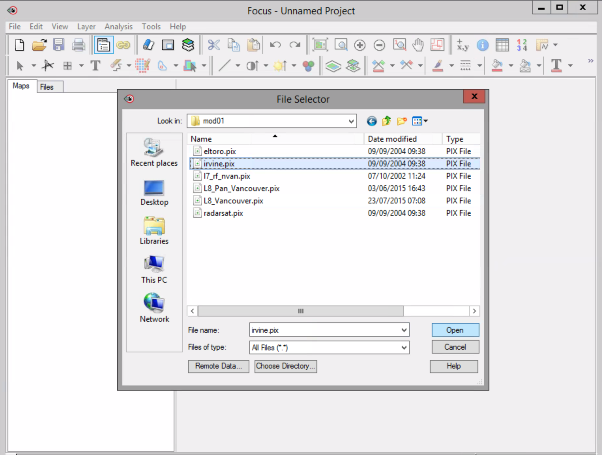
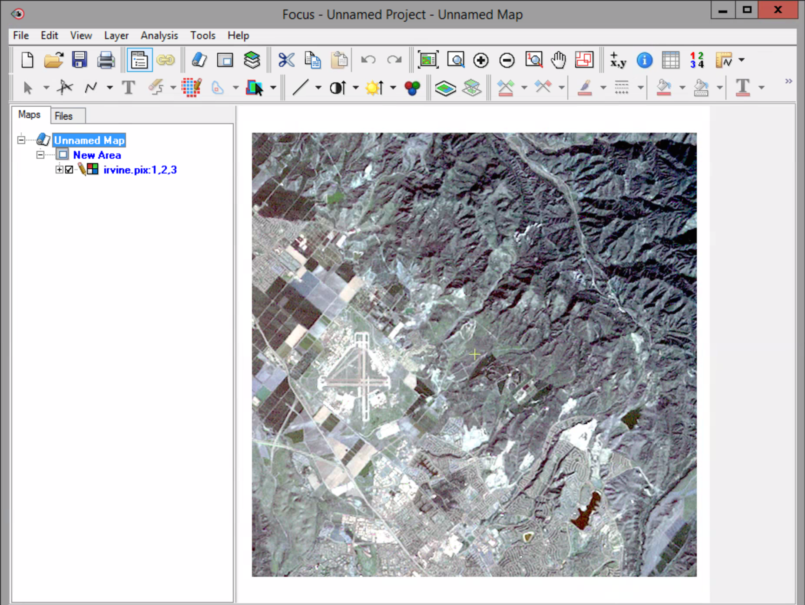
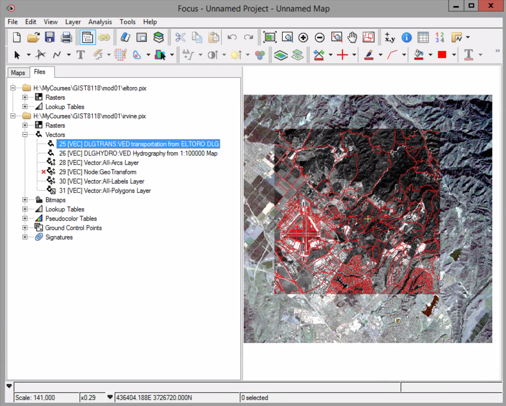

# Focus application

### To open a file in Focus:

- In the menu select File -> Open. The File Selector dialog opens.

- In your working folder click irvine.pix. Click Open.

In the control panel on the left of the Focus window an unnamed map with a new area and a RGB (red, green, blue) layer is automatically added.

The RGB layer displays a Landsat multispectral image of Irvine, California in the Focus view area.

### To show or hide a layer:

- Click on the check box on the left of the RGB Irvine.pix:1,2,3 layer. Notice the check disappears - the layer is now hidden. The viewing area will be blank.

### To add a layer with the Add Layer Wizard:

- Right click on the New Area icon in the Maps tree.

- In the context menu select Add...

- In the Add Layer Wizard, select Grayscale for the type of layer you want to add. Click Next.

- In the Add Layer Wizard, click Browse.

- In the file selector dialog, navigate to your working directory, locate and select eltoro.pix. 7. Click Open.

- In the available channels list, click the only available channel which is SPOT HRV1 Panchromatic (0.51-0.73um). In the Add Layer Wizard, click Finish.

### The Files Tree

- Click on the Files tab in the control pane. You can now see the Files tree, a list of available files – irvine.pix and eltoro.pix, and their components.

The components listed will depend on the data available and processing that has occurred on the data. In the above example eltoro.pix contains rasters and look up tables, where Irvine.pix contains rasters, vectors, bitmaps, lookup tables, pseudocolor tables, ground control points and signatures.

- Data are organized into different components depending on type, there are three types of data: raster, vector and auxiliary.
 
 - Rasters are stored in channels. These are your images you will be working with during this course.
􏰀
 - Vectors are stored in segments. These are your geographic points, lines and polygons representing features e.g. a road.
􏰀
 - Bitmaps, Lookup Tables, Pseudocolor Tables, Ground Control Points and Signatures are also stored in segments, these are **auxiliary data** used to assist in interpretation and analysis.

### To Add a Layer to the view from the Files tree:

- Expand the vectors component list from the irvine.pix file by clicking on the “+” beside it.

The available vector data are shown in the list. The vectors are organized in segments and all segemets are numbered. In this file segments 25 to 31 (minus 27) contain vector data.

- Right-click on the first segment, number 25, DLGTRANS:VED transportation..., and select View from the context menu .

- Switch back to the Maps tree in the control pane by clicking on the Maps tab.

- You should now have three (3) layers listed under the new area of your unnamed map – 1 vector layer, 1 grayscale layer and 1 RGB layer.

### The Layer Manager

